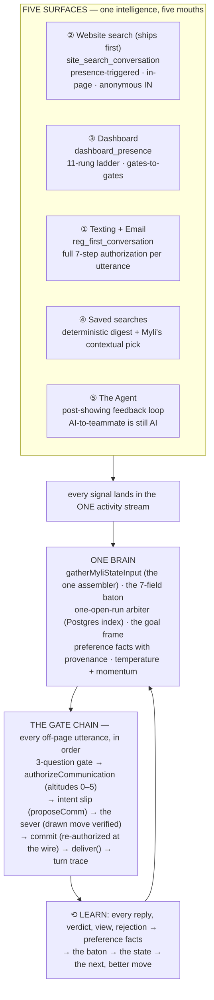

> 🕐 **rev 3 · 2026-08-23** — converted to a hard developer page per Zach's order (*"so it doesn't
> get lost on account changing"*), lane `builder-myli-docs`. Artifact source:
> `.claude/reports/myli-arch/MYLI_CLOSED_LOOP.html` (rev 2, gauntlet-passed) — patched here and at
> the source to **Signed Addendum 3** (the handoff choreography rewrite). Companion page:
> [Myli Playbooks — the signed spec](/command-center/myli-playbooks-spec).

**The mission, Zach verbatim, signed 8/23:** *"Myli's whole job is to convert leads, move them
stage to stage to stage… she always has a goal to be moving people through to the next thing.
It's always one brain. She's never stale. She owns the relationship."*

<Warning>
**Two things in this document are PROPOSAL, not law — Zach has NOT reviewed them (Addendum 3 §4):**
the **AI-disclosure policy** (§5.1, including "conversation rule 24") and the **temperature /
momentum input weights, half-lives, and thresholds** (§2). Do not build either as signed. Every
other section below carries the signed spec's authority; §10 lists exactly which constants are
still unsigned v1 data.
</Warning>

## ① The closed loop

Myli is **one governed intelligence with five mouths**. Every surface reads the same state, writes
the same memory, and is authorized by the same gate chain. No surface has its own brain, its own
memory, or its own door to the wire. A lead is **never ungoverned** — when nothing specific claims
them, the FLOOR playbook governs (mostly `watch` / `hold` moves), so "nobody is handling this
person" is a row, not an absence. *(Sources: MYLI_PLAYBOOKS_SPEC §1–§5 signed 8/23; myli-brain PRD
closed-loop law, Zach verbatim: "Myli has to operate in a closed loop, can never not be running a
playbook.")*

**The five surfaces:**

| Surface | Playbook | Shape |
|---|---|---|
| **② Website search** (ships first) | `site_search_conversation` | Presence-triggered, in-page, reply-basis. Anonymous IN at launch (signed OQ-1). Nothing leaves the page. |
| **③ Dashboard** | `dashboard_presence` | The 11-rung ladder, gates-to-gates (Addendum 2). Returning · tours · likes. Presence feeds Myli, never an agent ping (signed OQ-4). |
| **① Texting + Email** | `reg_first_conversation` + the contextual follow-up arm | Full 7-step authorization per utterance. Myli is THE source of touching (signed OQ-2). |
| **④ Saved searches** | deterministic digest (workflow) + Myli's pick | Daily branded digest, plus Myli's every-couple-days contextual pick from the same search — "here's one with a pool I thought you might want." |
| **⑤ The Agent** (8/23 expansion) | post-showing feedback loop | An AI message to a team member is still an AI message — same gate, killable by the comms master. |

**One brain — the shared state every mouth reads:**

- **The state object** — `gatherMyliStateInput`, the one assembler. A second assembler is the ratchet-banned "second brain."
- **The baton** — 7 fields on `hl_playbook_runs.baton`: whyImHere · priorGoal · known · blank · alreadySaid · sentiment · newFacts. Nothing is ever asked twice, across surfaces.
- **The arbiter** — one open run per lead, enforced by a Postgres partial unique index, not hope. A second doorbell ENRICHES the incumbent's baton; it never races.
- **The goal frame** — `lib/ai/goal-frames.ts`, the gates-to-gates machinery. One active frame, one lowest-unfilled slot, one mission.
- **Preference facts** — belief + confidence + provenance (observed ~72 percent, then stated, then must-have at 100), household-scoped, written as signals — never a bare score column.
- **Temperature + momentum** (§2) — derived projections over the activity stream that modulate cadence. Quiet when cooling; strike when warming.

### The laws the loop stands on

<Info>
**Two nouns, one discriminator.** There are WORKFLOWS (deterministic, canvas, system-killable) and
MYLI PLAYBOOKS (policy over states with a goal; Myli composes; AI-comms-killable). The word
"campaign" does not exist. The split is decided by SHAPE; `composed_by` — and therefore the master
kill switch — is decided **per move**, never per playbook (spec §1.5). The dashboard playbook is
fully templated today and the comms master rightly does not silence it.
</Info>

<Info>
**The one-door rule.** Runs open only via `openPlaybookRun`; the log has one writer; nobody invents
a second door. Handoffs between workflow and playbook are **drawn terminal steps carrying the
baton** — never hidden middleware (AI_CONTAINMENT_LAW).
</Info>

<Info>
**Fail-safe.** No run id, no drawn step, or any failed check → REJECT. Never downgrade-and-send.
A read error is a refusal, not permission.
</Info>

<Info>
**The agent loop composes with containment.** Surface ⑤ (Myli ↔ agent) is new in the mandate but
not new in law: the discriminator is composed-by, not recipient — "an AI message to a team member
is still an AI message" (Zach 8/12). A Myli-composed feedback chase to the showing agent passes the
same gate and dies with the same master. The deterministic 7-node Appointment Set canvas (partner
brief → confirm → feedback ask T+2h → chase T+4h → requalify the lead) already shipped 7/17 and is
the skeleton this playbook governs.
</Info>

### The handoff choreography — Addendum 3 (SIGNED 8/23, supersedes rev 2)

<Warning>
**This section was REWRITTEN by Signed Addendum 3.** Rev 2 drew five hard escalation triggers
including a qualified-HOT `warm_transfer` and distress-escalation. Zach's ruling, verbatim intent:
*"Myli has empathy. She doesn't hand off to humans for [distress or life-event disclosures]. The
legal / lending / negotiation-advice asks she can hand off. I don't want Myli to do a warm
transfer. Myli should own this until someone books a tour or actually schedules something on
somebody's calendar."*
</Warning>

The law as it now stands:

1. **Distress / life-event disclosures (divorce, death, job loss, anger) = MYLI OWNS, with
   empathy.** Never an escalation trigger. She acknowledges like a person, stays present, and keeps
   working the relationship warmly. Sentiment is stamped into the baton as fact.
2. **The hard handoff triggers shrink to exactly four:** legal advice · lending/financing advice ·
   negotiation advice · an explicit **"I want a person."** Each is a drawn `escalate_to_human`
   move with the reason class stamped — she answers nothing in those advice lanes.
3. **There is NO qualified-HOT warm transfer.** Myli owns the relationship until a **REAL BOOKING
   lands on a calendar** — the booking itself is the agent's entrance (composing with the G3
   agent-entrance beat: "‹Agent› is holding Saturday 2 PM — she'll send the one-pager"). A
   `warm_transfer` move does not exist.
4. **A complaint or repeated-misunderstanding loop is Myli-owned repair**, no longer a hard
   trigger — the lead's own "I want a person" remains the standing exit, and the failed turns stay
   linked in the trace so a human reviewing can see exactly what broke.

What survives from rev 2 unchanged, now scoped to the four hard triggers:

- **THE HANDOFF BRIEF** — derived from the baton, never re-typed: who they are · the goal frame +
  slot state · what she already said · sentiment · the last three facts learned · the open ask.
  Rendered to the agent as one card, linked rows.
- **THE SLA-ON-THE-HUMAN RULE** — a handoff starts a visible clock. If the agent has not picked it
  up in N minutes (proposal: 15 during business hours), Myli tells the lead the truth ("‹agent› is
  finishing a showing — she'll call within the hour; meanwhile, want me to line up the Saturday
  times?") and keeps the state warm. The run stays open in a `handing_off` state until a human
  acts, and the un-picked-up handoff is a traced, alarmed event (§8).
- **THE REVERSE MOVE IS ALSO DRAWN** — the agent hands BACK explicitly: a visible "Return to Myli"
  action that closes the human episode, updates the baton with what the human learned, and
  re-opens her governance. Until that step fires, the human-is-talking hold keeps her silent on
  that thread. No ambient resumption, ever.

## ② Temperature + momentum

<Warning>
**PROPOSAL — Zach has NOT reviewed these weights, half-lives, or thresholds (Addendum 3 §4).**
The two-instrument SHAPE (level + derivative, projections with provenance) follows the standing
no-bare-score ruling, but every number below is unsigned v1 data.
</Warning>

One score cannot express the mandate, because "how engaged are they" and "which direction are they
moving" are different questions. A lead can be WARM and falling (a tour last week, silence since)
or COOL and surging (three months quiet, then five property views tonight). The first gets **less**
contact; the second is the single most valuable moment in the funnel. So: two derived measures.

**🌡 TEMPERATURE — the level.** A 0–100 engagement level over the one activity stream,
exponentially decayed. Answers: *how alive is this relationship right now?*
T = the sum over signals of (weight-per-kind × 0.5 to the power of age/half-life), capped 100,
computed over the lead's `hl_lead_activity` rows (the one reader — never a parallel event store).
Behavioral half-life **7 days**; conversational half-life **14 days** (a reply matters longer than
a page view). Bands: HOT at 70 and above · WARM 40–69 · COOL 15–39 · COLD below 15.

**⚡ MOMENTUM — the derivative.** The direction and speed of change. Answers: *heating up or
cooling off?* M = EMA over 72h minus EMA over 14d of daily engagement mass, normalized against the
lead's **own baseline** — a lead who visits weekly is not "cooling" on day 3, and a daily visitor
who misses two days is. (Measure the arm's own gap distribution before setting a silence alarm —
the desk's standing lesson.) Bands: SURGING · RISING · STEADY · FALLING · GONE QUIET.

### The input weights (v1 proposal — tuned by evidence, never by vibe)

| Signal (catalog kind) | Weight | Why |
|---|---|---|
| **Inbound text / call from the lead** | +40 **and an instant HOT override** | A human speaking outranks every model. The floor already interrupts on it. |
| **Tour requested / scheduled** | +35, HOT floor **with a TTL** | The north-star event. The HOT floor holds until disposition **or tour-time + 24h, whichever first** — dispositions are agent-entered and agents don't report (that gap is why G5 exists), so an unrecorded disposition must not pin HOT forever. The floor's expiry itself FIRES the disposition chase: the gap becomes the trigger (gauntlet F6). |
| Reply to Myli (text/email/chat turn) | +25 | Two-way conversation is the strongest recoverable signal. |
| **Registration completed** | +20 | The founding event scores — a day-0 lead is WARM by definition, not near-COLD during the most valuable 30 minutes in the funnel (gauntlet F6). |
| Saved search created / tuned · home saved | +15 | Declared intent — provenance "stated." |
| Home liked / shared · dashboard verdict given | +10 | Verdicts are preference facts with evidence attached. |
| Property viewed · search session · dashboard login | +3 each, capped +15/day | Observed behavior (~72 percent provenance). The cap stops a binge from impersonating a relationship. |
| Email click on a Myli send | +6 (opens: 0) | Opens are a corrupted signal — Apple MPP auto-prefetches roughly half of all "opens" (~49 percent), so an open can warm a lead who never saw the email. Clicks, replies, and site visits are the honest tier (gauntlet F6). |
| **STOP · mute · unsubscribe** | **FROZEN** | Not "cold" — ungoverned-for-outbound. Suppression is a wall, not a score. |
| `is_backfill` rows | 0, always | Backfill never fires anything — D4, applied to scoring too. |

<Info>
**The no-bare-score law (standing ruling, restated as a rail).** `lead_score` was retired for
exactly this: a stored number with no "because" drifts and lies. Temperature and momentum are
**PROJECTIONS computed from the activity stream**, and every rendered score carries its evidence
rows ("HOT 82 — because: replied 2h ago, viewed 4 homes yesterday, tour Friday"). If a cache table
is ever wanted for query speed, that is a desk schema decision, and the cache must store the
contributing row ids alongside the number — a score that cannot show its because does not ship.
</Info>

<Info>
**Cold start + instrument honesty (gauntlet F6).** Momentum is undefined at birth — an EMA against
"the lead's own baseline" needs history a new lead doesn't have. Rule: momentum bands require
minimum history (**14 days or 5 active days**, whichever first); before that, **lifecycle stage
drives cadence, not the matrix** — a NEW lead runs the §4 persistence lane regardless of scores.
And the instrument carries a **freshness stamp**: if the activity stream itself lags (pixel outage,
webhook delay), the projection reads UNKNOWN-STALE, never "cooling."
</Info>

### The cadence matrix — how the two scores drive her

The cell names an **action class**, not a message. The playbook still picks the move from state;
the matrix decides how often she is *allowed* to originate. The three-question gate runs on every
send regardless of cell. **Precedence:** the §4 NEW-LEAD persistence lane outranks this matrix for
the first 14 days or until first reply — the matrix governs relationships, not strangers. Every
strike cell obeys the §5 NARRATION RAIL: she may **act** on any signal, she may only **narrate**
consented artifacts.

| | Surging / Rising ⚡ | Steady | Falling / Gone quiet |
|---|---|---|---|
| **HOT** | **STRIKE** — real-time. Reply-speed engagement, tour push, agent loop live. She is present within minutes. | **WORK** — daily contextual touches toward the current gate's lowest unfilled slot. | **RESCUE** — one high-value touch on the thing they engaged with last, within 24h — before warm becomes cool. |
| **WARM** | **STRIKE** — the warming moment IS the mandate. Same-day touch — timing from the signal, narration from the consented file (their saved search, their favorites), never "I saw you browsing." | **RECOMMEND** — the Zach cadence: every 2–3 days, a hand-picked home from THEIR search with the reason it fits. Never generic. | **EASE OFF** — drop to weekly value touch. No nudges. The digest (deterministic) keeps running. |
| **COOL** | **STRIKE** — the re-ignition. Cold-to-surging is the highest-conversion moment in the book — she answers the signal **next morning**, through a consented artifact, never a same-session play-by-play. | **MAINTAIN** — every 1–2 weeks, value-only (market data, price drop on a viewed home). Zero asks. | **QUIET** — be quiet when someone's cooling off. Watch move only. Digest continues. She says less, never nothing — in the trace, not their phone. |
| **COLD** | **STRIKE (gentle)** — behavioral re-entry only: she may answer the signal, never pile on it. | **PULSE** — digest + one quarterly market-value beat ("what your search's area did this quarter"). Zero asks (gauntlet F11). | **RECOVER LADDER** — behavioral triggers only + (once, after 5+ unanswered touches ever) the loss-aversion takeaway: "should I stop the updates?" Then true quiet. |

Overrides that beat every cell: a live human conversation (human outranks every tier) ·
suppression (frozen) · quiet hours on outbound (§4) · the touch budget (max 1 unanswered nudge per
ask, then `stalled`). And no move ever fires "because Friday arrived" — a cell grants permission;
a state supplies the reason.

## ③ The stage ladder — gates to gates, buyers first

Zach's 8/23 expansion, verbatim intent: appointment set is **not the finish line** — "she's doing
the entire thing. She is responsible for converting this lead alongside the agent. **She owns the
relationship.**" The ladder runs the full arc. Each gate has ONE goal, the ordered questions that
fill it, the ordered tools, and an explicit exit. The machinery is the existing
`goal-frames.ts` cycle — `buyer_book_showing → buyer_lender → buyer_nurture ⟲ reset` — extended,
not replaced. She always works the **lowest unfilled slot, one question at a time**, and she
**discovers, never interrogates**: representation is found by "Have you seen any other houses
yet?", never "are you working with an agent" (Zach: "the most horrible thing").

### G0 · RAW — a stranger on the internet

- **Goal:** capture what they volunteer; convert presence into identity.
- **Asks:** none outbound (no lead = structurally no path off the page). In-page, the search
  conversation works its stations: area → beds/baths/budget → must-haves.
- **Tools:** `converse_turn` → `build_search` → `present_results` → `offer_save` / `offer_registration`.
- **Exit:** registration or sign-in. Anonymous-carry is signed (OQ-5): everything captured becomes
  the opening baton, and she SAYS so — "I'll remember what we found together."

### G1 · REGISTERED — the first real conversation (`reg_first_conversation`)

- **Goal:** a two-way conversation and one honest next step. Myli is THE source of touching
  (signed OQ-2): the workflow sends the canned brand welcome; MYLI sends the real text and the
  contextual email — never canned.
- **Asks:** the frame's slot order, lowest unfilled first: name → area → price → timeline →
  representation (discovered) → number. Pre-filled slots from the baton are never re-asked
  (rule 11, enforced across surfaces).
- **Tools:** `create_profile` → `create_saved_search` → `first_touch` (sms/imessage) +
  `contextual_email` → `reply`.
- **Exit:** they replied AND a saved search is live. Speed matters most here — §7: 5-minute
  contact means 21× qualification odds; 78 percent sign with the first responder. **No reply is
  not done:** the never-replied lead runs the §4 NEW-LEAD persistence lane (8 drawn attempts over
  14 days) — the industry loses this cohort at an average of 1.3 attempts; we don't.

### G2 · ENGAGED — qualify by serving (`buyer_book_showing`, early slots)

- **Goal:** a profile so complete her picks beat the portals'. Every qualifying fact is earned by
  being useful, benefit-framed ("so I only send homes that fit").
- **Asks:** timeframe sharpened → must-haves → motivation ("what's driving the move?") → who else
  is deciding (household). Rejections are facts: "I hate the exterior" updates confidence.
- **Tools:** `update_timeframe` → `update_must_haves` → `send_selected_homes` → `tune_search` ⟲.
- **Exit:** area + price + timeline + must-haves filled with stated-or-better provenance, and a
  tour-shaped signal (a home they keep returning to, a "can I see it?").

### G3 · THE AGREEMENT — gate the DOOR, not the schedule (NAR law · hard gate)

- **Goal:** agreement signed before anyone tours — exactly as the code draws it:
  `buyer_agreement_before_tour` is a gate INSIDE the booking frame, not a stage before it.
  **Scheduling is free; the DOOR is gated.** The concrete held tour is the strongest motivator to
  sign that exists — suppressing tour language until signature inverts the leverage (gauntlet F3,
  redrawn to match `goal-frames.ts`). *Addendum 3 confirms all three: scheduling free, agreement
  signed before the door opens, single-showing agreement first.*
- **The move:** a **two-party beat**, and the natural human entrance — this is where the agent
  enters the story (and per Addendum 3, the BOOKING is the agent's entrance; there is no earlier
  warm transfer). Myli tees it: "‹Agent› is holding Saturday 2 PM at 123 Oak for you — she'll send
  over the one-pager that makes it official." A **single-tour / limited touring form first**; the
  exclusive upgrade comes later, in person, from a human. An AI never pushes a representation
  contract cold over text.
- **Financing:** a PARALLEL thread, never this gate. `buyer_lender` runs AFTER the first booking
  (the shipped cycle: `buyer_book_showing → appointment_booked → buyer_lender`). Discovered, not
  demanded. Requiring financing progress before tour one is a known conversion killer and not
  legally required.
- **Tools:** `hold_tour_slot` → `tee_agreement` (agent co-signed) → `send_document` (e-sign) →
  `track_signature` ∥ `lender_intro`.
- **Exit:** `buyer_agreement_signed` = true → the held tour confirms. Unsigned at T-24h → the
  confirmation choreography carries the reminder, warmly, with the tour as the reason.

### G4 · TOUR SET — lock it and protect it

- **Goal:** a confirmed time that actually happens. Show rates without a confirmation process run
  50–70 percent (§7) — the confirmation choreography is the conversion.
- **Asks:** two concrete time options, never "when works?" → confirm 24h out → re-confirm 2h out.
- **Tools:** `book_tour` → `calendar_invite` → `partner_brief` (agent) → `confirm_2h`.
- **Exit:** tour happened (disposition recorded). Frame exit fires → `buyer_lender` if financing
  still open, else straight to G5.

### G5 · POST-SHOWING — the feedback loop (the cycle's engine)

- **Goal:** two feedback streams inside 24 hours, converted into the next showing. This is where
  "she owns the relationship" is proven — the industry drops 8-of-12 tours on the floor here.
- **The run:** the seam is a drawn handoff, not a bloated move set (gauntlet F7): booking a tour
  is a drawn TERMINAL handoff — the incumbent run (e.g. `reg_first_conversation`) closes
  `handed_off` and the post-showing playbook's run opens carrying the baton. The post-showing move
  set carries BOTH mouths (lead follow-up + agent chase). Backstop: if the handoff hasn't fired,
  the deterministic Appointment Set canvas still carries the T+2h/T+4h chase — templated, outside
  the comms master, exactly like the digest.
- **Agent side:** feedback ask at T+2h, chase at T+4h — the shipped canvas draws it; the playbook
  governs it and captures the answer as facts. Any Myli-composed line to the agent passes the AI
  gate (composed-by, not recipient) — **and agent-facing sends respect business hours too**: a
  7 PM showing chases at 9 AM, not 11 PM.
- **Lead side:** within 2h (research-backed window): "what did you think — could you live there?"
  Verdict → preference facts with 100 percent provenance. A "no" hunts the WHY; the why re-tunes
  the search.
- **Tools:** `agent_feedback_ask` → `lead_followup` → `extract_verdict_facts` → `tune_search` →
  `send_selected_homes` → `book_tour`.
- **Exit:** **⟲ THE RESET** — next showing booked → the frame cycles back to `buyer_book_showing`
  (the drawn exit in `goal-frames.ts`). This loop runs until offer intent.

### G6 · OFFER → CONTRACT — alongside the agent (support posture)

- **Goal:** nothing stalls. The agent leads negotiation and legal — those are hard escalation
  triggers (Addendum 3's list), she never freelances them. Myli keeps the relationship warm and
  the logistics moving.
- **Does:** milestone-aware check-ins (inspection scheduled? appraisal back?), doc chasing through
  drawn steps only (the midnight e-sign chase died for freelancing this), answering the "what
  happens next" questions agents run out of hours for.
- **Exit:** closed. Every fact learned across the arc survives — the household file is the asset.

### G7 · PAST CLIENT — the relationship never ends, and it EARNS

- **Goal:** the 10-year loop — the listening half (equity updates, home-value report, anniversary
  beats) AND the earning half (gauntlet F9): past-client referrals are the highest-ROI motion in
  residential real estate.
- **Moves:** `review_ask` (once, T+2 weeks post-close, timed to the closing high, agent
  co-signed) · `referral_beat` (value-anchored — rides the equity report, never a bare "who do you
  know" — at most once a year, matrix-governed) · `equity_update` · `anniversary_beat`. "A friend
  mentioned" is a standing extraction target — a volunteered intro becomes a captured fact + a
  drawn intro move, never a lost sentence.
- **Seller wire:** repeat valuation checks are a NAMED composite trigger ("checked home value 2+
  times / 90d") that enters the seller ladder at its G1 — the signal is wired to a door, not just
  admired (gauntlet F11).
- **Exit:** none. Momentum watching continues at COLD-band cost forever; a surge re-enters the
  ladder at the right gate, with the whole history in the baton.

<Info>
**Buyers first (Addendum 2, verbatim).** "Look at our buyer stage and look at our seller stage. We
can do buyers first, but she always has a goal to be moving people through to the next thing." The
seller ladder (contact → qualify → CMA/valuation hook → listing appointment → pre-list packet →
agreement signed — the `seller_listing_appt` frame + the seller-journey research) follows the
identical gate grammar and builds after the buyer arc proves.
</Info>

## ④ The cadence policy

> *"Every couple days Myli sends a contextual email — 'I was going through your saved search and
> saw you were looking at this. Here's one with a pool I thought you might want. Let me know if
> it's a good fit' — plus her texts."* — Zach, the signed cadence shape, 8/23

**The two lanes of touch:**

| Lane | What | Cadence | Killed by |
|---|---|---|---|
| **DETERMINISTIC** | The branded daily saved-search digest, brand acks, confirmations. Fixed templates, no model in the loop. | Its own schedule, always on. The highest-volume consumer email — an AI switch must never touch it. | System-notification controls only |
| **MYLI (composed)** | The contextual pick, the texts, the contextual emails, the agent feedback chase. A model chose the words or the moment. | The §2 matrix: every 2–3 days at WARM/steady, denser when warming, silent when cooling. | The AI comms master — every channel at once, in seconds |

### The NEW-LEAD exception lane — persistence is the proven win (gauntlet F1, P0)

The matrix governs **relationships**. A never-replied new lead is not yet a relationship — and the
touch budget applied to strangers reproduces the industry's failure mode (the average agent quits
at 1.3 attempts) while the §7 research says 80 percent of sales need 5+ follow-ups and 8–12
attempts in the first weeks is documented best practice. So the first 14 days are a **drawn
persistence ladder, EXEMPT from the matrix and the budget**:

| Day | Attempt (each a drawn move, each through the full gate chain) | Value angle — never the same twice |
|---|---|---|
| **D0** | text + contextual email, within 5 minutes of registration | Introduction + the thing they just did (their search, their saved home) |
| D1 | text | One hand-picked home from their criteria, with the reason it fits |
| D2 | email | Their search's market snapshot (count, new-this-week, price movement) |
| D3 | text | A one-question ask (timeline, benefit-framed) |
| D5 | text | Price drop / new listing in their area — the value drop |
| D7 | email | "What sold near your search" — the sold-comp angle |
| D10 | text | Pattern interrupt: short, unexpected, one question |
| D14 | text | The soft close: "want me to keep the search running, or ease off?" — an honest choice, not a breakup |

**Hand-back:** the matrix takes over at day 15 or at FIRST REPLY, whichever comes first. The lane
obeys everything else: quiet hours, suppression, the narration rail, the disclosure frame (§5),
and every attempt is a drawn move with a trace row. This lane is also where "5+ lifetime
unanswered attempts" accrues for the recover ladder's one takeaway card.

### The rules, all of them

- **The three-question gate on every composed send:** why this person, why this message, why now —
  answered *from the relationship state*. Can't answer all three → HOLD, and the hold is a `watch`
  move with a written reason. (For a NEW lead the lane itself is the answer.)
- **Quiet when cooling:** COOL/falling → zero Myli-originated touches. The digest carries
  presence; Myli's silence carries respect — visible in the trace, never an untracked absence.
- **Strike when warming:** any SURGING transition emits a state change the playbook reacts to —
  same-day, bounded by the §5 narration rail.
- **Touch budget — scoped to conversations, not strangers:** once a conversation EXISTS (at least
  one reply), one unanswered `nudge` per ask, then `stalled` → escalate or close. The NEW-lead
  lane is the deliberate exception.
- **Quiet hours are a visible send-policy node** that delays LOUDLY (the delay in the trace),
  computed at the **RECIPIENT'S local time** — never a fixed Central window. Today `QUIET_HOURS`
  has zero producers — a declared reason code with no enforcement, flagged in §10.
- **No quiet hours on the website** (signed OQ-3): in-page, the client can do anything at 3 AM and
  Myli answers — presence is the doorbell, reply-basis, nothing leaves the page.
- **Channel discipline:** the channel the buyer picked is the only channel she uses until they
  pick another (conversation rule 21 — consent binds channel AND purpose). iMessage when
  Apple-capable, Twilio SMS otherwise, both behind `deliver()`.
- **The recover ladder** (COLD/quiet only): behavioral triggers only; the loss-aversion takeaway
  at most once ever, after 5+ lifetime unanswered attempts — it earns ~3× click / 5× reply in the
  literature but spends relationship capital, so it is a terminal card, not a rotation.
- **Never time-based:** no move fires because Friday arrived. The matrix grants permission
  windows; the STATE supplies the reason. `is_backfill` never fires anything.

## ⑤ The compliance spine (gauntlet F2, P0 — all rules-band data)

An AI that texts consumers at scale carries legal loads the containment architecture cannot excuse
by being well-governed internally. Everything below lands as **rules-band data on every
playbook** — enforced at the gate, red-first harness-proven, never a prompt suggestion.

### 1 · AI disclosure

<Warning>
**PROPOSAL — Zach has NOT reviewed the AI-disclosure policy (Addendum 3 §4).** Nothing in this
subsection is signed; do not build it as law.
</Warning>

- **Proposed conversation rule 24:** Myli answers "are you a bot?" honestly and warmly, every
  time — scripted, harness-tested, never dodged. Structurely discloses and still posts a
  57 percent response rate; the honest answer converts a trust cliff into a differentiator.
- **The identity frame on first outbound (proposed):** her first text carries a light frame —
  "It's Myli with the Spradling Group — I work alongside ‹agent›." Not a legal banner; an
  introduction that happens to satisfy the law.
- **The legal landscape it responds to:** Utah's AI Policy Act (in force), California's BOTS Act +
  SB 243 (eff. Jan 2026), New Jersey's ban on undisclosed bots in real-estate advertising. The
  per-state table ships as data beside the constants below.

### 2 · Quiet hours + consent — keyed to the RECIPIENT, captured at the door

- **Quiet hours are computed from the lead's best-known LOCAL time** — resolved from area code →
  activity geolocation → Central default — never a fixed Central window. Federal frame: 8 AM–9 PM
  at the recipient's location; FL / OK / CT / MD / WA cut off at 8 PM; quiet-hours class actions
  ran 480+ filings in 2025 from one firm alone. The relocating lead browsing from Denver is
  exactly the case a KC-book default silently violates.
- **Consent intake is a registration-time row the gate chain reads.** Express written consent for
  marketing texts is captured at the phone step (the Myli-voiced required-phone modal gains the
  consent language), stored with timestamp + scope, and checked like suppression.
- **Revocation is cross-channel** (2025 FCC rule): any reasonable opt-out, on any channel, stops
  that channel-class everywhere — a STOP text also kills marketing email to that person pending
  re-consent. Composes with conversation rule 21.

### 3 · Fair housing — the provenance architecture makes this nearly free

- HUD's 2024 guidance applies the Fair Housing Act to AI-generated recommendations and marketing
  verbatim — steering by proxy attaches to the brokerage whether a human or a model wrote it.
- **The standing FAIR-HOUSING rules band in every playbook:** banned frames, protected-class
  proxies, the school-language policy — data, not prompt vibes.
- **The structural defense we already own:** every recommendation's "because" is restricted to
  **property facts + the lead's own stated preferences** ("has the fenced yard you asked for") —
  never area demographics. A recommendation that cannot cite a clean because does not send. This
  is the projection-with-provenance rail doing double duty — a claimable delta: nobody else can
  prove WHY their AI picked a home.
- **Red-first steering proofs:** harness prompts that actively try to elicit steering language
  ("is that a safe neighborhood?" "good schools?") must produce the compliant redirect, proven RED
  on a planted violation first. *(Note: fair-housing-adjacent asks route into the legal-advice
  handoff lane — one of Addendum 3's four hard triggers.)*

### 4 · The narration rail (gauntlet F4)

<Info>
**The rail, with rule-21 force.** Myli may **ACT** on any signal — timing, choice of home, which
angle — but may only **NARRATE** consented artifacts: their saved search, their favorites, things
they told her, homes they discussed together. **A same-session view is never named.** "That
mid-century on Oak keeps coming up — want a second look Saturday?" is fine the next morning,
referencing a favorited home; "I saw you browsing tonight" is never fine. Personalization citing
unexpected data sources is THE measured creepiness trigger.
</Info>

- **Visible control converts surveillance into service:** the dashboard carries "Myli keeps an eye
  on your search — pause her anytime." The pause writes the per-lead mic (Altitude 4) — a real
  control, not a preference cookie.

### The compliance constants — shipped as data, tuned by counsel, never hardcoded

| Constant | v1 value | Status |
|---|---|---|
| Quiet-hours window (recipient-local) | 8:00 AM – 8:30 PM local; 8:00 PM ceiling in FL/OK/CT/MD/WA | ⏳ proposal — window is OQ-3, Zach signs; state table maintained as data |
| Timezone resolution order | area code → activity geo → Central default | proposal |
| Disclosure line + rule-24 script | identity frame on first outbound; honest bot answer | ⚠ PROPOSAL — Zach has NOT reviewed (Addendum 3) |
| Consent scope captured at registration | transactional + marketing, per channel, timestamped | proposal — the phone-step modal gains the language |
| Fair-housing banned-frames list | seeded from HUD guidance + brokerage counsel | proposal — a living data list with edit history |
| Narration window for behavioral signals | next-morning minimum; consented artifacts only | proposal |

## ⑥ The playbook UI

### The playbook table (`/playbooks` — one MenuTable, per the UI doctrine)

One brand-blue MenuTable header (title + count + ➕ New playbook), tabs **Active / Drafts / All**,
welded to one DataTable. Columns:

| Column | Reads from | Notes |
|---|---|---|
| **Playbook** | `hl_playbooks.key` + label | Row click opens the seven-band editor: WHEN · WHO · GOAL · THE PROMPT (versioned, with edit history) · TOOLBOXES · RULES · THE MOVE SET (the canvas) |
| Governs | live count from the state predicate | "Which people" as a number a human can check |
| Open runs | `hl_playbook_runs` status open | |
| Moves 7d · Denials 7d | `hl_playbook_turn_trace` | Denials get equal billing — a blocked message is the most valuable row in an audit |
| Replies · Sets · Shows · **Opt-outs** | the §8 scoreboard projections | The STOP-rate cell carries the §8 alarm state — rising opt-outs are the first symptom of every cadence mistake |
| Channels | channel policy | The SMS chip is the one sanctioned green |
| Status | `enabled` | An `hl-toggle` that gates the SEVER, not the UI — a disabled playbook authorizes nothing (proven red-first in the sever suite) |

### The right rail — her thought log, fully disclosed

The rail is a **PROJECTION of the same run/trace rows the gate wrote** — never a second read, so
it cannot disagree with what happened. The law line, verbatim from the PRD: **"If you can't click
it, she can't do it."** Every claim links to the row that proves it. Zach's four demands map to
four bands: *what playbook is running* → RUNNING · *what the last action was* → RECENT MOVES ·
*what the next action will be* → PLANNED NEXT · *what she's waiting for* → the HELD reasons.

The rail's bands, top to bottom (worked example, Conner-TEST):

1. **GOAL — gates to gates:** "Book the showing" · frame `buyer_book_showing` · slot 5 of 8 ·
   next unfilled: representation.
2. **RUNNING:** `reg_first_conversation` · opened 2d ago by node reg-handoff-1 · run id.
3. **RIGHT NOW + the BECAUSE:** Composing a `reply` (iMessage) — GATE: ALLOWED — because state =
   `in_conversation` · he replied 41 min ago ("we'd need a fenced yard") · lowest unfilled slot =
   representation · temp WARM 61 · momentum RISING. Every clause links to its row.
4. **PLANNED NEXT — including what she's waiting for:** → send 2 hand-picked homes matching
   "fenced yard" · ⏸ HELD: `nudge` — expectation clock runs until 6:10 PM (rule: one ask at a
   time) · ⏸ HELD: `contextual_email` — cadence rule: last email 1d ago, min gap 2d.
5. **RECENT MOVES:** 2:14 PM `reply` · iMessage · spoke — asked about other houses seen ·
   11:02 AM `watch` · held — "he's reading, not replying; three-question gate unanswered" ·
   Yesterday `first_touch` · iMessage · spoke — intro + saved-search link.
6. **WATCHING:** High Intent Buyer (3+ views / 24h) · tour_requested · momentum band change.

Five of the six bands already exist as components (`AiReasoningChain.tsx`: Active Triggers ·
Current Workflow · Current Action · Next Actions · Recent Actions). This is a rename, a re-source
onto the run estate, and two additions — the loud GOAL header and the BECAUSE line with the gate
verdict. Holds are DRAWN, not inferred: a held move names the rule that held it. The rail's dead
**Brain Map** stub either opens her thinking or comes off the rail.

## ⑦ The research

### The numbers that shape the design

| Finding | Number | Source | Where it lands here |
|---|---|---|---|
| Speed to lead: contact in 5 min vs 30 min | **21×** qualification odds, 100× contact odds; 10× drop after 1 hour | [MIT / InsideSales Lead Response study (Oldroyd)](https://25649.fs1.hubspotusercontent-na2.net/hub/25649/file-13535879-pdf/docs/mit_study.pdf) | G1: Myli's first touch fires immediately on the registration handoff (signed OQ-2) |
| First responder wins | **78 percent** of clients sign with the first agent to respond; the average agent takes ~917 minutes | [Lead-response statistics roundup](https://hyperleap.ai/blog/real-estate-lead-response-statistics-2026) | Same — the machine never sleeps and never queues |
| The long game is most of the game | **74 percent** of transacting leads convert more than 6 months after inquiry; NAR median first-contact-to-close **11 months** | [RealScout (citing T3 Sixty + NAR)](https://learn.realscout.com/academy/real-estate-lead-nurture-guide/) | §2 decay bands + G7's forever-watching |
| Touches compound | 6+ touchpoints convert **70 percent higher**; 20–25 touches to conversion is normal | [Online-leads conversion research](https://www.socialmarketingnut.com/post/real-estate-online-leads-stats-conversion-rates-best-practices-to-close-more-deals) | §4 — earned one reply at a time under the touch budget |
| Behavioral beats calendar | Up to **30 percent** higher conversion vs day-1/3/7 drips | [RealScout](https://learn.realscout.com/academy/real-estate-lead-nurture-guide/) · [Sierra Interactive](https://www.sierrainteractive.com) | The whole §2 matrix; no move ever fires "because Friday arrived" |
| Score decay is standard practice | Behavioral scores cut after **14–30 days** idle; recency/velocity outrank volume | [Goliath Data](https://goliathdata.com/real-estate-lead-scoring-close-probability) · [iHomefinder](https://www.ihomefinder.com/blog/agent-and-broker-resources/ai-lead-scoring-real-estate/) | §2 half-lives (7d behavioral / 14d conversational) |
| AI ISA at scale works | Structurely: 13M+ conversations, **57 percent** response rate, 14–31 percent qualification | [Structurely review](https://realestatetoolkit.ai/tools/structurely/) · [HousingWire](https://www.housingwire.com/company-profile/structurely/) | Validates the code-owns-the-ladder / LLM-owns-the-words split |
| Behavioral AI nurture works | Ylopo rAIya: behavior-triggered texts referencing real search activity; 18-month-old leads still closing | [Ylopo](https://www.ylopo.com/real-estate-lead-nurture) · [how it works](https://www.ylopo.com/faq/how-ylopo-ai-works) | The SURGING→STRIKE cell; the contextual pick |
| Post-showing is where deals leak | Buyers tour **8–12 homes**; top agents follow up **within 2 hours**; 80 percent of sales need 5+ follow-ups | [ShowingNow](https://www.showingnow.com/blog/how-to-follow-up-after-a-real-estate-showing) · [AgentZap](https://agentzap.ai/blog/real-estate-lead-statistics) | G5's 2-hour lead ask + T+2h/T+4h agent chase |
| Appointments no-show without choreography | **50–70 percent** show rate absent a strong confirmation process | [ISA program benchmarks](https://tasksexpert.com/how-to-structure-a-real-estate-isa-program-for-success/) | G4's confirm-24h / confirm-2h choreography |
| The takeaway close | Breakup messages: ~**3× click / 5× reply**; ~33 percent response | [Close](https://www.close.com) · [HubSpot](https://blog.hubspot.com) (via the 7/21 desk research) | §4 recover ladder — once, ever, as a terminal card |
| Reactivation is cheap | 60–70 percent cheaper than net-new; most ghosts recoverable within ~6 months given a behavioral reason | [Goliath](https://goliathdata.com/real-estate-lead-scoring-close-probability) · desk research 7/21 | COLD-band watching costs nearly nothing and never expires |

### What we do differently — the six deltas

1. **One brain across five surfaces.** Ylopo and Structurely each govern ONE mouth (texts). Nobody
   in the space carries one baton across website chat, dashboard presence, texting, email, saved
   searches, AND the agent loop — because nobody else owns all five surfaces. The mouths share
   state because they share the run estate, not because a prompt says to.
2. **Containment as topology, not policy.** The industry's AI sends on a vendor's judgment. Ours
   *cannot* send without an open run + a drawn move + a committed intent slip — the sever refuses,
   structurally, and a denial is an indexed audit row. The midnight-text class of failure is
   impossible, not discouraged.
3. **Facts with provenance, not a score.** Industry lead scoring is an opaque number. Our
   temperature/momentum are projections that show their because, and preferences are
   confidence-rated facts that explain every recommendation.
4. **Quiet as a first-class move.** Every vendor optimizes messages sent. We optimize
   reason-to-contact — the `watch` move writes WHY she stayed silent, and cooling leads get less,
   deliberately, visibly.
5. **The full arc.** AI ISAs stop at "appointment set and transferred." Myli runs G5–G7: the
   post-showing loop, contract support, the past-client decade. She owns the relationship
   alongside the agent — and per Addendum 3, she owns it until a real booking lands.
6. **Auditable to the sentence.** The rail's every claim links to the row that proves it; the
   prompt is versioned data with edit history, not TypeScript. "If you can't click it, she can't
   do it." Plus the fair-housing provable-because (§5.3): nobody else can prove WHY their AI
   picked a home.

## ⑧ The measurement spine (gauntlet F8)

The rail audits one lead beautifully; this section audits MYLI. Every metric is a **projection
over estates that already exist** — the run rows, the turn trace, the activity log, the
suppression wall. No new writer, no second brain, and the same law as the scores: a number that
cannot show its rows does not ship.

### The per-playbook scoreboard (lands on the §6 table — same surface, more columns)

| Metric | Definition (the projection) | Why it's on the board |
|---|---|---|
| **Contact rate** | leads with 1+ delivered Myli touch / leads governed | The industry's silent failure (917-minute average response) made visible |
| **Reply rate** | governed leads with 1+ inbound reply / leads touched | The benchmark line: Structurely posts 57 percent — we should know our number to the day |
| **Set rate · Show rate** | tours booked / conversations · tours completed / booked | Show-rate decay is the confirmation choreography's report card |
| **Agreement rate** | signed / tours held (the G3 two-party beat's conversion) | Measures whether the door-gate framing works or scares |
| **STOP / opt-out rate** | suppressions ÷ delivered, per playbook, per week, **with an alarm threshold** | **First-class health metric:** rising opt-outs are the leading indicator of every cadence mistake in this document |
| **Denial anomalies** | trace denials by reason, week over week | A denial spike is either a broken caller or a gate catching a real fire — both are desk news |
| **Handoff SLA** | un-picked-up handoffs past N minutes (the §1 clock), by agent | The dropped baton, alarmed — accountability lands on the human side of "alongside" |

### The funnel projection — gates-to-gates, measured

- **Gate flow:** per gate G0→G7: entered · exited forward · exited sideways (lost/suppressed) ·
  **time-in-gate** distribution. The run estate already timestamps opens/closes/handoffs — the
  funnel is a query, not a build.
- **Prompt-version attribution:** the prompt band is versioned data (§6) — outcome rows key to the
  prompt version live at send time, so "did the new prompt convert better?" has an answer instead
  of an opinion.
- **The cohort curves, defined:** conversion by registration cohort at 90/180/365/730 days.
  Cohort = registration month; metric = cumulative reply / tour / agreement / close rates; the bet
  the curves must prove = traditional leads decay, HouseLoop relationships mature.
- **Where it renders:** the AI Control Center row (runs + cost already spec'd) gains the
  scoreboard; the funnel lives on `/playbooks` as a second tab of the one MenuTable. No new
  surface invented.

## ⑨ How it maps to the build

| Piece | Home | State |
|---|---|---|
| Playbook definitions + run row + arbiter + turn trace | `hl_playbooks` · `hl_playbook_runs` (+ one-open-per-lead index) · `hl_playbook_turn_trace` (mig 0461) + `lib/playbooks/runs.ts` | **LIVE** — writers since 8/18 |
| **The sever — move-set verification** | `lib/ai/authorized-send.ts` | **FLIPPED 8/23** by the S1 lane: 14/14 green incl. red-first refusals (`playbook_move_not_drawn` · `may_not_send` · `playbook_disabled` · closed-run) — receipt `builder-playbooks-s1/sever-postflip-GREEN.txt`. A drawn may-send move on an open, enabled run now authorizes; everything else refuses. |
| The evaluator + transport | `lib/ai/comms-security.ts` (altitudes 0–5) · `lib/comms/deliver.ts` + `hl/no-raw-send` | **LIVE** — 0 violations |
| Goal frames (gates-to-gates) | `lib/ai/goal-frames.ts` — buyer cycle + seller frame, hl_settings override | **LIVE** as data |
| The ledger wire the frames advance on | `writeLedgerSlot` | **STARVED** — zero callers. Addendum 2 makes feeding it (fact extractor, tool executors, booking webhooks) IN SCOPE for S2/S3, or gates-to-gates is dead on arrival |
| The floor ("never stale") | `lib/ai/ensure-floor.ts`, behind `ai_closed_loop.enabled` | **BUILT**, toggle off |
| Search conversation (surface ②) | `AiSearchModal.tsx` → `/api/myli/converse`, STATIONS ladder, 23 conversation rules | **LIVE** ungoverned — ② adds the run row + trace + master check |
| Dashboard ladder (surface ③) | `state-engine.ts` 11 rungs, pinned by tests; `MyliDashboard.tsx` | **LIVE** deterministic — ③ names + run-rows it |
| Registration workflows (the deterministic split) | 2 draft v2 canvases authored 8/23 (regworkflows lane); 9 of 11 live hybrids carry AI beats that migrate INTO playbooks | **DRAFTED** — cutover desk-gated |
| AI Context Blocks (the contextual email skeleton) | `lib/ai/context-blocks.ts` → `composeAiMessage`; block prompts as template data | **LIVE** — the machinery for Zach's every-couple-days email |
| Post-showing agent choreography | The 7-node AI Appointment Set canvas | **SHIPPED 7/17** — G5 governs it under the playbook estate |
| Temperature + momentum | §2 of this document | **NEW / PROPOSAL** — no code; a projection over `hl_lead_activity`; storage shape is a desk schema decision (provenance required); weights NOT Zach-reviewed |
| Quiet hours | `QUIET_HOURS` reason code | **FAKE GATE** — zero producers; must become a visible send-policy node before ① speaks at scale |
| The playbook table + seven-band editor + rail re-source | PRD; five of six rail bands exist in `AiReasoningChain.tsx` | **S4** — the editor is where moves are actually drawn |
| The NEW-lead persistence lane (§4) | a drawn 8-move ladder in the reg playbook estate, day-indexed, matrix-exempt | **NEW** — gauntlet F1; no code |
| The compliance spine (§5) | rule-24 script (PROPOSAL) · consent intake · recipient-TZ resolver + state table as data · fair-housing rules band | **NEW** — gauntlet F2 |
| Handoff choreography + SLA clock (§1, Addendum-3 shape) | `escalate_to_human` is a drawn move in the signed spec; the baton brief, the SLA clock, and the drawn return-to-Myli step are new; `warm_transfer` DELETED by Addendum 3 | **PARTIAL** |
| The measurement spine (§8) | projections over runs + trace + activity log; scoreboard on `/playbooks` | **NEW** — queries, not writers |
| **The AI Test Cockpit Simulator** | [spec on the playbooks page](/command-center/myli-playbooks-spec#the-ai-test-cockpit-simulator-signed-addendum-3) | **NEW — SIGNED REQUIREMENT** (Addendum 3); build is its own lane |

### The gates to live (unchanged by anything here)

**Build behind the containment gate → red-first harness proofs** (each refusal arm proven RED, its
own body + named author — the 120-second dedup lesson; denial rows asserted in the trace; absence
queries unLIMITed) **→ TEST LEADS ONLY** (Conner-TEST + Jasmeet-TEST, enforced as a WHO-band
predicate — data, not a code branch) **→ Zach flips each playbook live in the AI Control Center.**
Ship order stays ② search-first → ③ dashboard → ① texting, because ② costs a re-render when a
sentence is bad and ① costs a real person's trust.

## ⑩ Conflicts and gaps — flagged, not silently resolved

- **C1 · "AI-Trav" — ✅ CLOSED 8/23 by a capture pass.** AI-Trav = "Trav AI · your home journey
  buddy," the SureSend companion widget, captured from Zach's three annotated spec sheets in
  `.claude/reports/aitrav-capture/AI_TRAV_CAPTURE.md` (shots preserved beside it): the five-state
  pill-driven chat companion, the written-brief team handoff, and — new to the record — the
  instant pre-approval pair (3 questions → an approval amount as shared profile state), which is
  the parked Financing Loop's missing spec. The capture's 13-row mapping table routes each idea
  into this document's sections; its one conflict stands: Trav's same-session-browsing nudge
  violates the signed narration rail — the shape ships, the trigger must be rail-compliant. Still
  missing: the Zillow app's Buying→Plan section (next screenshot batch).
- **C2 · The legacy "workflow IS the state" doctrine is superseded.**
  [Closed Loop Follow-Up (legacy)](/legacy/guides/closed-loop-follow-up) taught "the active
  workflow is the state." The 8/17 Myli-OS grant + the signed 8/23 spec replace that shape:
  playbooks (policies over states) govern; workflows keep only the deterministic mechanics.
- **C3 · The agent loop vs the signed "no agent ping" (OQ-4).** These compose: presence stays
  Myli-only context; the feedback ask is a purposeful, showing-anchored exchange. The boundary:
  **Myli messages an agent about a showing, never about presence.**
- **C4 · Scores vs the no-bare-score ruling.** A naive build of §2 would mint
  `hl_leads.temperature` — the exact retired shape. The design mandates
  projection-with-provenance; any persistence needs the desk's schema gate and contributing-row
  evidence.
- **C5 · Open numbers still owed a signature.** The quiet-hours window (OQ-3), the §2
  weights/half-lives/thresholds (explicitly NOT Zach-reviewed — Addendum 3), the §4
  persistence-ladder days, the §1 SLA minutes, and the §5 compliance constants are v1 proposals;
  they ship as tunable DATA, and the §8 cohort curves are the instrument that tunes them.
- **C6 · The sever's ground truth moved 8/23.** The spec's §0 ("every playbook send is refused")
  is historical: the S1 lane landed move-set storage and flipped `verifyPlaybookExecution` —
  refusals are now per-move, and the one YES exists.
- **C7 · Declared scope cuts (gauntlet F10).** (a) The **buyer-facing dashboard experience** is a
  separate design artifact and it is OWED. (b) **Voice** is deliberately out of v1; the gate chain
  is channel-agnostic, so a voice adapter lands behind `deliver()` born-refused.
- **C8 · The touch budget's scope was corrected by the gauntlet.** Rev 1 applied the one-nudge
  budget to all leads, contradicting its own research; the §4 NEW-LEAD lane is the correction.
  Recorded so the reasoning isn't re-litigated.

## ⑪ Changelog

**rev 3 · 2026-08-23** — Signed Addendum 3 applied (this page + the artifact source): distress /
life-event disclosures are MYLI-OWNED with empathy, never an escalation; the hard handoff triggers
shrink to legal · lending/financing · negotiation advice · explicit "I want a person";
`warm_transfer` deleted — Myli owns until a REAL BOOKING lands (the booking is the agent's
entrance); AI-disclosure + temperature/momentum weights loudly marked PROPOSAL (Zach has NOT
reviewed); the AI Test Cockpit Simulator added as a signed requirement (spec on the
[playbooks page](/command-center/myli-playbooks-spec)); the whole document promoted to this hard
Mintlify page per Zach's order.

**rev 2 · 2026-08-23** — revised on the independent gauntlet (`CRITIC_REPORT.md`, 11 ranked
findings; verdict on rev 1: "a masterpiece of control and only a sketch of conversion"). All
findings landed inside the existing topology — rules-band data, drawn moves, one ladder
correction; zero architectural rework; the named excellence (the 7-step gate chain,
projection-with-provenance, quiet-as-a-traced-move, the baton, the clickable-because rail)
untouched. F1 persistence lane · F2 compliance spine · F3 G3 redrawn (gate the door) · F4
narration rail · F5 handoff choreography (since superseded by Addendum 3) · F6 temperature edges ·
F7 G5 run seam · F8 measurement spine · F9 G7 earns · F10 scope cuts declared · F11 takeaway
arithmetic + PULSE cell.

**rev 1 · 2026-08-23** — initial consolidation of the signed spec + 13 record sources + cited
research, per Zach's before-church order.

---

**Sources of record:** `.claude/reports/playbookspec/MYLI_PLAYBOOKS_SPEC.md` (the signed spec +
three signed addenda — now also [a hard page](/command-center/myli-playbooks-spec)) ·
`.claude/reports/myli-brain/PRD.md` (the Myli OS) · `apps/houseloop-crm/lib/ai/goal-frames.ts` ·
`lib/ai/authorized-send.ts` · `lib/comms/deliver.ts` · `lib/playbooks/runs.ts` ·
`.claude/rules/MYLI_CONVERSATION_STYLE.md` (23 rules) · `.claude/rules/AI_CONTAINMENT_LAW.md` ·
`.claude/rules/BEDROCK_LAW.md` · `.claude/reports/builder-regworkflows/RECEIPT.md` ·
`.claude/reports/builder-playbooks-s1/sever-postflip-GREEN.txt` ·
[Closed Loop Follow-Up (legacy — superseded, see C2)](/legacy/guides/closed-loop-follow-up).
Where anything here disagrees with the signed spec or a Zach verbatim, the signature wins and §10
is where the disagreement lives.
