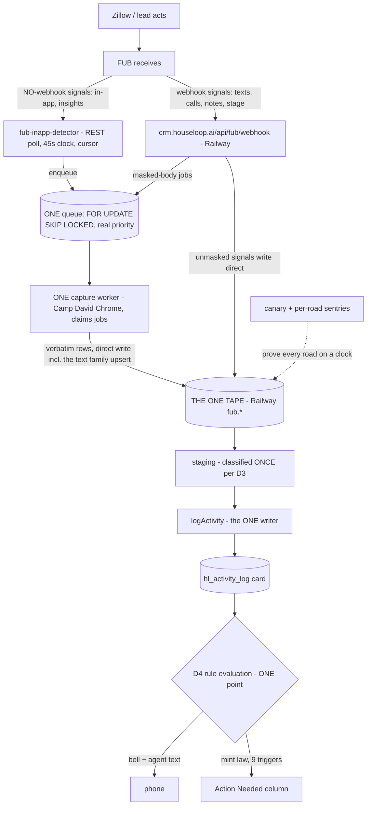

> **← [Chapter 1 · The FUB Pipeline book](/fub/fub-pipeline-board)** ·
> **[Chapter 8 · the operator's manual](/fub/master-scraper-ssot)** ·
> **[Chapter 9 · where this is going (D3 staging)](/fub/staging-import-prd)**
>
> **THE BOARD (system of record):** [crm.houseloop.ai/boards/fub-pipeline](https://crm.houseloop.ai/boards/fub-pipeline) — items **24 through 41**.
>
> **STATUS: ARMED 2026-08-22 NIGHT — BUILD IN EXECUTION, DESK-SIGNED.** Zach's verbatim delegation,
> 8/22 night: *"i'm not signing off on anything, you sign off on the whole thing… you build the whole
> thing"* and *"you build the fub captain and camp david as cattle right fucking now and you finish it
> tonight."* The signature model changed: **Lee's desk signs every gate below**; Zach signs nothing
> in this build. The night-build section that follows is the governing spec; the target-architecture
> chapters further down are its foundation and remain binding.

---

# ⚡ THE 8/22 NIGHT BUILD — the executed captain (desk-signed gates)

## Why tonight (the failures Zach named, each now a gate)

One live test in-app message on 8/22 exposed the estate end to end: **no detection** for in-app
(no webhook exists; the sweep component was never scheduled — zero automatic runs ever) · **a fake
priority queue** (47,900/47,900 pending rows stamped `high` = pure FIFO since May) · **a severed
tape road** (the relay quarantined by a table-grain census that missed the text family's second
writer path) · plus the standing diseases Zach listed verbatim: broken toggles, broken
notifications, intermittent saved searches and property inquiries, rentals misclassification,
multi-hour ("37 hours") inquiry latency. Every one maps to a gate below. The full arrival law:
[THE ZILLOW IN-APP SOP](/fub/master-scraper-ssot#-the-sop--how-a-zillow-in-app-message-arrives-zach-ordered-2026-08-22-written-from-a-live-trace).

## The build diagram — the ONE road every FUB signal rides

**What the diagram forbids (the wall):** no second queue, no relay hop, no component that captures
without enqueueing through the ONE queue, no notification decided anywhere but the D4 point, no
process that isn't repo-canonical + heartbeat-instrumented.

## The gate ladder — Lee signs each, with the receipt named

| gate | what must be true | proof required (no proof = not signed) | state |
|---|---|---|---|
| **G0 — the road works end to end** | a live Zillow in-app send reaches tape → card → bell → Action Needed | the timestamped chain on a fresh fire (gauntlet lane witnessing) | ✅ **SIGNED 22:04Z 8/22** — Zach's OWN send: FUB 22:02:01 → detected 9s → card+bell 22:03:57 (1m56s) → **SMS received on Zach's handset, confirmed by him live** ("got it!"). Receipt: gauntlet RECEIPT-R3 + this ledger |
| **G1 — detection on a clock** | in-app detection runs scheduled, cursor-correct, heartbeat it writes itself | live daemon + first-run receipt; then the Inngest port with its first scheduled `hl_run_log` row | ✅ **SIGNED** — live, 9s detection on the final proof; seen/settled cursor redesign proven red-first; Inngest port = the hardening slice, in flight |
| **G2 — the queue is real** | priority means priority; one queue; SKIP-LOCKED claims; no starved rows | pending-high census before/after + the July-four claimed | ✅ **SIGNED** — two rounds (47,764 + 102 stale-high → low; reversals kept); pending high = the live traffic only; job_queue fold = follow-on |
| **G3 — the tape road is direct** | every capture family writes the Railway tape with no relay; text family upserts (never wipes `notified_at`) | per-family cargo-map verification + a live row landing | ✅ **SIGNED** — proven twice live (the recovered strand + Zach's send); upsert never touches notify stamps; emails/calls writer-path census = follow-on |
| **G4 — every notification road proven** | each of the 9 mint triggers + notify kinds fires a real bell/text through the ONE D4 point; every toggle actually gates | per-kind live-fire receipts; a toggle flipped off provably stops the send | 🔨 |
| **G5 — classification is data** | no signal misfiles (the rentals disease); every mapping a registry row; unknowns to review, never a catch-all | registry diff + replay proof on the rental fixture (shipped 8/22 AM) | ✅ partial (rental re-point proven) · 🔨 full-registry verify |
| **G6 — Camp David is cattle** | the box runs the minimal named set, every process repo-canonical + deploy-scripted + heartbeat; everything else pm2-deleted and ledgered | pm2 roster == the manual's roster == the repo; kill-and-rebuild drill from git | 🔨 |
| **G7 — the manual** | one clean captain manual, unmistakable from legacy; the legacy chapter carries a CONDEMNED banner pointing here | the page live on Mintlify; the SOP + cargo map + gate receipts linked | 🔨 (SOP shipped; manual tonight) |

**Standing rails, unchanged by the delegation:** the `fub.*` tape is verbatim and never edited ·
backup-first before any destructive step · every quarantine goes in
`.claude/reports/fub-captain/QUARANTINE.md` with its reversal · a component "existing" is nothing —
**a clock and a first-run receipt or it doesn't exist** (the sweep sat unscheduled for months; that
class of lie is what G1/G8-style receipts kill).

## Landed tonight before this section was written (receipts on the board)

the webhook canary's first scheduled run green (`injected:true, arrived:true`, 21:17Z) · the in-app
detector live with a self-healing last-poll-floor cursor · the queue re-baseline · the stage-6b
direct text road deployed (md5-verified both sides) · the SOP + cargo map in the manual · the fake
priority-queue and never-scheduled-sweep autopsies on the record.

---

## The order this answers

Zach, 2026-08-19 night, verbatim:

> *"all of this multiple databases double direction things pointing at the wrong things need to not
> exist at all."*

This escalates the 8/18 commission — *"everything enterprise level robust this is unacceptable"* —
from **harden** to **quarantine**. The nine signed slices (board items 10-19) do not change. The
Captain is the **shape they land in**.

## The one sentence

**One service owns Follow Up Boss.** It has one database target, one queue with one consumer, one
capture engine with three arms, one deploy identity, and one sentry board. Nothing outside it opens
a FUB connection or calls the FUB API — enforced by a cage, not by an agent remembering.

This is the **one-door rule** ([BEDROCK_LAW](/bedrock-prd) layer 3) applied to an *integration*
rather than to the activity log. Same disease, same cure, same enforcement shape.

---

## Why a wall and not a convention

Every FUB failure in the 8/18-8/19 arc traces to a **second way of reaching the same thing.** Not one
of these is a coding mistake. Each is a place where two doors existed and only one was watched.

| the second door | what it cost |
|---|---|
| Two databases answering to one env-var name | *"every hand-run check looked at the wrong database and 'proved' the rows were fine"* — for weeks |
| A second CRM socket beside the chokepoint | found in the fleet census (#160), flagged as a one-door breach |
| Two rosters naming one process | the declared topology and the running topology can disagree with nothing to catch it |
| A live fix on the box, an older copy in the repo | the fix that closes the in-app bell gap exists in exactly one place, unversioned |
| Three capture arms, three notions of "enrolled" | a brand-new lead's first message was invisible for ~2 hours |

A chokepoint nobody *can* bypass is a wall. A chokepoint you are asked to *remember* is a
convention, and conventions are what the 8/19 ledger is a list of.

---

## Current state — measured, not remembered

Everything in this section was read on **2026-08-19**, read-only, by the lane that wrote this page.
Re-run before quoting. Never quote a number from memory.

### The two tapes — same name, same hour, different contents

| | Camp David | Railway |
|---|---|---|
| `current_database()` | `bossloop` | `railway` |
| `fub.*` tables | 29 | 30 |
| `fub.text_messages` | 392,183 | 398,742 |
| `fub.text_messages` newest | 2026-08-19 16:37:33Z | 2026-08-19 16:37:33Z |
| in-app rows (`zillow_inapp`) | 13,602 | 14,769 |
| tables the OTHER one lacks | `relay_state` | `body_recovery_heartbeat`, `zillow_inapp_ghost_quarantine` |

Both are **current**, so this is not a stall. It is two live tapes with one name and different
shapes. `fub.people` on Railway holds **49,249** rows — the preserved book, intact.

**The name is the trap, and the code says so itself.** From `fub-inapp-sweep.mjs`, in its own
`main()`:

> *"`DATABASE_URL` names TWO DIFFERENT DATABASES on this box: pm2's commonEnv gives
> localhost:5432/bossloop (Camp David, correct), while /Users/lee/.env gives the Railway MIRROR.
> This file's own pending-query autopsy below is the cost of that trap going unchecked — 'every
> hand-run check looked at the wrong database and "proved" the rows were fine', for weeks."*

Until the trap is gone, **every operation asserts `current_database()`, never the env-var name.**

### The frozen cluster

`fub.webhook_event_log` last row **2026-07-09 19:36:25Z** (224,867 rows). `fub.poll_state`'s newest
cursor **2026-07-09 19:23:48Z**. Same day, same cause: the retirement of the realloop dashboard
receiver — ruled **observability, not the road** (board item; task #165).

`fub.poll_state` holds exactly three cursors, every one stopped:

| key | value | last updated |
|---|---|---|
| `last_call_id` | 42365 | 2026-05-31 19:02:28Z |
| `last_people_activity_ts` | 2026-05-31T19:02:28Z | 2026-05-31 19:02:28Z |
| `last_event_id` | 1796130 | 2026-07-09 19:23:48Z |

The pollers that wrote them (`fubEventsPoll`, `fubCallsNotifyPoll`, `fubPeopleActivityPoll`) live in
`apps/dashboard/server/fub-webhooks.ts` — the retired receiver. **This is not a broken job. It is a
backstop that was decommissioned with its host and never replaced or written off.** The decision
owed is in the target architecture below.

### The queue

Railway `fub.body_recovery_queue`, live window: **157 error · 35 done.**

The larger email-arm pile (2,284 error rows, 8/11 to 8/18) is a **documented disable, not a
failure** — every error string is the same deliberate refusal: *"email_recovery_disabled (FUB
compose incident 2026-06-23); body arrives via emailsCreated webhook when FUB exposes it."* The
record outranks the reading. No fix owed; one hygiene item (stop enqueuing jobs whose only fate is
refusal).

### The fleet

`pm2 jlist`, read-only, five FUB apps online:

| app | script | restarts | proposed verdict |
|---|---|---|---|
| `fub-body-recovery` | `fub-body-recovery-consumer.mjs` | 2 | **ABSORB** — it is the Captain's consumer |
| `fub-relay` | `fub-relay.mjs` | 0 | **RETIRE** on the one-tape slice — it exists only because Camp David is a database |
| `fub-chrome-guard` | `fub-chrome-guard.mjs` | 0 | **ABSORB** as the browser supervisor |
| `fub-webhook-scraper` | `fub-webhook-scraper.mjs` | 0 | **ABSORB** into the one capture engine — it is an arm, not a service |
| `fub-home-refresh` | `fub-home-activity-refresh.mjs` | 1 | **ABSORB**, carrying the #161 caution on its face |

Correctly **not** running: `fub-backfill-a`/`-b`, `fub-watchdog`, `fub-sync` (the ventilator — down
permanent).

Every verdict lands with its **FACT column** named, never a pm2 status. The whole autopsy is that
"online" is a pid, not a working process.

### The code — the box and the repo do not agree today

sha256 over 11 scripts, repo (`tools/fub-scraper/`, `tools/fub-sync/`) versus Camp David
(`/Users/lee/`): **10 identical, 1 divergent.**

`fub-body-recovery-consumer.mjs` — repo 619 lines, box **637** (mtime 2026-08-19 05:48). The diff is
the **file-at-capture** change: the consumer now carries the just-captured row *in* the POST instead
of waiting on the relay.

**Read the direction carefully.** The box copy is the NEWER one. The fix that closes the in-app bell
gap is live on the box and **absent from the repo** — so "re-deploy the repo copy" would *undo* it.
This is not rot; it is a hand-deploy with no gate in either direction.

And the file predicted itself. From `tools/fub-scraper/deploy.sh`, in its own header:

> *"shipping a file by hand is how the box and the repo stop agreeing"*

— which also flags `body-recovery-watchdog.mjs` as sitting in the same exposure class, noted and not
fixed. Separately: `/Users/lee` holds **38** `fub*.mjs` files and **is not a git repository**. Most
are dead one-off probes from April sitting beside the ten that are load-bearing.

### Two rosters name one process

`ecosystem.config.cjs` registers the app running `fub-webhook-scraper.mjs` under the name
**`fub-webhook-sink`**; the live process reports as **`fub-webhook-scraper`**. The same config still
declares `fub-backfill-a`/`-b` and `fub-watchdog`, none of which run.

This cannot be fixed by editing the file alone, and `deploy.sh` says why:

> *"A change to this file does NOT take effect on `pm2 reload` — pm2 keeps the first registration's
> env. It needs `pm2 delete` plus `pm2 start ecosystem.config.cjs --only` for that app."*

So the declared topology and the running topology drift with nothing to catch it — and the thing
most likely to read the wrong one is a future agent working out what is alive.

### The CRM side

| what | where |
|---|---|
| The FUB connection chokepoint | `apps/houseloop-crm/lib/fub-import/fub-db.ts` — **32** files import it |
| The webhook door | `apps/houseloop-crm/app/api/fub/webhook` |
| The webhook router | `apps/houseloop-crm/lib/inngest/functions/fub-webhook-router.ts` |
| The capture callback | `apps/houseloop-crm/app/api/fub/body-recovered` |
| Other `/api/fub/*` routes | `ai-draft`, `fire-counts`, `import`, `inbox`, `lead`, `rebackfill`, `reply`, `sync-master`, `webhook-settings` |
| The classifier | `hl_event_mapping` (CRM DB) — the registry as data |
| The one ledger | `hl_activity_log` (CRM DB) — every signal ends here as a card, via `logActivity` |

---

## The live defect this PRD is standing on

Zach sent an in-app Zillow message from a consumer test account at **12:35 PM on 8/19**. It never
reached a tape, a card, or a bell. Three defects **stacked**, and any one of them alone loses the
message:

1. **ENROLLMENT GAP (capture).** In-app messages have no webhook; only the scrape road sees them,
   and a brand-new person is not in the rotation. Invisible for about two hours until a scrape was
   fired by hand. This is the capture-side twin of the filing-side bell gap (#158) — same disease,
   one layer earlier.
2. **DIRECTION INVERSION (tape).** Both recovered rows were stamped `is_incoming=false` though the
   **lead** wrote them. Same class as #180, measured from the other side.
3. **REFUSAL CASCADE (filing).** The writer refuses "outbound" texts by design (#188), so the
   backwards stamp made the card impossible even after recovery. Verified: zero message-kind rows on
   that lead after recovery.

Meanwhile the **same person's** tour request rode the webhook road and carded in about **5 seconds**.
The roads are not equally broken — the event roads work; the in-app scrape arm is the one that fails.

**The desk did not hand-file the two cards.** On the record, 8/19: *"the fix goes in the road, not
the row."*

**The architecture-locking fact.** Zach then checked his Zillow Premier Agent inbox: the message is
absent there too. The full map — the message travels Zillow app → Tech Connect → the FUB person-page
thread, skipping the Zillow PA inbox, FUB notifications, and the FUB REST API entirely. So **the FUB
person page is the only machine-readable surface that carries a new lead's first in-app message.**
The capture slice anchors there. Notification polling can only ever be supplementary.

---

## Target architecture — the Captain

### 1. One wall

A name-ban cage — the proven `hl/no-raw-send` shape, banning the **primitives by name** so
constants, types and probes from the same modules stay importable — makes a FUB connection string or
an `api.followupboss.com` fetch **outside the Captain** a red push.

It ships in **report-only mode first** (measure who is outside before banning anything), turns on at
**zero violations**, and is **proven to go red on a plant** before it counts as enforcement. A rule
that cries wolf gets switched off, which is worse than no rule.

### 2. One database target

Camp David writes the one tape **directly** — the shape `fub.zillow_home_activity` has already used
successfully since June. The relay dies with the hop. Camp David becomes the **browser host** it
actually is, and stops being a database. The two-tapes-one-name trap dies with it.

Until then: assert `current_database()`, every operation, every time.

### 3. One queue, one consumer — that cannot hang silently

`fub.body_recovery_queue` is the one work queue. The 8/19 incident proved the consumer can be
**alive with its poll loop dead** — the process was up, its own heartbeat had been red since 04:26Z,
and a real client's overnight message sat in the queue until a human looked. A watchdog now reads
the queue from **outside** the consumer. That fold-in becomes part of the Captain rather than a
bolt-on, and it carries the queue-hygiene slice with it: a feeder may not enqueue work for a
disabled consumer, dead-letter policy is explicit, and the uniqueness constraint narrows so an
errored resource can be re-queued.

### 4. One capture engine, three arms

The three mechanisms stay — they are physically different roads — but they become one engine with
one roster and one cadence.

| arm | mechanism | status |
|---|---|---|
| **Webhooks** | 20 active FUB subscriptions, all pointing at `crm.houseloop.ai/api/fub/webhook` (verified 8/19, 20 of 20) | live, minutes-fresh |
| **API discovery** | `GET /v1/people?sort=-lastInboxAppMessage` — the one FUB API surface that can see in-app activity at all, returning **who** has it and **when** | proven instant, 8/19 |
| **Browser scrape** | the person-page timeline as DATA via `fub-timeline-source.mjs` (since 8/11); DOM only as a loud, declared fallback | live |

The discovery arm's **per-person watermark** is hard-won and non-negotiable. A global cursor let one
person's fresh message make four other leads permanently undiscoverable — the code's own comment
records the cost: *"Zach lost tour requests to this."* Nobody may hide behind somebody else's
recency.

**Enrollment becomes event-driven:** a webhook mint triggers an immediate targeted person-page read,
so a brand-new lead's first in-app message is captured in seconds instead of whenever the rotation
happens to reach them.

### 5. One deploy identity

`deploy.sh` gains a `--verify` mode that hashes both sides and **refuses on mismatch**, and the
Captain's health surface reports the hash pair. What is running becomes a measured fact rather than
an assumption — and the only copy of a live fix stops living on one Mac's disk.

### 6. One sentry board

Per **(signal × arm)**, four rules, each earned by a measured failure:

1. **The key is per direction, not per capture.** The outbound in-app arm has been stale since
   2026-08-16 07:09Z with no alarm, because the inbound arm of the same capture kept the shared
   column fresh (#195). One probe masks its twin.
2. **The probe reads the FACT column** — the row the road writes. Never `synced_at`, never a
   heartbeat, never a pm2 status. The ventilator re-stamped freshness onto a mirror frozen for five
   weeks and every dashboard read healthy.
3. **A component never testifies about itself.** The 8/19 hang was found from outside the consumer;
   its own heartbeat was screaming into a log nobody reads.
4. **Stamped-versus-FILED, with age.** A captured row that never became a card is exactly the #158
   shape, and only this comparison sees it.

⚠ **The delivery half is not done.** #177 is open: the pager cannot reliably reach a human. A sentry
board whose alarms cannot arrive is the same disease with extra steps — 1,103 perfect self-diagnoses
written into a log nobody reads is what started this.

### 7. The open decision — the API backstop

**Does the Captain need a poller behind the webhooks?** A webhook FUB never sends is invisible to us
today; the three cursors that would have caught it stopped in May and July. Either answer is
acceptable — build the backstop, or write `poll_state` off as a tombstone. **Silence is not an
answer**, and it has been the answer since July. This is board item 33.

---

## The migration order

Nothing changes on a big-bang day. Each step is proven before the next.

1. **The wall, report-only** — measure who is outside it before banning anything.
2. **Deploy identity** — you cannot migrate code you cannot prove you are running.
3. **Capture consolidation** plus the three in-app defects — the user-visible one Zach is waiting on.
4. **One database target** — the relay dies here, and the two-name trap dies with it.
5. **Queue and consumer fold**, plus the daemon absorptions.
6. **Sentries go red-proven** *before* the old ad-hoc checks are removed.
7. **The wall goes enforcing.** The script graveyard and the roster are cleaned last, when nothing
   depends on being able to hand-run.

### What dies

The relay · Camp David as a database · the ad-hoc hand-run scripts · the two-name env trap ·
`fub-sync` (already down permanent) · the dashboard's FUB screens (*"Its FUB screens are dead to me
— retire them"*).

### What never dies

**The raw tape** (Bedrock D3 — verbatim, never edited). **The preserved 49k history.** And **the
browser scrape itself** — the acquisition question is closed: *"going direct to zillow doesn't
work… we have to scrape."* The scrape is the primary road and it gets hardened, never replaced.

---

## What this PRD does not touch

- **The SRG past-client refinery.** Different estate, SISU/dotloop-sourced, `hl_srg_*` stays frozen.
  The two meet only where a past client's Zillow signal files onto their lead — which the fixed
  pipeline already does correctly.
- **The 28 signed signals.** Signed, locked, and derived from `hl_event_mapping`. The Captain changes
  how signals *arrive*, never what they *are*.
- **The D3 staging layer.** That is [chapter 9](/fub/staging-import-prd) and it is about people, not
  capture. The Captain feeds it; it does not replace it.
- **Any import.** Nothing here imports anyone.

---

## Standing laws this composes with

[BEDROCK_LAW](/bedrock-prd) (the one-door rule, D3's untouchable tape, D2's FUB-is-a-pipe) ·
**ONE ANSWER TABLE** (a fact lives in one place; the era is a column) ·
**INNGEST OR IT DOESN'T EXIST** (an event id is not proof a function ran; only the run is) ·
**RULE #0** (no autonomous destructive SQL — every retirement step naming a table needs Zach's typed
approval in-session) · **ONE TREE, ONE BRANCH**.
