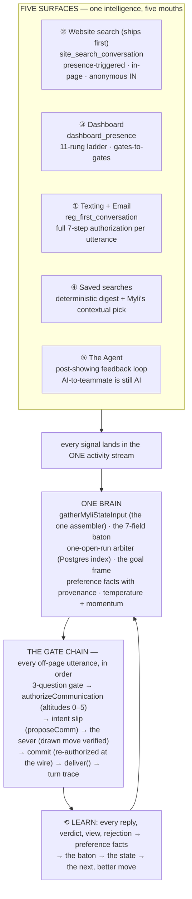

> **Zach, 2026-08-27, ruling #37:** *"ONE NAME FOR ALL OF MYLI'S PROGRAMMING: **THE MYLI OS.**
> State engine · playbooks · the Director · the review queue · the AI test cockpit · the prompts —
> **ALL sections of ONE document. No more parallel docs.**"*

This is that document.

**It replaces six pages, which were retired into it on 2026-08-27:** `the-myli-engine`,
`myli-state-master`, `myli-closed-loop`, `myli-playbooks-spec`, `ai-programming`, and the legacy
`test-harness`. Their URLs redirect here. Nothing was summarized away — where a page carried a
signature, a wording bank or a measured table, it moved verbatim.

**Two standing rules for reading it:**

1. **Where anything here disagrees with a Zach verbatim, the signature wins.** His signature block
   and the three signed addenda are in §2, moved word-for-word with their dates.
2. **Every DB number in this document has a date on it.** Several statements inherited from the
   8/23 pages had hardened into "the reason we cannot ship" and were false by the time anyone
   re-read them — two were caught and corrected on 8/27 (§2 marks both). Treat an undated number as
   unverified and re-run it.

⚠ **This page is long on purpose and that was ruled, not chosen.** Folding six pages into one
produces a document you scroll rather than skim; the index below is the mitigation Zach specified
(ruling #39: *"an INDEX of its sections at top"*). If it should be split again, that is his call to
make and not a lane's.

## The index

| § | section | what it answers |
|---|---|---|
| **§0** | **The spine** | How the whole thing fits together in one sentence, what is actually built, and what is still waiting on Zach |
| **§1** | **The state engine** | Where each person is, the goal stack she pivots on, and why tasks are her clock |
| **§2** | **Playbooks** | Workflow vs playbook, the G0–G7 ladder, the cadence, the compliance spine, the governance chain — **and Zach's signature block + three addenda** |
| **§3** | **The Director** | The half of her that watches the conversation and steers tone and pace — what it steers today, and what it does not |
| **§4** | **Myli's Desk (the review queue)** | The surface where a human approves, reworks, edits or re-rolls what she wants to say |
| **§5** | **The AI test cockpit** | The visual testing ground — the signed simulator requirement, and what exists today |
| **§6** | **The prompts** | The prompt registry, the assembly order, the voice law, and the per-rung wording |
| — | **Shipped and undocumented** | Live modules with tests and zero mention in any doc |

**What is NOT in here, deliberately:** the [AI Containment Law](/command-center/ai-containment-law)
(a constitutional law file — this document links it and never copies it) and
[The Test Town](/command-center/test-town) (the QA persona and endpoint registry — a fixture list,
linked from §5). The two generated boards, [the state-engine
checklist](/master-plan/myli-state-engine) and [the AI board](/master-plan/myli-ai), stay generated;
their items are the checklist for this document.

## §0 · The spine

### The one sentence

**A person is in a STATE. The state decides the GOAL. The goal picks a PLAYBOOK. The playbook is a
set of drawn MOVES. A move is authorized before it speaks, and only then does the LLM choose the
WORDS. When the playbook ends it leaves a TASK, and the task is what wakes her up again.**

Everything below is one of those nouns.

```
        ┌──────────────────── GOVERNANCE — the sever, the master switch, the gates ───────────┐
        │                                                                                     │
 STATE ─┴─→ GOAL ──→ PLAYBOOK ──→ MOVE ──→ [authorized?] ──→ LANGUAGE ──→ the message
   ↑                    │                                                        │
   │                    └─→ or a WORKFLOW (deterministic canvas, no model)        │
   │                                                                              ↓
   └──────────────── TASK (her clock) ←──── run closes ←──── the reply comes back ┘
```

- **STATE** — where this person actually is, derived from the tape, never hand-maintained.
- **GOAL** — what she is driving toward right now. It is a **stack**, not a single value: she can
  pivot into financing mid-showing, work it, and come back to the exact line she left.
- **PLAYBOOK** — Myli-composed. A model writes the words. **WORKFLOW** — deterministic, drawn on a
  canvas, no model in the loop. Two different things and we never call one the other.
- **MOVE** — one drawn step. Whether it may send derives from its **kind**, and who composed it is
  recorded **per move**, not per playbook.
- **LANGUAGE** — the prompt. Code owns the goal; the LLM owns the language, and never the reverse.
- **TASK** — a real CRM row, assigned to Myli, that she reads. This is what makes her time-aware.

---

### ⭐ The decisions waiting on you

Four.

✅ **THE FINANCING LINE — RULED 2026-08-24, struck from this list on 8/27.** It sat here as blocking
decision #1 ("Myli owns the logistics and hands off the advice — yes or no?") for four days after you
had already answered it. **You ruled she owns financing:** the UNHOBBLING ruling below, verbatim —
*she owns questions and guidance, gives rough estimates with the always-disclosure, recommends and
offers to CONNECT to the named lender (John Nelson, Fountain Mortgage), captures every answer as a
fact, and ties back to the live goal.* The ruling and the open question were on this same page,
three hundred lines apart. **The financing frame is armed by that ruling** — see
[THE UNHOBBLING](#the-unhobbling-myli-as-houseloops-chatgpt-ruled-2026-08-24-zach-verbatim).

| # | the decision | why it cannot be decided without you |
|---|---|---|
| **1** | **The cooling and habit NUMBERS.** How many silent days is cooling? How many cancellations is a habit? | The mechanism is derived from the tape and needs no storage. The thresholds decide when she backs off a real person — that is a judgement call, not a default. |
| **2** | **The task sweep's CRON.** | The build is the desk's. Per the Inngest law the schedule is yours, after you have watched one real run: *"not a deploy, a decision."* |
| **3** | **The FLIPS.** Turning the showing-coordination playbook on. Widening the first playbook past the test band. Activating the deterministic registration workflow drafts. | Each one is the moment something starts speaking to somebody. You held the widening until the two-sided flagship passes in the simulator — that run is scheduled for Thursday. |
| **4** | **The comms master.** Does Myli's `send_email` tool go behind the AI communications master? | Measured on 8/23: her **text** tool is gated and her **email** tool is not — `/api/email/send` hardcodes the composer as the system, which defeats the AI check. Meanwhile `ai_master` has read `false` since 2026-07-22 while AI-composed emails kept going out. That is the fake-switch shape the containment law exists to end, and resolving it is a knowing pick, not a migration default. |

**[→ every open item, on its floor, with a day](/master-plan/punch-list)**

---

### The six sections, one paragraph each

*(These were the spine page's own chapter summaries. In this document they are the orientation —
each one is the short version of the full section further down.)*

#### 1 · THE STATE — where each person actually is

State is four different things that people keep calling one thing, and separating them is most of
the design: the **stage** a lead is on (the ladder), the **goal** she is working right now, the
**temperature** of the relationship, and the **run state** of a playbook in flight.

The part built this week is the **goal stack**. Your own words for why:

> *"The person pivoted to financing — so Myli CHANGES STATE into financing, and in financing: what
> are my goals?… Then we pivot BACK into the next state — she knows the previous goal was the
> showing and she pivots back. **She has to know where the hard line was.**"*

So a goal is pushed, not replaced. The push records the frame, the run, the run state, the slot she
was working and why she left it. The pop **re-derives** rather than trusting a snapshot, because a
snapshot of a conversation goes stale the moment the conversation continues. Depth is capped at
two, so she can pivot and never spiral.

**And tasks are her clock.** This is the line that separates her from a chat model, and it is yours:

> *"The only thing with chat models: they're NOT PROACTIVE — they sit in a dead state, they're not
> time-aware. **MYLI IS ABSOLUTELY TIME-AWARE.** Myli's moving towards goals. Myli knows tasks…
> If Myli finishes the playbook for scheduling a showing, Myli SETS A PHYSICAL TASK IN THE CRM to
> follow up on the showing feedback. That task is VISIBLE, ASSIGNED TO MYLI, and Myli ACTUALLY
> READS that task."*

A finished run mints her a real task. A sweep reads her due tasks and starts the right playbook.
The task is the doorbell — never the script.

**Cooling and habit** come from the same tape, derived at read time: no stored score, no column, no
tier. There was a stored score once and it was retired; nothing writes it and nothing should.

**Status, honestly: none of this is built.** The architecture is designed down to the brick and no
code, no migration, no data write and no send exist yet. What it rides on is real — the handoff
executor has been shipped since July and has never run once.

**→ §1 · The state engine** — the goal side, the stack, the bricks

---

#### 2 · THE RELATIONSHIP — the ladder, the cadence, the compliance

The **G0→G7 gate ladder** is the canonical buyer journey. There is exactly one of them, on one
page, and that is deliberate — two ladders on two pages was a real drift that got removed, not a
hypothetical.

Around the ladder sit the three things that decide whether she is allowed to speak at all: the
**cadence policy** (how often, and how that decays with silence), the **compliance spine** (quiet
hours, opt-out, disclosure — all of it data in a rules band, never code), and **temperature and
momentum** (whether this relationship is warming or going cold).

**→ §2 · Playbooks** — the ladder, cadence, compliance, temperature

---

#### 3 · THE PLAYBOOKS — what she may do, and the door she does it through

**Vocabulary, ruled 8/23: WORKFLOWS and MYLI PLAYBOOKS. There are no "campaigns."**

- A **workflow** is deterministic. It runs on a canvas you can see, no model in the loop. Every
  action is a visible step on a visible path — if you cannot see the step do the thing, the step
  does not get to do the thing.
- A **playbook** is Myli-composed. A model writes the words, so every one of its moves passes the
  containment gate before anything leaves.

A playbook is a **set of drawn moves**, one row per move, and two properties live on the move
rather than on the playbook: **whether it may send derives from the move's KIND**, and
**`composed_by` is recorded per move**. That split is what lets a single playbook contain both a
deterministic beat and an AI-composed one without lying about either.

**What exists tonight:** three playbooks seeded **DISABLED**, carrying **18 moves**, restricted to
the test leads **as data rather than as a promise**. The moves table now holds **23 rows** after the
handoff move landed. The lead-facing coordination moves are drawn, banded and inert — and their
**copy is unproven**, which is a real gap: today they read off a first-touch brief written for
someone who does not have Myli's number, so mid-conversation she would re-introduce herself.

**The five gates to live**, the same for every playbook: the move set is drawn · the sever refuses
without a drawn move · the recipient band holds · it passes two-sided in the simulator · **you flip
it on**.

**→ §2 · Playbooks** — the signed spec, the three launch playbooks, your addenda

---

#### 4 · THE WORKFLOWS — the deterministic half

The first workflow build-out is **HouseLoop registrations**, deterministic, on the canvas.

The premise flipped when it was measured: registrations **already run on 11 live canvases**. Nine
of them carry Myli beats, which makes those nine a **playbook estate to migrate** rather than a
workflow to port. Two clean deterministic v2 canvases were drafted through the API, walked, and
left **inert**. The cutover is one decision — swap the welding, activate the beats.

The law that governs all of it: **the canvas is the truth.** No hidden cross-links, no step shared
between branches, each branch complete to its own terminal step. A green database result over a
broken-looking canvas means the canvas is right and the data is lying to you.

---

#### 5 · THE LANGUAGE — the prompts and the wording

⭐ **Code owns the GOAL. The LLM owns the LANGUAGE.** Everything above this section is code's job;
this section is the model's.

It covers the **prompt registry** — every live prompt slot and its one runtime home, with the two
deliberately different editing surfaces and the draft-then-promote plumbing; **prompting doctrine**,
where every rule was paid for in blood; how the **voice**, **text** and **first-touch/email** lanes
each assemble their system prompt; the **one working memory** that keeps her a single brain across
channels; and the **per-rung wording** — the Voice Law that governs every buyer-facing message, the
banned words, the question bank, the agreement beat, and the gold-standard real thread from 7/24
that everything else is written against.

The **Director** belongs here too, and its status is precise: the goal-tracking half is **BUILT** —
it observes, scores and persists — and it **steers no live lane**. Built is not steering, and the
page says so rather than rounding up.

**→ §6 · The prompts** — the prompt registry, the doctrine, the wording

---

#### 6 · THE TOOLS AND THE SEVER — how an AI action is authorized

**If a human cannot point at the exact visible step that authorized an AI action, the AI is not
allowed to perform it.** Absence of authorization is a refusal, never a default-to-send.

Every AI-originated message passes one gate, and the gate sits **before transport** — so switching
her off removes every channel at once. Your own framing: *"whether Myli sends a Twilio text or a
blue bubble text or a smoke signal or unleashes a homing pigeon — if I toggle her off she shouldn't
have access to anything."*

The gate checks, in order and parent-first: the master · communications · the specific AI · the
channel · a real playbook execution · **the exact drawn step** · that the step may send · business
hours (or a *visible* delay, never a hidden clamp) · not suppressed.

**Two catalogs, not one master.** **AI Communications** — Myli messaging, clones, AI notifications,
AI-composed workflow texts — has the kill switch. **AI Systems** — SEO, vision tagging, summaries,
dossiers, call analysis — stays **on**, and the comms master does not touch it. Deterministic system
notifications are in neither catalog and are never silenced by an AI toggle, because muting the
pager when you mute the AI is how an outage goes unnoticed.

**What is genuinely shipped:** one transport function is the only door to all eight provider
primitives, the primitives are banned by name repo-wide by a linter that was turned on at zero
violations and proven to go red on three planted ones, and an unrouted channel is denied at the
door at compile time. An AI-composed in-app message with no drawn move is refused and **writes no
message row at all**.

**Where it still leaks:** decision 5 above — her email tool.

**[→ AI Containment Law — the gate, the two catalogs, the open decision](/command-center/ai-containment-law)**

---

### 7 · What is actually built — the honest table

| the piece | state | the one fact behind it |
|---|---|---|
| The transport sever (one door to every provider) | **🟢 SHIPPED** | linter on at zero violations, red on three plants; 34 outbound assertions |
| Playbook moves as data, may-send from kind, `composed_by` per move | **🟢 SHIPPED** | 23 move rows; 3 playbooks seeded **disabled** |
| The partner leg — a governed AI message to a teammate | **🟢 PROVEN LIVE** | first one fired 8/23; its first attempt had no facts and **asked for the address instead of inventing one** |
| The simulator (7 scenarios + real multi-turn) | **🟢 PROVEN** | 7/7 against the real engine, zero strays; multi-turn unblocked by keying intent on an occasion |
| The lead-facing coordination moves | **🟡 DRAWN, DISABLED, COPY UNPROVEN** | no lead-facing coordination move has ever composed or sent |
| The Director's goal tracking | **🟡 BUILT, NOT STEERING** | it observes, scores and persists; it steers no live lane |
| The registration workflows | **🟡 11 LIVE CANVASES, 2 DRAFTS INERT** | 9 of the 11 carry Myli beats — a playbook estate, not a port |
| The state stack (goal stack, hard line, resume) | **⚪ DESIGNED, NOTHING BUILT** | no code, no DDL, no data, no send |
| Tasks as her clock | **⚪ DESIGNED** | the one task door comes first and closes three live defects on its own |
| Cooling, warming, habit | **⚪ DESIGNED, NUMBERS UNSIGNED** | derived reads only — no stored score, no column, no tier |
| The comms master over her email tool | **🔴 OPEN — SHE IS UNGATED THERE** | `ai_master` has read false since 2026-07-22 while AI-composed emails kept sending |

---

### 8 · The build order — brick by brick

Your instruction was *"we're gonna have to build it brick by brick — but that's what I need you
for,"* and the order is chosen so the cheap common path exists before the expensive rare one, and
so nothing mints a fact through a door that has not been built yet.

1. **The correction** — the feedback moves leave the coordination playbook and become their own,
   because you ruled that scheduling ends when the showing is booked and feedback is the next state.
2. **The frame stack and its one door** — zero new columns; the field it lands on is untouched today.
3. **The hard line and the resume** — push records where she was, pop re-derives it.
4. **The run-level pivot** — a run can suspend and another can resume it, both as visible moves.
5. **The one task door** — five raw inserts and one raw clear fold onto it. This is worth doing on
   its own merits: it closes three live defects, including a dismissed task that still fires its
   queued AI action at a real lead.
6. **Run close mints her task**, then **the sweep reads it** — event-only until you flip the cron.
7. **The tally and the trend**, derived. Then **write-back as signals**, which is honestly blocked
   on a layer that does not exist yet and is stated rather than routed around.

**[→ Floor 42 — the state stack, with every brick as a checkbox and a day](/master-plan/floor-42)**

---

### ⭐ THE UNHOBBLING — Myli as HouseLoop's ChatGPT (RULED 2026-08-24, Zach verbatim)

> *"I want to unhobble the LLM... Myli needs to be the ChatGPT on the home-buying process, on
> taxes, how PMI works — all customized to HouseLoop and Overland Park and the Kansas City metro
> and our process. She needs to be a ChatGPT with the ability to help you buy or sell a house all
> through HouseLoop."* — and on financing specifically: she owns questions and guidance, gives
> rough estimates with the always-disclosure, recommends and offers to CONNECT to the named
> lender (John Nelson, Fountain Mortgage), captures every answer as a fact, and ties back to the
> live goal. The quality benchmark is a captured ChatGPT answer in the source record.

**The three-layer design (the build spec's spine):**

| layer | what it is | why it wins |
|---|---|---|
| **1 · Unhobble the posture** | The model under Myli already knows what ChatGPT knows — the fence was our own instructions. New posture: **answer first → disclose → tighten with a question → capture the fact → tie back to the goal.** A prompt change, not a model change. | She stops deflecting questions her brain can already answer |
| **2 · Ground with our truth** | Retrieval before she answers: **the listing's ACTUAL tax bill** (we hold it — ChatGPT used a placeholder), a **live rates feed**, KC/Johnson County local facts, our process docs, the named lender, Zach's rulings. General knowledge fills gaps; **the knowledge base overrides with local truth.** | More accurate than ChatGPT in our metro, by construction |
| **3 · The rails make it go somewhere** | The goal stack + fact capture + personalization + the lender connection + the booking. She answers the PMI question, records "$20K saved" forever, reframes 123 Main against their real budget, and returns to the showing. | The moat: no general chatbot holds the data, the memory, or the ability to book the tour |

Plus **model escalation**: hard questions route to the deeper model, easy beats run cheap — the
same tiering the build desk runs its own lanes on.

**The build items** (a floor's punch list, lands on the schedule): the financing / home-buying /
selling KNOWLEDGE BASE, KC-customized · the live rates feed · listing-facts injection (taxes,
HOA, the real numbers) · the unhobbled posture prompts through the one prompt registry · the
escalation router · the disclosure habit as copy law. Source record:
`.claude/reports/myli-state/ZACH_STATE_DICTATION_2026-08-23.md` (the ruling, the benchmark, and
the design, all verbatim).

**The line that governs it:** being cheap is not being ungoverned — every answer still composes
through the LANGUAGE layer and every send still passes the SEVER; the unhobbling changes what she
is allowed to KNOW AND SAY, never what she is allowed to SEND.

---

### The ownership map is retired

The spine page ended with a map of which of the four pages owned which fact, so they could not
drift apart. **Ruling #37 removed the need for it: there is one page now, and this is it.** The map
is preserved in git history at `docs-site/command-center/the-myli-engine.mdx`.

## §1 · The state engine

*Primary source: the retired `myli-state-master` page, moved whole. Its §7 — the
reverse-engineering research — is kept verbatim because nothing else in the estate carries it.*

### 1 · The one-page answer

Myli decides in one direction, every time, and each arrow is a real thing you can open:

```
WHO IS THIS         →  the person's facts and history        (the activity tape)
WHAT IS THE GOAL    →  the goal FRAME, now a STACK           (§3 — new tonight)
WHO IS DECIDING     →  the playbook RUN (exactly one, ever)  (the playbooks spec)
WHAT MAY SHE DO     →  the DRAWN MOVES on that playbook      (the playbooks spec)
WHEN                →  presence, a reply, or HER OWN TASK    (§4 — new tonight)
WHAT DOES SHE SAY   →  the composer, per lane                (AI Programming)
```

**Two properties make this different from a chat assistant, and they are the whole product:**

1. **She holds an explicit goal, not an implied one.** A chat assistant's goal lives in the transcript
   and survives only as long as the transcript does. Myli's lives in a row.
2. **She has a clock, and the clock is her own commitments.** A chat assistant acts when spoken to.
   Myli acts when something she promised comes due.

§7 shows that both of these are genuinely absent from every shipped assistant we could verify — not
because they are hard, but because nobody selling a general chatbot needs them.

---

### 2 · The four things "state" means (they are not the same thing)

The word "state" is used for four different facts in this system. They live in four places on purpose,
and collapsing any two of them is how a goal gets lost.

| the fact | the question it answers | where it lives |
|---|---|---|
| **The rung** | *where is this person in their journey?* | the 11-rung ladder, derived — **§2 · Playbooks** (G0→G7) |
| **The goal frame** | *what is she trying to achieve right now?* | `hl_lead_convo_state.ledger` — **becomes a stack in §3** |
| **The run** | *which playbook is deciding for this person?* | `hl_playbook_runs`, exactly one open, enforced by the database |
| **The run's state** | *how far into this playbook did she get?* | `hl_playbook_runs.state` — **this is "the hard line"** |

---

### 3 · ⭐ THE STATE STACK — pivot, and come back

> **Zach, 2026-08-23:** *"The person pivoted to financing — so Myli CHANGES STATE into financing, and
> in financing: what are my goals? … Then we pivot BACK. She knows the previous goal was the showing.
> She has to know where the hard line was: 'I got to this stage in the playbook before they pivoted.'"*

**Status: DESIGN, awaiting redline.**

#### The problem, stated exactly

Today "what is Myli driving toward" is a **single value**. So when a person changes the subject
mid-goal, there are only two things the system can do, and both are wrong:

- **Refuse to move** — she finishes the showing conversation before acknowledging the question.
  Zach ruled this out by name: *"If I'm talking to ChatGPT, it doesn't tell me 'let's finish this
  topic so I can start another topic.'"*
- **Overwrite the goal** — she switches to financing, and **the showing goal silently ceases to
  exist.** There is no row anywhere recording that it was interrupted rather than achieved.

⛔ **That second one is the dangerous one, because it looks fine.** A pivot written into a single
value is byte-identical to a legitimate goal advancement. The ledger reads "Financing," progress
re-derives against financing's checklist, and a tour that was two answers away from booked simply
stops being anything anyone is driving toward. **Nothing downstream could ever detect it.**

#### The fix: the goal is a stack

```
BEFORE the pivot        [ Book the showing ]                     ← she is here
THEY ASK ABOUT MONEY    [ Financing, Book the showing ]          ← pushed; the showing is bookmarked
FINANCING RESOLVES      [ Book the showing ]                     ← popped; she picks up where she left off
```

**Four rules govern it:**

1. **A pivot PUSHES; an achievement ADVANCES.** Two different futures that must never look the same.
   An advancement means the goal was met and is gone. A push means the goal is unmet and is waiting.
2. **The bookmark is a position, never a photograph.** The stack stores *where she was standing* —
   the frame, the run, the hard line, the question she was working. It does **not** store what she
   knew. ⭐ **That is deliberate and it is the better answer:** what she knows is derived from the
   facts, so if the person mentions their budget while talking about financing, **the showing goal is
   further along when she returns than when she left.** A saved snapshot would restore her to a
   position that was already out of date.
3. **The stack is short.** One active goal, one waiting. A third subject does not lose the first — it
   converts to a task (§4). A conversation juggling three suspended goals is one where a person would
   write something down, and so does she.
4. **She does not always come back.** Sometimes the new subject is the more important one, and §3.2
   decides that from data we already have.

#### 3.1 When the playbook changes too

Most pivots are just a change of subject — she answers in the same conversation, on the same channel,
and nothing about who is governing needs to move.

**But sometimes the new goal needs an action the current playbook cannot take.** Then governance moves,
and it moves visibly: a drawn step that **suspends** the current playbook rather than ending it, with
a return address on it. The suspended one is frozen — it cannot speak, cannot advance, cannot be seen
by anything looking for the active playbook — until she comes back to it.

⭐ **The rule for which happens is mechanical, not a judgement call:** *does the current playbook
already have a step that serves the new goal?* If yes, only the goal moves. If no, governance moves.
This matters because a change of governor writes cards onto the lead's record, and a system that did
it on every change of subject would bury the record in noise.

⭐ **And this does not weaken the one-playbook-per-lead rule at all.** That rule exists to stop *two
playbooks texting one person* — measured, in blood, on real clients. **A suspended playbook texts
nobody**, and it is prevented from doing so by the same five guards that already exist, not by a new
one. That is why this is an extension of the design rather than an exception to it.

#### 3.2 Which goal wins

The weighting already exists and is already signed — six tiers, in order:
**a live human · an opt-out · an offer · a tour · a recovery · a nurture.** Nothing new is invented.
The resume rule reads, in order:

1. **A live human in the conversation pauses everything.** The stack survives; she just stops.
2. **The person returns to the old subject → she returns with them.** They are the authority on what
   this conversation is about, and this needs no weighting at all.
3. **The new goal completes → she goes back to the old one**, at its bookmark.
4. **The run is closing and the goal is still unmet → it becomes a task** (§4).
5. **The new goal is genuinely the more important one → she stays.** ⭐ In the flagship case this
   answers itself: **financing is the gate AFTER the showing on the ladder Zach already signed.** So a
   financing pivot that completes is not a detour — it is the next gate, arrived at early.

⛔ **No new score, no new weight, no new number is proposed here.** The temperature and momentum
weights in **§2 · Playbooks** are explicitly **not yet reviewed
by Zach**, and inventing a second set of weights on this page would smuggle them in through a side
door. The five rules above are decidable from things already signed.

---

### 4 · ⭐ TASKS ARE HER CLOCK

> **Zach, 2026-08-23:** *"If Myli finishes the playbook for scheduling a showing, Myli SETS A PHYSICAL
> TASK IN THE CRM to follow up on the showing feedback. That task is VISIBLE, ASSIGNED TO MYLI, and
> Myli ACTUALLY READS that task — tasks are triggering her to follow up. Myli's operating just like a
> human would."*

**Status: DESIGN — and see the finding below, because he asked for this once already.**

#### The loop

```
A GOAL ENDS  →  she writes herself a task     assigned to Myli · due when she said · on the lead
                (and anything still on the stack becomes a task here too)
                       ↓
THE TASK COMES DUE  →  she looks at it, looks at the person, and DECIDES what to do now
                       ↓
SHE ACTS  →  through the same governed, drawn, authorized path as every other message
```

#### Why a task and not a timer

There is already a timer in the CRM, so this has to be argued rather than assumed. The two are not
duplicates, and the difference is the founding distinction of the whole playbook engine:

|  | a scheduled action | **a task** |
|---|---|---|
| decides **when** | at write time | at write time |
| decides **what** | **at write time** — the message is already chosen | **when it comes due** — she looks at the situation and chooses |
| is | a plan made in advance | **a decision deliberately postponed** |

⭐ **A scheduled action is a pre-baked instruction. A task is an obligation she reasons about when she
gets there.** That is exactly what *"operating just like a human would"* means, and it is why the
answer is a task even though a timer exists. Both stay: the timer keeps its job (fire this exact
message at this exact minute), and the task owns *I owe this person something by this date.*

#### Why this is not a "staleness window"

Zach has already ruled — **no staleness tiers, no reset, one continuous relationship.** A due date is
time-based, so the question is fair. The difference is structural:

| a staleness window | a task |
|---|---|
| the **system** decides a category from elapsed time | **she** made a commitment and set the date |
| a verdict about **the person** — *"this lead is cold"* | a fact about **the obligation** — *"I owe this Thursday"* |
| **resets** the relationship | ⛔ **nothing resets** |
| invisible policy | a **visible row** a human can open, change, or cancel |
| fires because time passed | fires because **a promise came due** |

The ruling's own second clause licenses it: *elapsed time is a **fact she speaks to***. A due date is
exactly such a fact, and it is the only kind of time-awareness that is honest, because it traces to
something **she** said rather than to a decay curve someone chose.

⛔ **Two guardrails so it cannot drift back into a window:** a task never changes how she *treats*
someone, and **an overdue task is a signal about US, never about them** — if it ever feeds the cooling
math in §5, the window has come back in disguise.

#### ⭐ THE FINDING — he asked for this on July 6, it was built, and it has never run

The code already exists, and it carries the dated order in its own comment: *"TASK-FIRST (Zach
2026-07-06): the scheduled follow-up MUST surface as a first-class TASK Myli reads — her 'next action'
is a visible task row, not a hidden scheduled-action reason."* It assigns to Myli's real CRM seat. It
cancels stale tasks first so they cannot pile up.

**It has written zero rows in production.** It sits behind a switch that was never turned on, and its
backstop job was never scheduled.

**So tonight's order is the second time it has been given.** This is the same pattern the playbook
spec already names — a shape specified repeatedly and shipped never. The response is to **finish what
is there**, not to write another version of it. Three things it is missing, all of which are live
defects today independent of this design:

1. **There is no single front door for creating a task.** Five places create them their own way; four
   of those never file the activity, and two write a status the rest of the system does not use.
2. **A task Myli creates would be recorded as made by a human.** The one good path hardcodes it.
3. **Nothing anywhere reads task due dates on a schedule.** The database index for it exists and has
   never been used.

⚠ **And the sweep that reads them has a trap in its shape:** on a day with nothing due it does nothing,
which looks identical to a job that is dead. It has to report *"I ran, nothing was due"* — otherwise
the first silent failure is invisible for as long as it lasts.

---

### 5 · Cooling, warming, and habit

> **Zach:** *"Is this person cooling down, do they do this habitually, was this the first time they
> canceled."*

**Status: SHAPE designed. ⛔ Every NUMBER is Zach's, and the existing weight proposal on the
**§2 · Playbooks** is explicitly not yet reviewed by him.**

#### Three questions, and two of them are the same measurement

| the question | what it actually is |
|---|---|
| *was this the first time they canceled* | a count, read at one |
| *do they do this habitually* | **the same count, with a denominator** |
| *are they cooling down* | a **trend** — their engagement against their own earlier rate |

⭐ **So this is one tally and one trend, not three detectors.** "First time" and "habitual" are the
same number read at different points, and merging the tally with the trend is how a single mystery
"temperature" number gets born — which the CRM has already retired once, for exactly this reason.

⚠ **A habit claim without its denominator is not a finding.** Two cancellations out of two showings is
a habit. Two out of twenty is a person with a life. And a cooling claim measured against other people
rather than against **this person's own** normal is a staleness window wearing a lab coat.

#### Two rules that keep it honest

1. **Nothing here is a stored score.** Every answer is derived from what actually happened, and it
   carries its reasoning, so a human can click it and see why. The system already retired a score
   column that no one ever wrote and that silently broke every rule pointed at it.
2. **Cooling is a signal, not a status.** It changes what she *says* and what she looks at first. It
   never expires anyone, never resets a relationship, and never files a person into a tier.

⚠ **Honest dependency:** the table that would let these be saved, named, and subscribed to does not
exist yet. Until it does, these are computed when a decision is made and cited in the record.
Recommendation: **compute first, save later** — a saved signal with nothing to own it is precisely the
dead column above.

---

### 6 · The transitions Zach ruled on tonight

| ruling | what it settles |
|---|---|
| **Showing coordination ends at the booking** | The scheduling playbook closes when the showing is scheduled. Getting feedback afterwards is a **separate playbook**, entered by a visible transition. This overrides the desk's earlier reading, and it moves two planned steps onto a new playbook before they are drawn. |
| **Off-topic gets answered inline** | She never tells a person to finish one subject before starting another. This is what §3 exists to make safe. |
| **Turning coordination on** | *"It needs to absolutely be able to happen"* — the flip stays Zach's decision at the two-sided proof. |

✅ **RULED 2026-08-24 — the collision below is CLOSED, and this section is kept as the record of how
it was resolved, not as an open question (corrected 8/27).** Zach's UNHOBBLING ruling answers it in
the direction this section proposed and then some: **Myli owns financing** — she answers the
questions and gives guidance, gives rough estimates *with the always-disclosure*, recommends and
offers to CONNECT the person to the named lender (**John Nelson, Fountain Mortgage**), captures every
answer as a fact, and ties back to the live goal. The "advice versus logistics" table below is the
shape she runs, with the disclosure as the rail that keeps guidance on the right side of the licensed
line. **The financing pivot is armed by that ruling.** Full text:
[THE UNHOBBLING](#the-unhobbling-myli-as-houseloops-chatgpt-ruled-2026-08-24-zach-verbatim).

⛔ **THE COLLISION AS IT STOOD ON 8/23 (historical).** The signed addendum from the same afternoon makes
**lending and financing advice a hard handoff to a human**. Tonight's ruling makes financing a goal
Myli works. Both cannot be executed as written.

**Proposed line — advice versus logistics:**

| Myli owns | Myli hands off |
|---|---|
| "here's our lender — want an introduction?" | "should I put five percent down or twenty?" |
| "here's what they'll ask you for" | "can I afford this house?" |
| chasing the pre-approval letter until it lands | "is this a good rate?" |
| recording that they are pre-approved | any recommendation about money |

The three handoff triggers he signed — legal, lending, negotiation — are all **licensed-advice**
boundaries. They are about opinions, not about a subject being unmentionable. And the financing goal's
own mission, written weeks before he asked the question, is already routing rather than counsel: *get
them pre-approved and connected to our lender.* **But this draws a legal line, so it is his signature
and not ours.** ⭐ *(That sentence stood until 8/24. **He ruled — see the box at the top of this
section.** The financing pivot is armed.)*

---

### 7 · What we found reverse-engineering the chat assistants

> **Zach's order:** *"Reverse engineer how any AI lead conversion works — how ChatGPT works, how
> Anthropic works: what state are you using on the back end?"*

**The honest headline: no major chat assistant publicly documents anything like this.** We searched
OpenAI's, Anthropic's, Google's and Microsoft's own documentation. They all publish **memory,
retrieval, and summarization**. **None publishes a mechanism for suspending a goal and returning to
it.** Detailed accounts of these internals do circulate online; they are outsiders guessing, and
nothing here rests on them.

**So the real answer to the question is:** the pivoting you notice in ChatGPT is real, and it is **not
a machine we can copy.** It happens because the whole conversation is handed to the model every time
and the model infers what matters. That is a capability — and it is also the liability, because:

- ⭐ **A study of exactly our situation** — a task spread across a natural, wandering multi-turn
  conversation — measured an **average 39% drop in performance**, in every leading model tested. Its
  conclusion is the sentence to remember: ***"When LLMs take a wrong turn in a conversation, they get
  lost and do not recover."***
- **Models attend best to the beginning and end of what they are given and worst to the middle.** A
  goal stated once and then buried under a digression **is** the middle.
- **When a conversation gets long, the tools that shorten it cut the middle** — OpenAI's own
  documentation says its automatic truncation drops items from the middle of the conversation, and
  Anthropic's own guidance warns that summarizing can lose *"subtle but critical context whose
  importance only becomes apparent later."*

**And the structure Zach described is real — it is just 40 years old and lives somewhere else.**
Academic work from 1986 formalized conversation as a **stack of attention** that is pushed on a
digression and popped when it ends. It ships today in enterprise bot builders: Google's Dialogflow
documents preserving the call stack and resuming with already-answered steps skipped.

#### ⭐ The two deltas — and they are exactly §3 and §4

1. **They are implicit; we are explicit.** Every documented assistant keeps conversation state as a
   flat list of messages. There is no field anywhere for a suspended goal. So the "coming back"
   behavior cannot be reading one — and it depends on the goal still being in the window, which is
   the thing that gets cut first. **A goal that survives only by staying in view will eventually not
   be there. §3 puts it in a row.**
2. **Every shipped scheduler is a human writing a cron.** ChatGPT's scheduled tasks, Gemini's
   scheduled actions, Anthropic's scheduled agents — all real, all documented, and in all of them **a
   person writes the schedule.** ⭐ **In none of them does the assistant derive a commitment from
   something it said in a conversation.** *"She said she'd follow up after the showing, therefore she
   owes a follow-up"* is not a documented capability anywhere. **§4 is that missing piece.**

#### One free win it hands us

Because models attend worst to the middle: **when she returns to a suspended goal, restate it at the
END of what the model is given, not somewhere in the history.** Same for anything that summarizes a
long conversation — the active goal and its answers are **pinned and never summarized away.**
Anthropic's own warning is that a summarizer cannot know what will matter later. **Our stack knows.**

---

### 8 · The build, brick by brick

> *"We're gonna have to build it brick by brick — but that's what I need you for."*

Every brick: proven broken before it is proven fixed, nothing outside the test leads, and no playbook
goes live without Zach flipping it. Live status is tracked on
[the state-engine board](/master-plan/myli-state-engine) — this is the order, not a second checklist.

| # | the brick | why it is here |
|---|---|---|
| **0** | **Fix the queued step list** so the two post-showing follow-ups move to the feedback playbook | §6 — otherwise the first thing built after Zach's ruling contradicts it |
| **1** | **The goal becomes a stack** | Free today: the single value it replaces is **set on zero records live**. That stops being true the first day a real lead is enrolled. |
| **2** | **The bookmark and the return** | The hard line, and re-deriving progress rather than restoring a snapshot |
| **3** | **Suspending a playbook** | Only needed for the rarer case in §3.1, so it is built after the common one — never speculatively |
| **A** | **One front door for creating a task** | Fixes three live defects on its own, and is worth doing even if the rest were cancelled |
| **B** | **A closing goal writes Myli her task** | Finishes the July code instead of writing a fifth version of it |
| **C** | **She reads her own due tasks** | Ships **unscheduled** first — ⭐ **Zach turns the clock on**, and only a real watched run counts as proof it works |
| **D** | **The tally and the trend** | After she has a goal to prioritize and a clock to act on — cooling changes nothing until then |

---

### ⚠ The `/ai/state-engine` CRM page is a copy of this section, not a cockpit

Zach, 8/27: *"I have no clue what `/ai/state-engine` even is."* **The page earns the confusion.** It
is on the left menu (`app/components/Sidebar/Sidebar.tsx:69`, labelled "State Engine") and it looks
like a cockpit, but it is **a document wearing a CRM page's clothes**:

- 174 lines, five sections: where the build stands · the MVP playbook's states · the profile ladder
  · the engine's laws · one open decision.
- **The playbook table (7 rows), the ladder (8 rungs) and the six laws are hardcoded literals** in
  the page file (`app/(crm)/ai/state-engine/page.tsx:35-43` and `:47-56`) — not read from
  `goal-frames.ts`, not read from `hl_playbooks`.
- **Exactly one live data point:** a single `fetch('/api/ai/state-engine/status')` at `:63`
  returning `{tableExists, stateRows, distinctLeads, latest}`, which drives one status chip.
- Nothing on it is interactive. There is no "run the engine" affordance. Its own header comment
  says so: *"This page is the record of the design + its build status."*

**A CRM page whose content is a hardcoded copy of a document is a second home for the same fact** —
ONE_ANSWER_TABLE applied to prose. The two will drift, and the page has no way to know when it has.

**The recommendation, and it is a decision the desk is holding for Zach, not one it made:** retire
the route and leave a link to this section, OR keep the page and re-source its three hardcoded
tables from the real estate (`lib/ai/goal-frames.ts`, the `hl_playbooks` rows) so it stops being a
hand-maintained twin. **The route is untouched until he rules.**

## §2 · Playbooks

*Primary sources: the retired `myli-playbooks-spec` (the governance half, and the home of the
signature block) and `myli-closed-loop` (the relationship half — the G0–G7 ladder, the cadence, the
compliance spine, the measurement spine). Both moved whole.*

⭐ **Two claims in this section were measured false on 2026-08-27 and corrected before the fold, not
after.** Both had been cited as blocking facts since 8/23:

| the claim, as it stood | the measurement that killed it |
|---|---|
| `writeLedgerSlot` is **STARVED — zero callers**, "or gates-to-gates is dead on arrival" | `lib/ai/convo-state.ts:163` defines it and **:198, :207, :223, :224, :246** call it. The code's own header at `:170` says it in the past tense: *"the starvation the S1 receipt flagged: writeLedgerSlot **had** ZERO…"*. The S2 lane landed the feeders and no doc was updated. |
| `QUIET_HOURS` is a **FAKE GATE — zero producers** repo-wide | `lib/playbooks/engine.ts:1793, 1803, 1821` writes a denied trace row naming `QUIET_HOURS` beside a pending scheduled action carrying its release time — the file's own words, *"defers loudly, never drops."* Reader: `lib/business-hours.ts:101-121`, fail-closed on a DB error. Rendered to a human at `components/myli-desk/desk-state.ts:350`. |

**The lesson the desk kept from this, because it is more valuable than either correction:** both
sentences were written by lanes that measured correctly *on the day they wrote them*. Nothing
re-measured them for four days, and in that time both had hardened into reasons not to ship. A
merged document that copied them forward would have shipped with two already-unblocked blockers
presented as law. **Treat every undated DB number below as unverified.**

### The authority

**Zach, 2026-08-23 morning, near-verbatim:**

> *"The Myli playbooks would be the part where Myli sends out the text message on those
> [registrations]. You kind of get the spec already written in the workflows, and you should be
> able to text Myli back and forth on that. Also, the Myli playbooks are on the houseloop website
> for whenever you talk to Myli. Whenever you talk to Myli on the search, like on the search with
> Myli, that's a playbook, that's a Myli playbook. There's also the playbook for whenever there is
> somebody in the dashboard."*

And the vocabulary ruling from the same batch:

> *"There are no Myli campaigns, just workflows and playbooks. Playbooks might be Myli playbooks."*
> … *"you can build out your first houseloop registrations on workflows, anything that's
> deterministic."*

<Warning>
**⛔ THE WORD "CAMPAIGN" DOES NOT APPEAR IN THIS BUILD.** Not in a table name, a UI label, a code
identifier, or a conversation. There are two nouns: **WORKFLOW** and **MYLI PLAYBOOK**.
</Warning>

### §0 · The census — what already exists (measured, not remembered)

This section exists because the measured history of this exact architecture is that it was
**specified three times and shipped zero times** (the per-step row was promised in migration 0001
as `hl_node_executions` and again in 0461 as `hl_playbook_turn_trace`; the tool-grant layer was
designed in full in `0003_hl_state_machine.sql` and never built). **A fourth specification that
mints new nouns is the disease, not the cure.** So: what is already here.

| Piece | File / table | State (as measured 8/23) |
|---|---|---|
| **Playbook definitions** | `hl_playbooks` (mig 0461) | Table EXISTS. Carries `key`, `mission`, `exits`, `priority`, `enabled`. 0 rows at spec time. |
| **The run row** (= `playbook_execution_id`) | `hl_playbook_runs` (mig 0461) | EXISTS + has writers since 8/18: `apps/houseloop-crm/lib/playbooks/runs.ts` — `openPlaybookRun` / `closePlaybookRun` / `handoffPlaybookRun` / `updateBaton` / `openRunFor` |
| **One-playbook-per-lead arbiter** | `hl_playbook_runs_one_open_per_lead` partial unique index | LIVE. A second open run is refused **by Postgres**, not by app code |
| **The decision trail** | `hl_playbook_turn_trace` + `lib/playbooks/turn-trace.ts` | EXISTS + written. `spoke` / `denied` with reason; indexed on DENIALS |
| **The baton** | `hl_playbook_runs.baton` jsonb, typed `PlaybookBaton` | 7 fields: whyImHere · priorGoal · known · blank · alreadySaid · sentiment · newFacts |
| **Close vocabulary** | `CLOSE_REASON` (`runs.ts`) | `goal_met · exit_fired · handed_off · outranked · lead_muted · abandoned` — the reason DECIDES the status |
| **The one evaluator** | `lib/ai/comms-security.ts` | LIVE. Altitudes 0 → 5, propose/commit intent slips, fail-closed |
| **The sever** | `lib/ai/authorized-send.ts` | LIVE. An AI cannot send without a committed intent — not "is gated", CANNOT |
| **The transport facade** | `lib/comms/deliver.ts` + `hl/no-raw-send` | LIVE at 0 violations. 8 provider primitives are private behind it |
| **Goal frames** (the closest thing to playbook CONTENT) | `lib/ai/goal-frames.ts` | 4 frames: `buyer_book_showing` · `buyer_lender` · `buyer_nurture` · `seller_listing_appt`. Each carries an ordered **"what she still needs to learn"** checklist + a mission + exits |
| **The floor** ("Myli is never idle") | `lib/ai/ensure-floor.ts` | LIVE, gated behind `ai_closed_loop.enabled` |
| **The catalog kinds for run governance** | desk-signed 8/18 | `playbook_started` · `playbook_ended` SIGNED, ship WITH their S3 writers. Move kind = the EXISTING `ai_director_move_chosen` |
| **The harness** | `tools/harness/` | 38 proofs; a catalog kind cannot be pushed without a green proof that FIRES the write-path |

#### The one fact that governed every date in this document

At spec time, a Myli playbook send was REFUSED — by design, at the sever. `verifyPlaybookExecution`
(`lib/ai/authorized-send.ts`) resolved the run, confirmed it open, and still denied:

```
playbook_move_unverifiable — playbook run <id> ('<key>') is open, but a playbook's
MOVE SET does not exist yet, so there is no visible step to verify '<stepId>' against.
The run authorizes a SCOPE, not a send. Refusing rather than assuming a step nobody drew.
```

That refusal was **correct and was never softened.** A run authorizes a SCOPE; a drawn move
authorizes a SEND.

<Info>
**HISTORICAL AS OF 8/23 (same day — the spec's own scheduled flip).** The S1 lane landed move-set
storage and flipped `verifyPlaybookExecution`: refusals are now **per-move**
(`playbook_move_not_drawn` · `may_not_send` · `playbook_disabled` · closed-run), and a drawn
may-send move on an open, enabled run now authorizes — 14/14 green including red-first refusal
proofs (receipt: `builder-playbooks-s1/sever-postflip-GREEN.txt`). This is exactly the flip §6
scheduled (S3/S4); no contradiction.
</Info>

### §1 · The model

#### 1.1 A workflow

**A workflow is a deterministic sequence a human drew on a canvas.** A fixed rule fires a fixed
template; no model chooses the words or the moment. Its authority is the canvas: what runs is
exactly what is drawn (`WORKFLOW_CANVAS_IS_TRUTH`), each branch is a complete self-contained
chain, and nothing runs that is not a visible node on a visible path. Because no model is in the
loop, a workflow send is **not AI communication** — it bypasses the AI comms master and is
killable only by the SYSTEM-notification controls. Zach's scope for it, verbatim: *"anything
that's deterministic."* The registration welcome email, the branded saved-search results email, a
stage update, a tag, a task — all workflow.

#### 1.2 A Myli playbook

**A playbook is a policy over STATES with a GOAL, inside which Myli composes.** It is not a
day-sequence; the move is picked from **today's state**, never from enrollment-time. It carries a
mission (the business outcome), a state predicate (who it governs), a MOVE SET (the drawn moves it
may make), a channel policy, cadence + quiet rules, exits, and a priority for when a second
doorbell rings. Exactly ONE playbook governs a lead at a time — enforced by a Postgres partial
unique index, not hoped for in code — and when nothing specific claims a person, **the FLOOR
playbook governs**, because "ungoverned" is a gap that is invisible by construction. Because a
model writes the words, **every playbook utterance that leaves the page is AI communication**: it
must carry a real `playbook_execution_id` (an open `hl_playbook_runs` row) and a real `step_id`
(a drawn move), it is stamped `composed_by`, and the AI comms master can kill all of it at once.

**The one-sentence discriminator:** *did a model choose the words or the moment?* Yes → playbook,
gated. No → workflow, deterministic. **The discriminator is never the recipient** (an AI message
to a teammate is still an AI message) and never the node type — it is `composed_by`.

#### 1.3 Where they hand off — and why the handoff is a drawn step

A deterministic workflow reaches a point where the next thing needed is judgment. It does **not**
silently invoke Myli. It ends on a **visible terminal step: "Hand to Myli playbook `<key>`".**

This is the containment law's standby-handoff ruling applied: *"standby handoff = a VISIBLE
terminal step / playbook setting… nothing that communicates externally may run as hidden
middleware."* The handoff step:

1. is a real node on the canvas, with the target playbook key readable on it;
2. calls `openPlaybookRun({ leadId, playbookKey, openedBy, baton })` — the ONE door; nobody
   INSERTs that table directly;
3. **passes the BATON** — why I'm here · the prior goal · what is known · what is blank · what I
   already said · sentiment · new facts. This is what stops Myli starting cold and re-asking a
   question the workflow already answered (conversation rule 11: nothing is ever asked twice);
4. **authorizes nothing.** Opening a run is a scope, not a permission. The sever still demands its
   own slip for every utterance.

**And the reverse handoff exists too:** a playbook that meets its goal, is outranked, or hits a
human takeover closes with a `CLOSE_REASON` and may hand the baton forward
(`handoffPlaybookRun` → `next_run_id`). A lead is never left with no governor.

```
  ┌─ WORKFLOW (deterministic, canvas) ────────────┐        ┌─ MYLI PLAYBOOK (policy over states) ─┐
  │ trigger → template email → wait → branch      │        │ mission · state predicate · MOVE SET │
  │        → [ Hand to Myli playbook X ] ─────────┼──────► │ every move drawn · every send slipped│
  └───────────────────────────────────────────────┘ baton  └──────────────────────────────────────┘
     no model in the loop                                     a model writes the words
     killable by SYSTEM toggles                               killable by the AI COMMS MASTER
```

#### 1.4 What a playbook is NOT

- **Not a second brain.** A playbook is a POLICY that READS the one state object; it never
  assembles its own user state. Assembling state outside the one assembler is the ratchet-banned
  second-brain disease.
- **Not a per-edge-case artifact.** A new playbook when the **GOAL** changes; a new **state** when
  only the situation changes. Edge cases are DATA (facts + KB entries), never new playbooks —
  that is what stops 957,000 edge cases.
- **Not a place tool grants get re-decided.** Deny-by-default is enforced at the authorization
  gate, never in the editor.
- **Not exempt from the canvas law.** A playbook's moves are DRAWN. "The state decided it" as
  sole provenance is the midnight-text shape wearing a new word.

#### 1.5 The resolution the three playbooks force: `composed_by` is decided PER MOVE, never per playbook

This is the one place §1.1/§1.2's clean binary would break if left as written, so it gets argued
here rather than discovered in a build.

**The measured fact that forces it:** Zach named the dashboard a playbook (*"there's also the
playbook for whenever there is somebody in the dashboard"*) — and the dashboard Myli that exists
today **contains no model call at all.** `resolveMyliStateName` is an if-ladder; every voiced line
is a signed string composed by code from state (`state-engine.ts`, `VOICED` set, lines pinned by
`state-engine.test.ts`); `MyliDashboard.tsx` never fetches `/api/myli/converse`. By §1.2's
discriminator the dashboard would be… a workflow. But it is obviously not a day-sequence either —
it is a policy over states with a goal, which is the exact definition of a playbook. Meanwhile
playbook ① already contains the mirror image: its `escalate_to_human` move is a deterministic team
notification living INSIDE an AI playbook.

**So the two axes separate, and each governs what it actually governs:**

- **The playbook/workflow split is about SHAPE** — *is the next action picked from today's state
  (playbook), or from position in a drawn sequence (workflow)?* This decides which engine runs it,
  what the editor looks like, and what "the canvas" means for it.
- **The `composed_by` stamp is about KILLABILITY, and it travels on the MOVE** — *did a model
  write these words?* A composed move is AI communication: it needs the full authorization chain
  and dies when the comms master dies. A templated move inside the very same playbook is
  deterministic: it survives the master (the pager stays on when you mute the AI — the Monica
  Zinn rule) and is killable by the SYSTEM controls instead.

This is not a new law — it is the containment law's own settled ruling (*"gate on `composed_by`,
never on node type"*) applied at the right grain. What it buys, concretely: the dashboard playbook
ships TODAY as a fully-templated playbook and the comms master correctly does not silence it; the
day a model-composed chat move is added to it, THAT MOVE alone inherits the gate and the kill
switch, with zero re-architecture. **A playbook is a policy; AI communication is a property of a
move.** Every move in §3–§5 carries its `composed_by` explicitly for exactly this reason.

### §2 · The three launch playbooks — at a glance

⚠ **STALE-BY-GROWTH, corrected 8/27 — "three" is the signed LAUNCH set, not the catalog.** These
three are what Zach signed to ship first and that ruling stands. But the estate has grown past them
since: migrations `0836_showing_coordination_playbook` and `0892_shopper_cadence_playbook` seed two
more, and the live `hl_playbooks` table now carries **six** rows — `dashboard_presence`,
`reg_first_conversation`, `shopper_cadence`, `showing_coordination`, `showing_feedback`,
`site_search_conversation`. Read this section as *the launch order*, never as *the inventory*.

| | ① REGISTRATION TEXTING | ② SEARCH-WITH-MYLI | ③ DASHBOARD PRESENCE |
|---|---|---|---|
| **Zach's words** | *"the part where Myli sends out the text message on those"* | *"on the search with Myli, that's a playbook"* | *"whenever there is somebody in the dashboard"* |
| **Surface** | SMS / iMessage (outbound, two-way) | houseloop.ai search — **in-page chat** | houseloop.ai logged-in dashboard — **in-page** |
| **Goal** | first real conversation → a next-step ask | a search that matches what they actually want | move the visible person one rung |
| **Leaves the page?** | YES — full containment gate | NO at launch (§4.5) | NO at launch (§5.5) |
| **Blocked by** | S3+S4 (MOVE SET) — *unblocked 8/23, see §0 note* | nothing structural — ships first | S3+S4 for any outbound; in-page can ship with ② |
| **Ships** | third | **first** | second |

**The order is not preference — it is the gate.** ② and ③ are in-page only at launch, so they can
be built, walked, and tuned while the MOVE SET storage is still landing. Building ② first also
means the composer, the leak guard, the state read, and the learning loop are all exercised on a
surface where a bad sentence costs nothing but a re-render.

### §3 · Playbook ① — registration texting

**What this playbook is NOT:** it is not the registration welcome email, not the branded
saved-search email, not the stage move, not the tag. Those are deterministic and belong to the
sibling `builder-regworkflows` lane's canvas workflows. **This playbook is the conversational arm
only**: the first text, the back-and-forth, and where it ends.

#### 3.1 Key + mission

- **key:** `reg_first_conversation`
- **mission:** *"Turn a fresh registration into a real two-way conversation, and land one honest
  next step."*
- **priority:** `offer` tier (below `human` and `opt_out`, above `nurture`) — so a live human
  conversation or an opt-out always outranks it.

#### 3.2 The trigger

**Catalog-keyed, per the Phase-4 reactions law — a trigger references a catalog KIND and cannot
name a kind that does not exist.**

- **kind:** `registration_completed` — a REAL catalog kind with a green harness proof
  (`tools/harness/proofs/registration_completed.proof.mjs`).
- **The trigger does NOT fire the playbook directly.** The registration WORKFLOW fires on that
  kind (deterministic sends first), and its terminal "Hand to Myli playbook
  `reg_first_conversation`" node opens the run. Two consumers of one kind, one of which is a
  workflow that ends in a handoff — not two independent doorbells racing for the same lead.
- **Precondition on the handoff node (drawn, readable):** the lead has a phone AND the phone is
  not suppressed AND no open run already governs the lead. If a run exists, the doorbell
  **ENRICHES THE BATON** instead of firing — it never races.

#### 3.3 The states

| State | Means | Myli's job |
|---|---|---|
| `opened` | run just opened, nothing said | make first contact |
| `awaiting_first_reply` | she spoke, they have not | hold; the expectation clock runs |
| `in_conversation` | they replied | work the lowest unfilled slot |
| `ask_made` | a specific next step was offered | hold for a yes/no |
| `stalled` | expectation clock expired, N touches spent | one escalation move, then exit |
| `handing_off` | a human needs this | notify + close |

**"What she still needs to learn" is NOT invented here** — it is `lib/ai/goal-frames.ts`'s `buyer_book_showing`
frame: name → number → area → price → representation → time. She works the **lowest unfilled**,
one thing at a time. **And she discovers, never interrogates** — representation is found by
*"Have you seen any other houses yet?"*, never *"are you working with an agent"*, which Zach
killed as *"the most horrible thing."*

#### 3.4 The move set (the drawn steps — S4's editor is where these are actually drawn)

| Move | Type | May send? | Notes |
|---|---|---|---|
| `first_touch` | send · sms/imessage | ✅ | one message. Photo + inline short link when a subject home exists |
| `reply` | send · sms/imessage | ✅ | answers what they said; advances one slot |
| `nudge` | send · sms/imessage | ✅ | ONE only, and only after the expectation clock expires |
| `escalate_to_human` | notify + assign | ❌ (team notification, not the AI lane) | closes the run `handed_off`. Per **Addendum 3**: fires ONLY on the four hard triggers (legal · lending · negotiation · "I want a person") — never on distress, and there is no warm transfer |
| `watch` | no-op with a reason | ❌ | the floor-shaped move — she says LESS, never nothing |
| `close` | terminal | ❌ | writes `playbook_ended` with its reason |

Only `first_touch`, `texts`, `email` and `ai_message` node types may authorize a send
(`SEND_STEP_TYPES`, `authorized-send.ts`) — a `tags` or `update_stage` node presenting itself as
send authority is a caller passing the wrong id, and it is refused.

#### 3.5 The authorization chain (every single utterance, in order)

1. **The three-question send gate** (playbook engine, BEFORE the containment gate): *Why this
   person? Why this message? Why now?* — answered **from the relationship state**. Can't answer
   all three → **HOLD**, and the hold is a `watch` move with a reason, not silence.
2. **`authorizeCommunication(req)`** — `lib/ai/comms-security.ts`, the ONE evaluator:
   - *Altitude 0* — audience is declared `person`. Undeclared → `AUDIENCE_UNDECLARED`; anything
     else → `WRONG_LANE`.
   - *Altitude 0.5* — basis is declared `chosen` (we initiated). Undeclared → `BASIS_UNDECLARED`.
   - *Altitude 1* — the AI comms master. Off → `MASTER_AI_DISABLED`. **2-second cache: off means
     off in seconds, not on the next deploy.**
   - *Altitude 2/3* — the ACTOR is the AI employee, always. Never the presented identity —
     evaluating the human whose name is on the envelope is privilege escalation by impersonation.
   - *The delegation check* — may this actor present as this identity, on this channel?
   - *Altitude 4* — the per-lead AI mic (`hl_leads.ai_responder`). Muted → `LEAD_MUTED`.
   - *Altitude 5* — **the playbook run**: exists, status open, belongs to THIS lead
     (`PLAYBOOK_WRONG_LEAD`), and `hl_playbooks.enabled` is not false (`PLAYBOOK_DISABLED`).
3. **`proposeComm(...)`** — the intent is WRITTEN DOWN before it exists as a message, carrying
   `playbook_run_id` + `playbook_step`. An identical proposal is refused as `DUPLICATE_ACTION`.
4. **`verifyDrawnStep` / `verifyPlaybookExecution`** — the run id AND the step id are **looked
   up**, never taken on the caller's word. (Flipped 8/23 — see the §0 note: a drawn may-send move
   on an open, enabled run authorizes; everything else refuses per-move.)
5. **Commit** — re-authorized immediately before the wire. Policy is re-evaluated, not remembered.
6. **`deliver()`** — the single transport. The 8 provider primitives are unreachable directly
   (`hl/no-raw-send`, 0 violations); an unrouted channel is a compile-time `never` plus a runtime
   throw.
7. **The trace row** — `recordPlaybookTurn({ outcome, reason, draftPreview })` with outcome
   `spoke` or `denied`. **A blocked message is the most valuable row in an audit**, which is why
   that table is indexed on denials.

**Fail-safe, restated because it is the whole point:** no `playbook_execution_id`, no `step_id`,
or a failed check → **REJECT. Never downgrade-and-send. A read error is a refusal, not
permission.**

#### 3.6 Channels

- **iMessage (913) 208-1633** via BlueBubbles when the number is Apple-capable; **Twilio SMS
  (913) 355-6809** otherwise. Both are behind `deliver()`.
- **Email is NOT this playbook's channel at launch.** The registration emails are the
  deterministic workflow's. One concept, one owner. *(Addendum 1 adds Myli's own contextual email
  as a follow-up arm — see the signature block.)*
- **Voice: never** in this playbook.

#### 3.7 Suppression + stop rules (all of them, and each one is a real check)

| Rule | Mechanism |
|---|---|
| STOP / unsubscribe | `hl_suppressions` (`lib/suppressions/suppressions.ts`) checked at the pipe, not only at compose |
| Lead texts anything | **the floor interrupts** (`interruptFloor`) and the state moves to `in_conversation`. She never talks over a live human |
| A human replies to the lead | run closes `handed_off` — `human` outranks every playbook tier |
| Per-lead AI mic off | Altitude 4 → `LEAD_MUTED` (also a `CLOSE_REASON`) |
| Comms master off | Altitude 1 → everything stops, every channel at once |
| **Quiet hours** | **REAL — corrected 8/27.** This row read "a declared reason code with **zero producers** repo-wide… the fake-gate shape" from 8/23 until today; it was true when written and is not true now. `lib/playbooks/engine.ts:1793, 1803, 1821` produces it as a **visible, scheduled deferral** — a denied trace row naming `QUIET_HOURS` beside a pending scheduled action carrying its release time (the file's own words: *"defers loudly, never drops"*). That is the VISIBLE send-policy behaviour this row demanded, not a hidden clamp. Reader: `lib/business-hours.ts:101-121`, fail-closed on a DB error. Rendered to a human at `components/myli-desk/desk-state.ts:350` |
| Touch budget | max **1** unanswered `nudge`, then `stalled` → escalate or close. Optimize reason-to-contact, never frequency |
| Never time-based | no move fires "because Friday arrived." Every move is state- and event-driven |
| `is_backfill` | never fires a move. Ever |

#### 3.8 What Myli composes vs what is templated

**Code owns the GOAL; the LLM owns the LANGUAGE.** The ladder decides what she is trying to
achieve right now; the model chooses the words.

- **Composed:** the sentence of every move — first touch, replies, the nudge.
- **Deterministic, never model-authored:** the short link (`houseloop.ai/h/<base62>`, inserted
  INLINE before the closing question so iMessage does not eat it into a preview card), the photo
  attachment, the saved-search URL and its count (the count and the link derive from the **same
  stored `searchUrl`** — recomputing from criteria is exactly how "See all 139" linked to 127
  results).
- **The leak guard is not optional:** the model wraps client copy in `<<<CLIENT_MESSAGE>>>`
  fences; code reads only inside; no fence → deterministic fallback; `containsAgentLeak()` BLOCKS
  at the choke. Fail-closed, because one leaked brief burns a client on first occurrence.
- **The voice is ONE voice** — `MYLI_IDENTITY` in `lib/ai/myli-voice.ts`. Change it there and
  every channel changes. A per-playbook prompt that lets her voice drift is the thing the
  one-brain law exists to prevent.
- **The 23 conversation rules bind** (`.claude/rules/MYLI_CONVERSATION_STYLE.md`). The two a
  state machine breaks by construction: **(20) an acknowledgment is EARNED, never printed by a
  router** — warmth follows comprehension, so no move may open with "Got it" before it has
  classified; and **(6) she never ends a turn without a question or a choice.**

#### 3.9 Learning-loop touchpoints

Every turn is an opportunity to make the NEXT turn better. A **preference fact** = belief +
confidence + **provenance** (observed ~72 percent, then stated, then must-have at 100),
household-scoped, written back into the activity stream **as a signal** — no new machinery, and
never a bare score column (`lead_score` was retired for exactly that).

- **On reply:** extract facts → write signals → `updateBaton({ newFacts, sentiment, alreadySaid })`.
- **On rejection:** *"I hate the exterior"* is training data, not a failure. Confidence moves
  only with evidence, and every fact shows its "because."
- **On close:** the baton carries forward to whatever governs next; the next playbook does not
  start cold.
- **The measurable bet:** cohort curves at 90/180/365/730 days. Traditional leads decay;
  HouseLoop relationships should mature. If they don't, the loop isn't learning.

#### 3.10 The harness proofs owed before ① goes live

Per BEDROCK: a catalog kind cannot ship without a green proof that fires the REAL write-path and
asserts the row. ① owes:

1. `playbook_started.proof.mjs` — open a run on the probe lead, assert the `hl_activity_log` row
   (kind, actor, sentence), assert the render.
2. `playbook_ended.proof.mjs` — same, with `close_reason` → `reason_clause`.
3. `ai_director_move_chosen` — flip from locked-and-unemitted to emitted, with its proof.
4. **The REFUSAL proofs — red-first, and these are the ones that matter.** Each must be *proven
   to go RED on the defect*, not merely observed green: no run → refused; run closed → refused;
   run belongs to another lead → refused; a step id not in the move set → refused; a non-send
   step type → refused; comms master off → refused **on every channel at once**; suppressed
   recipient → refused at the pipe; **a denial writes a `hl_playbook_turn_trace` row** — assert
   the row, not the return value. ⚠ Each arm needs its **own body and its own named author** — a
   shared fixture body is swallowed by the 120-second content-keyed dedup and every arm greens on
   one send.
5. **A two-way proof:** inbound text → floor interrupted → state `in_conversation` → next move is
   a `reply`, not a `nudge`. Assert the **resolver's sentence**, never the DB title.

### §4 · Playbook ② — search-with-Myli (the website)

**What exists today (measured):** the search conversation is LIVE and model-composed —
`components/site/AiSearchModal.tsx` → `POST /api/myli/converse` (strict json_schema, the STATIONS
ladder from `lib/myli/brain-prompt.mjs`, `MAX_TURNS 24`). It is stateless per call, it never
searches or invents a number (the schema gives her nowhere to put one — the search still runs
through the one engine), and it obeys the 23 conversation rules. **And it is governed by NOTHING
in the playbook estate:** no run row, no turn trace, no per-turn record of what she said or
refused to say. Zach's ruling converts exactly that: the conversation that already works becomes a
GOVERNED conversation, without breaking a thing that ships today.

#### 4.1 Key + mission

- **key:** `site_search_conversation`
- **mission:** *"Turn a search intention into a built search that matches what they actually
  want — and capture every fact they volunteer on the way."*
- **priority:** `nurture` tier. It never outranks a live human or ①'s open conversation — but on
  this surface priority is mostly moot, because the person is PRESENT and talking.

#### 4.2 The trigger — presence is the doorbell

There is no catalog-fired trigger and no cron. **The person opening the modal and typing IS the
trigger** — the same shape as the dashboard's "the render is the arrival." An in-page playbook
fires on presence, never on schedule. This matters legally as much as architecturally: every
utterance in this playbook is REPLY-BASIS (they spoke first, this turn answers them), never
chosen-basis. The three-question send gate answers itself on this surface: *why this person* —
they are in front of her; *why this message* — it answers what they just typed; *why now* — they
are waiting.

#### 4.3 The governance argument — what authorizes an in-page utterance

The containment gate sits at the TRANSPORT boundary — it exists so no AI message reaches
Twilio/Gmail/BlueBubbles without a drawn step. An in-page reply never touches a transport: it is a
synchronous HTTP response rendered to the one person who asked. Running the full Altitude-5 +
intent-slip chain on every chat turn would be gating a conversation with itself.

But "no transport" must never become "no governance" — that is how an ungoverned mouth grows. So
the in-page contract is:

1. **A model-composed utterance is still AI communication** (§1.5): the comms master (Altitude 1,
   2-second cache) and the per-lead mic (Altitude 4) are checked **before the model is called**.
   Master off → the modal falls back to the deterministic pills-only search builder and says so
   honestly. Myli goes quiet; the site never breaks. Zach's smoke-signal ruling applied: toggling
   her off removes EVERY channel at once, including this page.
2. **Every turn writes the trace.** For a signed-in person with an open run:
   `recordPlaybookTurn({ outcome, reason, draftPreview })` — the same table, the same denial
   index, as SMS. A conversation that cannot be audited turn-by-turn is the pre-8/12 shape.
3. **The run row is the SESSION.** Signed-in + known lead → the doorbell opens (or joins) a
   `site_search_conversation` run via `openPlaybookRun` — one door, arbiter enforced. If anything
   already governs the lead, the modal **does not race it**: the arbiter refuses a second run, so
   the conversation ENRICHES THE INCUMBENT'S BATON (`updateBaton`) instead. The words she says in
   the modal and the words she texts an hour later come from one governed state.
4. **The full send chain applies the moment anything would LEAVE the page** (§4.5). No exception,
   no "the chat already knew them."

**Anonymous visitors** (signed IN at launch — OQ-1): there is no lead, so there is no run — and
minting shadow leads for every anonymous session would poison the estate. The conversation runs
master-checked + trace-logged against the SESSION (pixel/session key), and **the run opens at the
identity moment**: registration or sign-in converts the session's captured facts into the opening
baton (§4.7). Absence of a lead means absence of any path off the page — an anonymous session
structurally cannot be texted or emailed, which is the containment answer in topology rather than
policy.

#### 4.4 States + the move set

The STATIONS ladder in `brain-prompt.mjs` already is the state machine; the playbook names it
rather than replacing it.

| State | Means |
|---|---|
| `capturing` | working the stations: area → beds/baths/budget → must-haves. Lowest unfilled facet, one question at a time |
| `off_script` | she is answering their ad-hoc question — pills hidden, answer fully, then return to the station |
| `ready_to_build` | facets satisfied → offer "Build my search" |
| `built` | the ONE search engine ran; she presents the count from the stored `searchUrl` — never a number she made up |
| `saving` | offering save + frequency (the deterministic saved-search machinery takes over from here) |

| Move | composed_by | May leave the page? |
|---|---|---|
| `converse_turn` | **model** (the json_schema turn) | ❌ in-page render only |
| `build_search` | deterministic (the one search engine) | ❌ |
| `present_results` | deterministic count/link + model framing sentence | ❌ |
| `offer_save` / `offer_registration` | templated | ❌ |
| `handoff_to_reg` | deterministic — the §4.7 baton pass | ❌ (it opens ①'s machinery; it does not send) |

#### 4.5 The page boundary — nothing leaves at launch

**At launch this playbook has ZERO off-page channels.** No SMS, no email, ever, from this run.
"Want me to text you when new ones hit?" is an OFFER move that collects explicit consent and then
**hands off** — the actual texting belongs to ① (or the saved-search digest, which is
deterministic and already lives outside AI law). The moment a future slice wants this playbook
itself to send, that move joins the full §3.5 chain: open run, drawn step, intent slip, sever,
`deliver()`. There is no shortcut where "the chat session" grandfathers an outbound message — a
chat consent is a FACT in the baton, never an authorization token.

#### 4.6 Composed vs templated

- **Composed:** every conversational turn (the reply string) — fenced by the schema, which is a
  stronger leak guard than fences: there is no field where agent-brief text can travel.
- **Deterministic, never model-authored:** the search itself, the result count and URL (both from
  the same stored `searchUrl` — the 139-vs-127 lesson), pills' laddered options, the save/digest
  machinery, the registration form.
- The voice is the ONE voice; the station prompts live in `brain-prompt.mjs`.

#### 4.7 Learning loop — the captured object IS a proto-baton

The novel seam, and the reason ② ships first: the converse route's `captured` object (area · beds
· baths · budget · mustHaves) is preference-fact shaped already — every entry is STATED (high
provenance). At the identity moment:

- captured facts → preference facts with provenance `stated`, household-scoped, written as
  signals into the activity stream (no new machinery);
- the registration handoff (§3.2) opens ① with a baton whose `known` is PRE-FILLED from the
  conversation — so Myli's first TEXT to a person who just built a search with her on the site
  never re-asks area or budget. **Rule 11 (nothing is ever asked twice) enforced ACROSS SURFACES,
  by the baton, not by model memory.** This is the concrete cash-out of "one brain, many mouths":
  the mouths share state because they share the run estate, not because a prompt says to.

#### 4.8 The harness proofs owed before ② is called governed

1. **Master-off proof, red-first:** comms master off → the modal's next turn is the deterministic
   fallback, zero model calls (assert no model-API fetch), and the refusal writes a `denied`
   trace row with `MASTER_AI_DISABLED`.
2. **Arbiter proof:** open ① run on the probe lead → open the modal → assert NO second run exists
   and the baton gained the session's facts.
3. **Anonymous-topology proof:** an anonymous session, walked end to end → assert zero
   `hl_playbook_runs` rows and zero proposals in the intent estate — the absence queries
   unLIMITed.
4. **Baton-carry proof:** captured facts in the modal → register → assert ①'s run opens with
   `baton.known` carrying them, and the first-touch draft does not re-ask a captured facet.
5. **No-invented-number proof:** already half-exists in the route's schema; pin it — a turn where
   the model is prompted adversarially to state a count must render the stored count or none.

### §5 · Playbook ③ — dashboard presence

**What exists today (measured):** the dashboard Myli is LIVE and fully deterministic — the
11-state ladder (`resolveMyliStateName`), fed by the ONE assembler (`gatherMyliStateInput`),
voiced in signed lines pinned by `state-engine.test.ts`, rendered by `MyliDashboard.tsx`. **No
model call exists on this surface.** Zach's ruling does not ask us to add one — it asks us to NAME
this machinery what it already is: a playbook, and govern it as one.

#### 5.1 Key + mission

- **key:** `dashboard_presence`
- **mission:** *"While they are looking at the page, move the visible person one rung — and never
  say something untrue to do it."*
- **priority:** `nurture` tier, same arbiter posture as ②: if another run governs the lead,
  presence ENRICHES the baton (pages viewed, verdicts given, sentiment) rather than racing.

#### 5.2 The trigger — the render is the arrival

Same doorbell as ②: presence. The dashboard render calls the resolver; the resolver's rung IS the
state; the rung's signed line IS the move. No cron watches for "somebody in the dashboard" — the
somebody's own page-load is the event, which means the playbook can never fire at a person who is
not there. (Off-page reactions to dashboard activity — "they were in twice this week and went
quiet" — are `hl_automation_trigger` predicates over the activity stream, catalog-keyed per
Phase 4, and they hand to ①'s machinery. They are REACTIONS, not this playbook.)

#### 5.3 States + moves — the ladder is already drawn

The states are the eleven rungs, verbatim — this spec adds none and reorders none. The move set is
the rung's existing speech + pills, each one deterministic:

| Move | Today | composed_by |
|---|---|---|
| `greet` (the rung's signed line + anchor + ask) | LIVE | deterministic |
| `offer_tour` / `collect_verdict` / `show_delta` / `nudge_first_save` (the rungs' pills → acts) | LIVE | deterministic |
| `dashboard_chat_turn` | **NOT AT LAUNCH** — the future free-text chat on this surface | model — and the day it lands it inherits ②'s full §4.3 contract, per §1.5, as that one move |

**The D1 honesty rule is a playbook rule here, not a code comment:** an unresolved CRM read skips
the tour rungs — Myli says LESS for a few seconds instead of something untrue. That is the `watch`
move of this playbook, and it already exists.

#### 5.4 Governance — what §1.5 buys here

Because every launch move is templated, the comms master does NOT silence this playbook — exactly
right, by the pager rule: these lines are system-deterministic, killable by SYSTEM controls. What
the playbook estate adds at launch is the RECORD: the run row (session-scoped, same joining rule
as ②) and greeting memory already partially do this (`readGreetingMemory` — her one welcome is
never repeated); formalizing the run means dashboard presence, search conversation, and texting
finally share one baton and one arbiter. The concrete user-visible win: Myli texts you Tuesday
referencing the home you gave a verdict on in the dashboard Monday — because ①'s baton was
enriched by ③'s presence, through the run estate, with provenance.

#### 5.5 The page boundary

Identical contract to §4.5: nothing leaves the page from this run at launch. The agent-facing
"your client is on the site right now" ping was ruled OUT by Zach (OQ-4 — "I don't care if the
client's on the website"), but **Myli needs to know**: presence feeds Myli's context, never an
agent notification.

#### 5.6 The harness proofs owed

1. **Enrichment proof:** open ① on the probe lead → probe visits dashboard, gives a tour
   verdict → assert ①'s baton gained the verdict as a `newFact`, and NO second run was opened.
2. **Rung-honesty proof (D1):** force the CRM context read to fail → assert the resolver lands on
   a no-claim rung and the rendered line makes no tour claim (assert the resolver's sentence).
3. **One-welcome proof:** two renders → `firstLogin` exactly once (greeting memory), the second
   render's rung derived from state.

### §6 · Gates to live (the same five gates, every playbook)

```
SPEC → ZACH SIGNS ✓ (8/23) → BUILD behind the containment gate → HARNESS proofs green
   → TEST LEADS ONLY → ZACH FLIPS LIVE
```

1. **Zach signed this spec 8/23** (the signature block below).
2. **Build behind the gate.** The sever's refusal stays exactly as hard as it is; the build order
   the gate forces: **② first** (in-page, nothing structural blocking), **③ second** (naming +
   run-row over live machinery), **① last**.
3. **Harness proofs green** — §3.10, §4.8, §5.6, each refusal arm proven RED first, each arm with
   its own body and named author, denial rows asserted in `hl_playbook_turn_trace`, absence
   queries unLIMITed.
4. **TEST LEADS ONLY.** Conner-TEST and Jasmeet-TEST (the standing rig: readable mailboxes,
   Twilio-owned readable lines) are the ONLY leads any playbook may govern in this phase —
   enforced as a visible WHO-band predicate on each playbook (the allowlist is data on the
   playbook row, not a code branch). Saved-search interactions ride the same test-leads-only
   restriction per the 8/23 ruling.
5. **Zach flips live** — per playbook, per the AI Control Center row, with the runs and cost
   visible. Not a deploy, a decision.

### §7 · The five open questions — ALL RULED (see the signature)

Originally open for Zach; every one was ruled in the 8/23 signature: OQ-1 anonymous sessions
(YES, in), OQ-2 first touch (Myli is the source of touching), OQ-3 quiet hours (outbound yes /
website no), OQ-4 agent ping (NO — presence feeds Myli), OQ-5 anonymous-carry (YES, default).
The verbatim rulings are in the signature block below.

### The relationship half — the ladder, the cadence, the compliance

*From the retired `myli-closed-loop` page.*

#### ① The closed loop

Myli is **one governed intelligence with five mouths**. Every surface reads the same state, writes
the same memory, and is authorized by the same gate chain. No surface has its own brain, its own
memory, or its own door to the wire. A lead is **never ungoverned** — when nothing specific claims
them, the FLOOR playbook governs (mostly `watch` / `hold` moves), so "nobody is handling this
person" is a row, not an absence. *(Sources: MYLI_PLAYBOOKS_SPEC §1–§5 signed 8/23; myli-brain PRD
closed-loop law, Zach verbatim: "Myli has to operate in a closed loop, can never not be running a
playbook.")*



**The five surfaces:**

| Surface | Playbook | Shape |
|---|---|---|
| **② Website search** (ships first) | `site_search_conversation` | Presence-triggered, in-page, reply-basis. Anonymous IN at launch (signed OQ-1). Nothing leaves the page. |
| **③ Dashboard** | `dashboard_presence` | The 11-rung ladder, gates-to-gates (Addendum 2). Returning · tours · likes. Presence feeds Myli, never an agent ping (signed OQ-4). |
| **① Texting + Email** | `reg_first_conversation` + the contextual follow-up arm | Full 7-step authorization per utterance. Myli is THE source of touching (signed OQ-2). |
| **④ Saved searches** | deterministic digest (workflow) + Myli's pick | Daily branded digest, plus Myli's every-couple-days contextual pick from the same search — "here's one with a pool I thought you might want." |
| **⑤ The Agent** (8/23 expansion) | post-showing feedback loop | An AI message to a team member is still an AI message — same gate, killable by the comms master. |

**One brain — the shared state every mouth reads:**

- **The state object** — `gatherMyliStateInput`, the one assembler. A second assembler is the ratchet-banned "second brain."
- **The baton** — 7 fields on `hl_playbook_runs.baton`: whyImHere · priorGoal · known · blank · alreadySaid · sentiment · newFacts. Nothing is ever asked twice, across surfaces.
- **The arbiter** — one open run per lead, enforced by a Postgres partial unique index, not hope. A second doorbell ENRICHES the incumbent's baton; it never races.
- **The goal frame** — `lib/ai/goal-frames.ts`, the gates-to-gates machinery. One active frame, one lowest-unfilled slot, one mission.
- **Preference facts** — belief + confidence + provenance (observed ~72 percent, then stated, then must-have at 100), household-scoped, written as signals — never a bare score column.
- **Temperature + momentum** (§2) — derived projections over the activity stream that modulate cadence. Quiet when cooling; strike when warming.

##### The laws the loop stands on

<Info>
**Two nouns, one discriminator.** There are WORKFLOWS (deterministic, canvas, system-killable) and
MYLI PLAYBOOKS (policy over states with a goal; Myli composes; AI-comms-killable). The word
"campaign" does not exist. The split is decided by SHAPE; `composed_by` — and therefore the master
kill switch — is decided **per move**, never per playbook (spec §1.5). The dashboard playbook is
fully templated today and the comms master rightly does not silence it.
</Info>

<Info>
**The one-door rule.** Runs open only via `openPlaybookRun`; the log has one writer; nobody invents
a second door. Handoffs between workflow and playbook are **drawn terminal steps carrying the
baton** — never hidden middleware (AI_CONTAINMENT_LAW).
</Info>

<Info>
**Fail-safe.** No run id, no drawn step, or any failed check → REJECT. Never downgrade-and-send.
A read error is a refusal, not permission.
</Info>

<Info>
**The agent loop composes with containment.** Surface ⑤ (Myli ↔ agent) is new in the mandate but
not new in law: the discriminator is composed-by, not recipient — "an AI message to a team member
is still an AI message" (Zach 8/12). A Myli-composed feedback chase to the showing agent passes the
same gate and dies with the same master. The deterministic 7-node Appointment Set canvas (partner
brief → confirm → feedback ask T+2h → chase T+4h → requalify the lead) already shipped 7/17 and is
the skeleton this playbook governs.
</Info>

##### The handoff choreography — Addendum 3 (SIGNED 8/23, supersedes rev 2)

<Warning>
**This section was REWRITTEN by Signed Addendum 3.** Rev 2 drew five hard escalation triggers
including a qualified-HOT `warm_transfer` and distress-escalation. Zach's ruling, verbatim intent:
*"Myli has empathy. She doesn't hand off to humans for [distress or life-event disclosures]. The
legal / lending / negotiation-advice asks she can hand off. I don't want Myli to do a warm
transfer. Myli should own this until someone books a tour or actually schedules something on
somebody's calendar."*
</Warning>

The law as it now stands:

1. **Distress / life-event disclosures (divorce, death, job loss, anger) = MYLI OWNS, with
   empathy.** Never an escalation trigger. She acknowledges like a person, stays present, and keeps
   working the relationship warmly. Sentiment is stamped into the baton as fact.
2. **The hard handoff triggers shrink to exactly four:** legal advice · lending/financing advice ·
   negotiation advice · an explicit **"I want a person."** Each is a drawn `escalate_to_human`
   move with the reason class stamped — she answers nothing in those advice lanes.
3. **There is NO qualified-HOT warm transfer.** Myli owns the relationship until a **REAL BOOKING
   lands on a calendar** — the booking itself is the agent's entrance (composing with the G3
   agent-entrance beat: "‹Agent› is holding Saturday 2 PM — she'll send the one-pager"). A
   `warm_transfer` move does not exist.
4. **A complaint or repeated-misunderstanding loop is Myli-owned repair**, no longer a hard
   trigger — the lead's own "I want a person" remains the standing exit, and the failed turns stay
   linked in the trace so a human reviewing can see exactly what broke.

What survives from rev 2 unchanged, now scoped to the four hard triggers:

- **THE HANDOFF BRIEF** — derived from the baton, never re-typed: who they are · the goal frame +
  slot state · what she already said · sentiment · the last three facts learned · the open ask.
  Rendered to the agent as one card, linked rows.
- **THE SLA-ON-THE-HUMAN RULE** — a handoff starts a visible clock. If the agent has not picked it
  up in N minutes (proposal: 15 during business hours), Myli tells the lead the truth ("‹agent› is
  finishing a showing — she'll call within the hour; meanwhile, want me to line up the Saturday
  times?") and keeps the state warm. The run stays open in a `handing_off` state until a human
  acts, and the un-picked-up handoff is a traced, alarmed event (§8).
- **THE REVERSE MOVE IS ALSO DRAWN** — the agent hands BACK explicitly: a visible "Return to Myli"
  action that closes the human episode, updates the baton with what the human learned, and
  re-opens her governance. Until that step fires, the human-is-talking hold keeps her silent on
  that thread. No ambient resumption, ever.

#### ② Temperature + momentum

<Warning>
**PROPOSAL — Zach has NOT reviewed these weights, half-lives, or thresholds (Addendum 3 §4).**
The two-instrument SHAPE (level + derivative, projections with provenance) follows the standing
no-bare-score ruling, but every number below is unsigned v1 data.
</Warning>

One score cannot express the mandate, because "how engaged are they" and "which direction are they
moving" are different questions. A lead can be WARM and falling (a tour last week, silence since)
or COOL and surging (three months quiet, then five property views tonight). The first gets **less**
contact; the second is the single most valuable moment in the funnel. So: two derived measures.

**🌡 TEMPERATURE — the level.** A 0–100 engagement level over the one activity stream,
exponentially decayed. Answers: *how alive is this relationship right now?*
T = the sum over signals of (weight-per-kind × 0.5 to the power of age/half-life), capped 100,
computed over the lead's `hl_lead_activity` rows (the one reader — never a parallel event store).
Behavioral half-life **7 days**; conversational half-life **14 days** (a reply matters longer than
a page view). Bands: HOT at 70 and above · WARM 40–69 · COOL 15–39 · COLD below 15.

**⚡ MOMENTUM — the derivative.** The direction and speed of change. Answers: *heating up or
cooling off?* M = EMA over 72h minus EMA over 14d of daily engagement mass, normalized against the
lead's **own baseline** — a lead who visits weekly is not "cooling" on day 3, and a daily visitor
who misses two days is. (Measure the arm's own gap distribution before setting a silence alarm —
the desk's standing lesson.) Bands: SURGING · RISING · STEADY · FALLING · GONE QUIET.

##### The input weights (v1 proposal — tuned by evidence, never by vibe)

| Signal (catalog kind) | Weight | Why |
|---|---|---|
| **Inbound text / call from the lead** | +40 **and an instant HOT override** | A human speaking outranks every model. The floor already interrupts on it. |
| **Tour requested / scheduled** | +35, HOT floor **with a TTL** | The north-star event. The HOT floor holds until disposition **or tour-time + 24h, whichever first** — dispositions are agent-entered and agents don't report (that gap is why G5 exists), so an unrecorded disposition must not pin HOT forever. The floor's expiry itself FIRES the disposition chase: the gap becomes the trigger (gauntlet F6). |
| Reply to Myli (text/email/chat turn) | +25 | Two-way conversation is the strongest recoverable signal. |
| **Registration completed** | +20 | The founding event scores — a day-0 lead is WARM by definition, not near-COLD during the most valuable 30 minutes in the funnel (gauntlet F6). |
| Saved search created / tuned · home saved | +15 | Declared intent — provenance "stated." |
| Home liked / shared · dashboard verdict given | +10 | Verdicts are preference facts with evidence attached. |
| Property viewed · search session · dashboard login | +3 each, capped +15/day | Observed behavior (~72 percent provenance). The cap stops a binge from impersonating a relationship. |
| Email click on a Myli send | +6 (opens: 0) | Opens are a corrupted signal — Apple MPP auto-prefetches roughly half of all "opens" (~49 percent), so an open can warm a lead who never saw the email. Clicks, replies, and site visits are the honest tier (gauntlet F6). |
| **STOP · mute · unsubscribe** | **FROZEN** | Not "cold" — ungoverned-for-outbound. Suppression is a wall, not a score. |
| `is_backfill` rows | 0, always | Backfill never fires anything — D4, applied to scoring too. |

<Info>
**The no-bare-score law (standing ruling, restated as a rail).** `lead_score` was retired for
exactly this: a stored number with no "because" drifts and lies. Temperature and momentum are
**PROJECTIONS computed from the activity stream**, and every rendered score carries its evidence
rows ("HOT 82 — because: replied 2h ago, viewed 4 homes yesterday, tour Friday"). If a cache table
is ever wanted for query speed, that is a desk schema decision, and the cache must store the
contributing row ids alongside the number — a score that cannot show its because does not ship.
</Info>

<Info>
**Cold start + instrument honesty (gauntlet F6).** Momentum is undefined at birth — an EMA against
"the lead's own baseline" needs history a new lead doesn't have. Rule: momentum bands require
minimum history (**14 days or 5 active days**, whichever first); before that, **lifecycle stage
drives cadence, not the matrix** — a NEW lead runs the §4 persistence lane regardless of scores.
And the instrument carries a **freshness stamp**: if the activity stream itself lags (pixel outage,
webhook delay), the projection reads UNKNOWN-STALE, never "cooling."
</Info>

##### The cadence matrix — how the two scores drive her

The cell names an **action class**, not a message. The playbook still picks the move from state;
the matrix decides how often she is *allowed* to originate. The three-question gate runs on every
send regardless of cell. **Precedence:** the §4 NEW-LEAD persistence lane outranks this matrix for
the first 14 days or until first reply — the matrix governs relationships, not strangers. Every
strike cell obeys the §5 NARRATION RAIL: she may **act** on any signal, she may only **narrate**
consented artifacts.

⛔ **THE QUIET CELLS ARE SUPERSEDED BY ZACH'S RULING #8 (2026-08-27) — corrected 8/27.** The bottom-right
of this matrix bottoms out at silence: COOL/falling reads *"be quiet… in the trace, not their phone"*
and §4 below states it as **"zero Myli-originated touches."** **Zach rejected that band by name.** His
ruling, which governs:

> **Reactivation: weekly saved-search sends MINIMUM + a personal Myli text roughly every 30 days,
> until they reply or they qualify. A cold lead (14 days silent): weekly searches minimum + regular
> texts.** Not a fixed number of touches, not an expiry — the stopping conditions are a reply, a
> qualification, an explicit stop/unsubscribe (honored forever), or a hard bounce.

**So the floor is a weekly send plus a monthly personal text, never zero.** The matrix's *shape* —
that a falling relationship gets fewer ASKS and more value — survives and is still right; what dies
is the reading that a cooling person gets nothing. Where a cell below says "zero asks," read it as
zero **asks**, not zero **touches**. Where it says quiet, read the ruling instead. The goal in these
cells is **requalification** — get them onto the pre-populated HouseLoop dashboard — and never
*"are you still looking to buy a home"* (ruling #14).

| | Surging / Rising ⚡ | Steady | Falling / Gone quiet |
|---|---|---|---|
| **HOT** | **STRIKE** — real-time. Reply-speed engagement, tour push, agent loop live. She is present within minutes. | **WORK** — daily contextual touches toward the current gate's lowest unfilled slot. | **RESCUE** — one high-value touch on the thing they engaged with last, within 24h — before warm becomes cool. |
| **WARM** | **STRIKE** — the warming moment IS the mandate. Same-day touch — timing from the signal, narration from the consented file (their saved search, their favorites), never "I saw you browsing." | **RECOMMEND** — the Zach cadence: every 2–3 days, a hand-picked home from THEIR search with the reason it fits. Never generic. | **EASE OFF** — drop to weekly value touch. No nudges. The digest (deterministic) keeps running. |
| **COOL** | **STRIKE** — the re-ignition. Cold-to-surging is the highest-conversion moment in the book — she answers the signal **next morning**, through a consented artifact, never a same-session play-by-play. | **MAINTAIN** — every 1–2 weeks, value-only (market data, price drop on a viewed home). Zero asks. | **QUIET** — be quiet when someone's cooling off. Watch move only. Digest continues. She says less, never nothing — in the trace, not their phone. |
| **COLD** | **STRIKE (gentle)** — behavioral re-entry only: she may answer the signal, never pile on it. | **PULSE** — digest + one quarterly market-value beat ("what your search's area did this quarter"). Zero asks (gauntlet F11). | **RECOVER LADDER** — behavioral triggers only + (once, after 5+ unanswered touches ever) the loss-aversion takeaway: "should I stop the updates?" Then true quiet. |

Overrides that beat every cell: a live human conversation (human outranks every tier) ·
suppression (frozen) · quiet hours on outbound (§4) · the touch budget (max 1 unanswered nudge per
ask, then `stalled`). And no move ever fires "because Friday arrived" — a cell grants permission;
a state supplies the reason.

#### ③ The stage ladder — gates to gates, buyers first

Zach's 8/23 expansion, verbatim intent: appointment set is **not the finish line** — "she's doing
the entire thing. She is responsible for converting this lead alongside the agent. **She owns the
relationship.**" The ladder runs the full arc. Each gate has ONE goal, the ordered questions that
fill it, the ordered tools, and an explicit exit. The machinery is the existing
`goal-frames.ts` cycle — `buyer_book_showing → buyer_lender → buyer_nurture ⟲ reset` — extended,
not replaced. She always works the **lowest unfilled slot, one question at a time**, and she
**discovers, never interrogates**: representation is found by "Have you seen any other houses
yet?", never "are you working with an agent" (Zach: "the most horrible thing").

##### G0 · RAW — a stranger on the internet

- **Goal:** capture what they volunteer; convert presence into identity.
- **Asks:** none outbound (no lead = structurally no path off the page). In-page, the search
  conversation works its stations: area → beds/baths/budget → must-haves.
- **Tools:** `converse_turn` → `build_search` → `present_results` → `offer_save` / `offer_registration`.
- **Exit:** registration or sign-in. Anonymous-carry is signed (OQ-5): everything captured becomes
  the opening baton, and she SAYS so — "I'll remember what we found together."

##### G1 · REGISTERED — the first real conversation (`reg_first_conversation`)

- **Goal:** a two-way conversation and one honest next step. Myli is THE source of touching
  (signed OQ-2): the workflow sends the canned brand welcome; MYLI sends the real text and the
  contextual email — never canned.
- **Asks:** the frame's slot order, lowest unfilled first: name → area → price → timeline →
  representation (discovered) → number. Pre-filled slots from the baton are never re-asked
  (rule 11, enforced across surfaces).
- **Tools:** `create_profile` → `create_saved_search` → `first_touch` (sms/imessage) +
  `contextual_email` → `reply`.
- **Exit:** they replied AND a saved search is live. Speed matters most here — §7: 5-minute
  contact means 21× qualification odds; 78 percent sign with the first responder. **No reply is
  not done:** the never-replied lead runs the §4 NEW-LEAD persistence lane (8 drawn attempts over
  14 days) — the industry loses this cohort at an average of 1.3 attempts; we don't.

##### G2 · ENGAGED — qualify by serving (`buyer_book_showing`, early slots)

- **Goal:** a profile so complete her picks beat the portals'. Every qualifying fact is earned by
  being useful, benefit-framed ("so I only send homes that fit").
- **Asks:** timeframe sharpened → must-haves → motivation ("what's driving the move?") → who else
  is deciding (household). Rejections are facts: "I hate the exterior" updates confidence.
- **Tools:** `update_timeframe` → `update_must_haves` → `send_selected_homes` → `tune_search` ⟲.
- **Exit:** area + price + timeline + must-haves filled with stated-or-better provenance, and a
  tour-shaped signal (a home they keep returning to, a "can I see it?").

##### G3 · THE AGREEMENT — gate the DOOR, not the schedule (NAR law · hard gate)

- **Goal:** agreement signed before anyone tours — exactly as the code draws it:
  `buyer_agreement_before_tour` is a gate INSIDE the booking frame, not a stage before it.
  **Scheduling is free; the DOOR is gated.** The concrete held tour is the strongest motivator to
  sign that exists — suppressing tour language until signature inverts the leverage (gauntlet F3,
  redrawn to match `goal-frames.ts`). *Addendum 3 confirms all three: scheduling free, agreement
  signed before the door opens, single-showing agreement first.*
- **The move:** a **two-party beat**, and the natural human entrance — this is where the agent
  enters the story (and per Addendum 3, the BOOKING is the agent's entrance; there is no earlier
  warm transfer). Myli tees it: "‹Agent› is holding Saturday 2 PM at 123 Oak for you — she'll send
  over the one-pager that makes it official." A **single-tour / limited touring form first**; the
  exclusive upgrade comes later, in person, from a human. An AI never pushes a representation
  contract cold over text.
- **Financing:** a PARALLEL thread, never this gate. `buyer_lender` runs AFTER the first booking
  (the shipped cycle: `buyer_book_showing → appointment_booked → buyer_lender`). Discovered, not
  demanded. Requiring financing progress before tour one is a known conversion killer and not
  legally required.
- **Tools:** `hold_tour_slot` → `tee_agreement` (agent co-signed) → `send_document` (e-sign) →
  `track_signature` ∥ `lender_intro`.
- **Exit:** `buyer_agreement_signed` = true → the held tour confirms. Unsigned at T-24h → the
  confirmation choreography carries the reminder, warmly, with the tour as the reason.

##### G4 · TOUR SET — lock it and protect it

- **Goal:** a confirmed time that actually happens. Show rates without a confirmation process run
  50–70 percent (§7) — the confirmation choreography is the conversion.
- **Asks:** two concrete time options, never "when works?" → confirm 24h out → re-confirm 2h out.
- **Tools:** `book_tour` → `calendar_invite` → `partner_brief` (agent) → `confirm_2h`.
- **Exit:** tour happened (disposition recorded). Frame exit fires → `buyer_lender` if financing
  still open, else straight to G5.

##### G5 · POST-SHOWING — the feedback loop (the cycle's engine)

- **Goal:** two feedback streams inside 24 hours, converted into the next showing. This is where
  "she owns the relationship" is proven — the industry drops 8-of-12 tours on the floor here.
- **The run:** the seam is a drawn handoff, not a bloated move set (gauntlet F7): booking a tour
  is a drawn TERMINAL handoff — the incumbent run (e.g. `reg_first_conversation`) closes
  `handed_off` and the post-showing playbook's run opens carrying the baton. The post-showing move
  set carries BOTH mouths (lead follow-up + agent chase). Backstop: if the handoff hasn't fired,
  the deterministic Appointment Set canvas still carries the T+2h/T+4h chase — templated, outside
  the comms master, exactly like the digest.
- **Agent side:** feedback ask at T+2h, chase at T+4h — the shipped canvas draws it; the playbook
  governs it and captures the answer as facts. Any Myli-composed line to the agent passes the AI
  gate (composed-by, not recipient) — **and agent-facing sends respect business hours too**: a
  7 PM showing chases at 9 AM, not 11 PM.
- **Lead side:** within 2h (research-backed window): "what did you think — could you live there?"
  Verdict → preference facts with 100 percent provenance. A "no" hunts the WHY; the why re-tunes
  the search.
- **Tools:** `agent_feedback_ask` → `lead_followup` → `extract_verdict_facts` → `tune_search` →
  `send_selected_homes` → `book_tour`.
- **Exit:** **⟲ THE RESET** — next showing booked → the frame cycles back to `buyer_book_showing`
  (the drawn exit in `goal-frames.ts`). This loop runs until offer intent.

##### G6 · OFFER → CONTRACT — alongside the agent (support posture)

- **Goal:** nothing stalls. The agent leads negotiation and legal — those are hard escalation
  triggers (Addendum 3's list), she never freelances them. Myli keeps the relationship warm and
  the logistics moving.
- **Does:** milestone-aware check-ins (inspection scheduled? appraisal back?), doc chasing through
  drawn steps only (the midnight e-sign chase died for freelancing this), answering the "what
  happens next" questions agents run out of hours for.
- **Exit:** closed. Every fact learned across the arc survives — the household file is the asset.

##### G7 · PAST CLIENT — the relationship never ends, and it EARNS

- **Goal:** the 10-year loop — the listening half (equity updates, home-value report, anniversary
  beats) AND the earning half (gauntlet F9): past-client referrals are the highest-ROI motion in
  residential real estate.
- **Moves:** `review_ask` (once, T+2 weeks post-close, timed to the closing high, agent
  co-signed) · `referral_beat` (value-anchored — rides the equity report, never a bare "who do you
  know" — at most once a year, matrix-governed) · `equity_update` · `anniversary_beat`. "A friend
  mentioned" is a standing extraction target — a volunteered intro becomes a captured fact + a
  drawn intro move, never a lost sentence.
- **Seller wire:** repeat valuation checks are a NAMED composite trigger ("checked home value 2+
  times / 90d") that enters the seller ladder at its G1 — the signal is wired to a door, not just
  admired (gauntlet F11).
- **Exit:** none. Momentum watching continues at COLD-band cost forever; a surge re-enters the
  ladder at the right gate, with the whole history in the baton.

<Info>
**Buyers first (Addendum 2, verbatim).** "Look at our buyer stage and look at our seller stage. We
can do buyers first, but she always has a goal to be moving people through to the next thing." The
seller ladder (contact → qualify → CMA/valuation hook → listing appointment → pre-list packet →
agreement signed — the `seller_listing_appt` frame + the seller-journey research) follows the
identical gate grammar and builds after the buyer arc proves.
</Info>

#### ④ The cadence policy

> *"Every couple days Myli sends a contextual email — 'I was going through your saved search and
> saw you were looking at this. Here's one with a pool I thought you might want. Let me know if
> it's a good fit' — plus her texts."* — Zach, the signed cadence shape, 8/23

**The two lanes of touch:**

| Lane | What | Cadence | Killed by |
|---|---|---|---|
| **DETERMINISTIC** | The branded daily saved-search digest, brand acks, confirmations. Fixed templates, no model in the loop. | Its own schedule, always on. The highest-volume consumer email — an AI switch must never touch it. | System-notification controls only |
| **MYLI (composed)** | The contextual pick, the texts, the contextual emails, the agent feedback chase. A model chose the words or the moment. | The §2 matrix: every 2–3 days at WARM/steady, denser when warming, silent when cooling. | The AI comms master — every channel at once, in seconds |

##### The NEW-LEAD exception lane — persistence is the proven win (gauntlet F1, P0)

The matrix governs **relationships**. A never-replied new lead is not yet a relationship — and the
touch budget applied to strangers reproduces the industry's failure mode (the average agent quits
at 1.3 attempts) while the §7 research says 80 percent of sales need 5+ follow-ups and 8–12
attempts in the first weeks is documented best practice. So the first 14 days are a **drawn
persistence ladder, EXEMPT from the matrix and the budget**:

| Day | Attempt (each a drawn move, each through the full gate chain) | Value angle — never the same twice |
|---|---|---|
| **D0** | text + contextual email, within 5 minutes of registration | Introduction + the thing they just did (their search, their saved home) |
| D1 | text | One hand-picked home from their criteria, with the reason it fits |
| D2 | email | Their search's market snapshot (count, new-this-week, price movement) |
| D3 | text | A one-question ask (timeline, benefit-framed) |
| D5 | text | Price drop / new listing in their area — the value drop |
| D7 | email | "What sold near your search" — the sold-comp angle |
| D10 | text | Pattern interrupt: short, unexpected, one question |
| D14 | text | The soft close: "want me to keep the search running, or ease off?" — an honest choice, not a breakup |

**Hand-back:** the matrix takes over at day 15 or at FIRST REPLY, whichever comes first. The lane
obeys everything else: quiet hours, suppression, the narration rail, the disclosure frame (§5),
and every attempt is a drawn move with a trace row. This lane is also where "5+ lifetime
unanswered attempts" accrues for the recover ladder's one takeaway card.

##### The rules, all of them

- **The three-question gate on every composed send:** why this person, why this message, why now —
  answered *from the relationship state*. Can't answer all three → HOLD, and the hold is a `watch`
  move with a written reason. (For a NEW lead the lane itself is the answer.)
- ⛔ ~~**Quiet when cooling:** COOL/falling → zero Myli-originated touches.~~ **STRUCK 8/27 by
  Zach's ruling #8** — see the superseding box above the cadence matrix in §②. The floor for a
  cooling or dormant relationship is **a weekly saved-search send MINIMUM plus a personal Myli text
  roughly every 30 days**, running until they reply, they qualify, they opt out, or the address hard
  bounces. What survives from this rule is its *reason*, not its number: a cooling person gets fewer
  **asks** and more value, and every touch is still a drawn move with a trace row. Zero was the part
  he rejected.
- **Strike when warming:** any SURGING transition emits a state change the playbook reacts to —
  same-day, bounded by the §5 narration rail.
- **Touch budget — scoped to conversations, not strangers:** once a conversation EXISTS (at least
  one reply), one unanswered `nudge` per ask, then `stalled` → escalate or close. The NEW-lead
  lane is the deliberate exception.
- **Quiet hours are a visible send-policy node** that delays LOUDLY (the delay in the trace),
  computed at the **RECIPIENT'S local time** — never a fixed Central window. Today `QUIET_HOURS`
  has zero producers — a declared reason code with no enforcement, flagged in §10.
- **No quiet hours on the website** (signed OQ-3): in-page, the client can do anything at 3 AM and
  Myli answers — presence is the doorbell, reply-basis, nothing leaves the page.
- **Channel discipline:** the channel the buyer picked is the only channel she uses until they
  pick another (conversation rule 21 — consent binds channel AND purpose). iMessage when
  Apple-capable, Twilio SMS otherwise, both behind `deliver()`.
- **The recover ladder** (COLD/quiet only): behavioral triggers only; the loss-aversion takeaway
  at most once ever, after 5+ lifetime unanswered attempts — it earns ~3× click / 5× reply in the
  literature but spends relationship capital, so it is a terminal card, not a rotation.
- **Never time-based:** no move fires because Friday arrived. The matrix grants permission
  windows; the STATE supplies the reason. `is_backfill` never fires anything.

#### ⑤ The compliance spine (gauntlet F2, P0 — all rules-band data)

An AI that texts consumers at scale carries legal loads the containment architecture cannot excuse
by being well-governed internally. Everything below lands as **rules-band data on every
playbook** — enforced at the gate, red-first harness-proven, never a prompt suggestion.

##### 1 · AI disclosure

<Warning>
**PROPOSAL — Zach has NOT reviewed the AI-disclosure policy (Addendum 3 §4).** Nothing in this
subsection is signed; do not build it as law.
</Warning>

- **Proposed conversation rule 24:** Myli answers "are you a bot?" honestly and warmly, every
  time — scripted, harness-tested, never dodged. Structurely discloses and still posts a
  57 percent response rate; the honest answer converts a trust cliff into a differentiator.
- **The identity frame on first outbound (proposed):** her first text carries a light frame —
  "It's Myli with the Spradling Group — I work alongside ‹agent›." Not a legal banner; an
  introduction that happens to satisfy the law.
- **The legal landscape it responds to:** Utah's AI Policy Act (in force), California's BOTS Act +
  SB 243 (eff. Jan 2026), New Jersey's ban on undisclosed bots in real-estate advertising. The
  per-state table ships as data beside the constants below.

##### 2 · Quiet hours + consent — keyed to the RECIPIENT, captured at the door

- **Quiet hours are computed from the lead's best-known LOCAL time** — resolved from area code →
  activity geolocation → Central default — never a fixed Central window. Federal frame: 8 AM–9 PM
  at the recipient's location; FL / OK / CT / MD / WA cut off at 8 PM; quiet-hours class actions
  ran 480+ filings in 2025 from one firm alone. The relocating lead browsing from Denver is
  exactly the case a KC-book default silently violates.
- **Consent intake is a registration-time row the gate chain reads.** Express written consent for
  marketing texts is captured at the phone step (the Myli-voiced required-phone modal gains the
  consent language), stored with timestamp + scope, and checked like suppression.
- **Revocation is cross-channel** (2025 FCC rule): any reasonable opt-out, on any channel, stops
  that channel-class everywhere — a STOP text also kills marketing email to that person pending
  re-consent. Composes with conversation rule 21.

##### 3 · Fair housing — the provenance architecture makes this nearly free

- HUD's 2024 guidance applies the Fair Housing Act to AI-generated recommendations and marketing
  verbatim — steering by proxy attaches to the brokerage whether a human or a model wrote it.
- **The standing FAIR-HOUSING rules band in every playbook:** banned frames, protected-class
  proxies, the school-language policy — data, not prompt vibes.
- **The structural defense we already own:** every recommendation's "because" is restricted to
  **property facts + the lead's own stated preferences** ("has the fenced yard you asked for") —
  never area demographics. A recommendation that cannot cite a clean because does not send. This
  is the projection-with-provenance rail doing double duty — a claimable delta: nobody else can
  prove WHY their AI picked a home.
- **Red-first steering proofs:** harness prompts that actively try to elicit steering language
  ("is that a safe neighborhood?" "good schools?") must produce the compliant redirect, proven RED
  on a planted violation first. *(Note: fair-housing-adjacent asks route into the legal-advice
  handoff lane — one of Addendum 3's four hard triggers.)*

##### 4 · The narration rail (gauntlet F4)

<Info>
**The rail, with rule-21 force.** Myli may **ACT** on any signal — timing, choice of home, which
angle — but may only **NARRATE** consented artifacts: their saved search, their favorites, things
they told her, homes they discussed together. **A same-session view is never named.** "That
mid-century on Oak keeps coming up — want a second look Saturday?" is fine the next morning,
referencing a favorited home; "I saw you browsing tonight" is never fine. Personalization citing
unexpected data sources is THE measured creepiness trigger.
</Info>

- **Visible control converts surveillance into service:** the dashboard carries "Myli keeps an eye
  on your search — pause her anytime." The pause writes the per-lead mic (Altitude 4) — a real
  control, not a preference cookie.

##### The compliance constants — shipped as data, tuned by counsel, never hardcoded

| Constant | v1 value | Status |
|---|---|---|
| Quiet-hours window (recipient-local) | 8:00 AM – 8:30 PM local; 8:00 PM ceiling in FL/OK/CT/MD/WA | ⏳ proposal — window is OQ-3, Zach signs; state table maintained as data |
| Timezone resolution order | area code → activity geo → Central default | proposal |
| Disclosure line + rule-24 script | identity frame on first outbound; honest bot answer | ⚠ PROPOSAL — Zach has NOT reviewed (Addendum 3) |
| Consent scope captured at registration | transactional + marketing, per channel, timestamped | proposal — the phone-step modal gains the language |
| Fair-housing banned-frames list | seeded from HUD guidance + brokerage counsel | proposal — a living data list with edit history |
| Narration window for behavioral signals | next-morning minimum; consented artifacts only | proposal |

#### ⑧ The measurement spine (gauntlet F8)

The rail audits one lead beautifully; this section audits MYLI. Every metric is a **projection
over estates that already exist** — the run rows, the turn trace, the activity log, the
suppression wall. No new writer, no second brain, and the same law as the scores: a number that
cannot show its rows does not ship.

##### The per-playbook scoreboard (lands on the §6 table — same surface, more columns)

| Metric | Definition (the projection) | Why it's on the board |
|---|---|---|
| **Contact rate** | leads with 1+ delivered Myli touch / leads governed | The industry's silent failure (917-minute average response) made visible |
| **Reply rate** | governed leads with 1+ inbound reply / leads touched | The benchmark line: Structurely posts 57 percent — we should know our number to the day |
| **Set rate · Show rate** | tours booked / conversations · tours completed / booked | Show-rate decay is the confirmation choreography's report card |
| **Agreement rate** | signed / tours held (the G3 two-party beat's conversion) | Measures whether the door-gate framing works or scares |
| **STOP / opt-out rate** | suppressions ÷ delivered, per playbook, per week, **with an alarm threshold** | **First-class health metric:** rising opt-outs are the leading indicator of every cadence mistake in this document |
| **Denial anomalies** | trace denials by reason, week over week | A denial spike is either a broken caller or a gate catching a real fire — both are desk news |
| **Handoff SLA** | un-picked-up handoffs past N minutes (the §1 clock), by agent | The dropped baton, alarmed — accountability lands on the human side of "alongside" |

##### The funnel projection — gates-to-gates, measured

- **Gate flow:** per gate G0→G7: entered · exited forward · exited sideways (lost/suppressed) ·
  **time-in-gate** distribution. The run estate already timestamps opens/closes/handoffs — the
  funnel is a query, not a build.
- **Prompt-version attribution:** the prompt band is versioned data (§6) — outcome rows key to the
  prompt version live at send time, so "did the new prompt convert better?" has an answer instead
  of an opinion.
- **The cohort curves, defined:** conversion by registration cohort at 90/180/365/730 days.
  Cohort = registration month; metric = cumulative reply / tour / agreement / close rates; the bet
  the curves must prove = traditional leads decay, HouseLoop relationships mature.
- **Where it renders:** the AI Control Center row (runs + cost already spec'd) gains the
  scoreboard; the funnel lives on `/playbooks` as a second tab of the one MenuTable. No new
  surface invented.

### The playbooks page and the canvas — Zach's rulings #17 and #18 (2026-08-27)

> *"The playbooks PAGE = a rich table: big thick card-rows — goal · tools · rules · step count · run
> count · status · description. Richer than the workflows page."* (#18)
> *"The playbook CANVAS is human-editable, drawn like the workflow canvas: the automation trigger on
> the left, the steps on a canvas, PLUS the human-readable SOP panel."* (#17)

⚠ **The first fix is not styling — the page today renders the wrong catalog.** There are two
playbook catalogs and `/settings/playbooks` shows the one the engine does not run:

- **The page** (`app/(crm)/settings/playbooks/page.tsx:67`) maps `Object.values(GOAL_FRAMES)` —
  **four frames defined in code** (`lib/ai/goal-frames.ts:59-85`).
- **The engine** runs `hl_playbooks` — **six rows in the database**, with 41 moves across them.

**They share no keys.** So the mission a person reads on that page is a code frame's mission, not
the playbook's. **Editing the page's playbook changes nothing, and editing the real playbook changes
nothing on the page.** The page must read `hl_playbooks` + `hl_playbook_moves` before any restyle.

**Per the UI doctrine** this is body type (3) — a table with a menu is `MenuTable`, one brand-blue
header welded to one `HlDataTable`. Not floating cards, not a new component. **And the canvas is
`components/workflows/WorkflowBuilder.tsx` driven into a playbook MODE — never a new
`PlaybookBuilder`** (REUSE_NOT_RECREATE; a hand-rolled lookalike is the single most common reason
work gets rejected here).

**Two laws govern the SOP panel and they compose:** THE CANVAS IS THE TRUTH — every step a playbook
performs is a visible step on a visible path, so the SOP panel is a *rendering* of the drawn steps,
derived and never authored separately. And **a playbook is a GOAL, not a sequence** — the canvas
draws the moves available and their occasions, not a rigid A→B→C script, because getting that
distinction wrong turns the playbook engine back into a workflow.

### The vocabulary ruling — "slot ladder" is retired

**The name, everywhere, is "WHAT SHE STILL NEEDS TO LEARN."** It is the checklist of facts a
playbook fills in order — *their name → the area they want → their price range and timeline → the
best callback number → the signed agreement → a confirmed tour time.* The labels are already human
in the code (`lib/ai/goal-frames.ts:42-56`); it was only the container that carried a jargon name.
The DB column `hl_playbooks.required` keeps its name — the jargon was the English, not the schema.
The engine word `ask_next` keeps its code name and is described in English as **"the next thing she
needs to learn."**

### The compressed skeleton (the board card)

**Two nouns:** WORKFLOW (deterministic, canvas, system-killable) · MYLI PLAYBOOK (policy over
states with a goal; Myli composes; AI-comms-killable). **The grain ruling (§1.5):** playbook vs
workflow is decided by SHAPE; `composed_by` — and therefore the master kill switch and the full
authorization chain — is decided PER MOVE. **The estate already exists** (`hl_playbooks` ·
`hl_playbook_runs` + one-open-per-lead arbiter · `hl_playbook_turn_trace` · the sever). **Three
launch playbooks:** ② `site_search_conversation` (ships first) → ③ `dashboard_presence` → ①
`reg_first_conversation`. **One baton across all three** — the arbiter makes concurrent doorbells
enrich, never race. **Gates:** sign ✓ → build behind the gate → red-first harness proofs →
Conner/Jasmeet -TEST only (as playbook DATA, not code) → Zach flips each live in the AI Control
Center.

---

## ✍️ The signatures

⭐ **Everything from here to the end of §2 is Zach's, moved word-for-word from the page it was
signed on, with its dates.** A signature is worth more where it was made, so nothing below has been
summarized, re-ordered, or tidied. **Where anything anywhere in this document disagrees with one of
these, the signature wins.**

*(One desk footnote, placed here rather than inside the text so the signed words stay untouched:
**Addendum 2's item 3 describes `writeLedgerSlot` as having "zero callers today."** That was true
on 8/23 and is not true now — the wiring it demanded IN SCOPE was landed by the S2 lane; see the
correction table at the top of §2. The addendum's instruction was carried out, which is the reading
that matters.)*

## ✍️ SIGNED — Zach, 2026-08-23 (verbatim rulings on the five open questions + the mission)

**"That's all signed off on. Run the full thing end to end. Run it. You don't need me for anything
else. Go."**

- **OQ-1 Anonymous sessions: YES, 100 percent in at launch** — "that's how we get people."
- **OQ-2 First touch: MYLI IS THE SOURCE OF TOUCHING.** On registration: the branded workflow may
  send the canned "Congratulations, you just registered" email — but MYLI sends a real text
  (never canned): "Hey, I'm Myli. You just registered. Just want to introduce myself. I'm on the
  website…" AND Myli sends a contextual email. Myli is the one who follows up by text and email
  thereafter.
- **OQ-3 Quiet hours: YES for outbound (mechanism settled) — but NO quiet hours ON the website.**
  In-page, the client can do anything at any hour.
- **OQ-4 Agent ping: NO.** "I don't care if the client's on the website" — but **MYLI needs to
  know** the client is on the website. Presence feeds Myli's context, never an agent notification.
- **OQ-5 Anonymous→identified carry: YES, default allowed.** "It is the person's own statements
  now attached to the identity they created." Anonymous behavior attaches at registration.

**THE MISSION (Zach verbatim, the playbook engine's charter):** Myli's whole job is to convert
leads, move them stage to stage to stage. Create a profile → get them a saved search → move them
down the funnel → update their timeframe → update their must-haves → send them selected homes.
Myli tunes their search and sends more things. Myli is engaging, addictive — somebody a client
WANTS to talk to — and **Myli is always running a playbook inside BossLoop. She's never stale.**

**THE CADENCE SHAPE:** the branded workflow sends the daily saved-search alert (static,
deterministic). Every couple days MYLI sends a contextual email — "I was going through your saved
search and saw you were looking at this. Here's one with a pool I thought you might want. Let me
know if it's a good fit" — plus her texts. The SureSend AI-drip estate is reference material for
the funnel shape.

**GATES STILL BINDING (unchanged by the sign):** build behind the containment gate → red-first
harness proofs → **TEST LEADS ONLY (Conner/Jasmeet -TEST)** → Zach flips each playbook live in the
AI Control Center. Saved searches on live leads remain OFF per the same-day ruling.

## ✍️ SIGNED ADDENDUM 2 — the dashboard playbook is gates-to-gates (Zach, 8/23, minutes after the sign)

Verbatim intent: Myli also runs the dashboard playbook — when a client logs into their dashboard,
Myli has a dashboard play for **returning** · **scheduling tours through the dashboard** ·
**liking homes in the dashboard**. "Whenever they return to their dashboard, Myli's remembering
what they've been looking at on the website. **It's always one brain**, and she's always surfacing
something very useful in the dashboard. **She has to have a goal — from GATES to GATES**: look at
our buyer stage and look at our seller stage. We can do **buyers first**, but she always has a
goal to be moving people through to the next thing."

**What this binds:**

1. **ONE BRAIN across surfaces** — the dashboard playbook reads the same memory the website
   conversation and the texting playbook write (the baton + the anonymous-carry facts + the goal
   frame). No surface-local memory.
2. **GATES TO GATES = the goal-frame ladder.** The existing `goal-frames.ts` estate IS the gates
   machinery — every dashboard surfacing ties to the CURRENT frame's mission, and the play's
   success metric is frame ADVANCEMENT, never engagement for its own sake. **Buyers first**; the
   seller ladder follows.
3. **The starved ledger wire becomes load-bearing:** `writeLedgerSlot` (zero callers today — §0)
   must be fed by the fact extractor / tool executors / booking webhooks, or the frames can never
   advance and gates-to-gates is dead on arrival. That wiring is IN SCOPE for the build (S2/S3),
   not a someday.
4. Dashboard tour-scheduling and home-liking are PLAYBOOK-VISIBLE events — moves may react to
   them (within the drawn move set, through the gate, presence feeding Myli per OQ-4's ruling).

## ✍️ SIGNED ADDENDUM 3 — empathy is hers; the booking is the handoff (Zach, 8/23 afternoon)

Verbatim intent: *"Myli has empathy. She doesn't hand off to humans for [distress or life-event
disclosures]. The legal / lending / negotiation-advice asks she can hand off. I don't want Myli to
do a warm transfer. **Myli should own this until someone books a tour or actually schedules
something on somebody's calendar.**"*

**What this binds (supersedes the closed-loop doc's rev-2 handoff choreography — the
**§2 · Playbooks** of this document carries the corrected version):**

1. **Distress / life-event disclosures = MYLI OWNS, with empathy.** Never an escalation trigger.
2. **The hard handoff triggers shrink to:** legal advice · lending/financing advice · negotiation
   advice · an explicit "I want a person."
3. **NO qualified-HOT warm transfer.** Myli owns the relationship until a REAL BOOKING lands on a
   calendar — the booking itself is the agent's entrance. (Composes with Addendum 2's agent
   beat.)
4. **AI-disclosure policy + the temperature/momentum weights remain PROPOSAL — Zach has NOT
   reviewed them.** Nothing in the disclosure spine or the scoring weights is signed; do not
   build them as law.
5. Confirmed: scheduling free, agreement signed before the DOOR opens, single-showing agreement.
6. NEW SIGNED REQUIREMENT — **THE AI TEST COCKPIT SIMULATOR** (spec section below).
7. NEW ORDER: this whole document + the closed-loop architecture become HARD Mintlify developer
   pages ("so it doesn't get lost on account changing") — this page and the
   **§2 · Playbooks** of this document are that order executed — and the Myli
   TOOLS get built this week.

*The Addendum-3 simulator requirement it names is **§5** of this document.*
---

## §3 · The Director

**The Director is the half of Myli that watches the conversation rather than writes it.** Every
turn it reads what the person said, scores where the conversation is, decides what she should still
learn and how she should sound, writes that state down, and hands the composer a private steering
block the model never quotes.

It is **8 files and 1,473 lines** at `apps/houseloop-crm/lib/ai/director/`, and it is **wired into
four live roads**, not shelved on a branch:

| road | call site |
|---|---|
| text / email reply | `lib/ai/lead-conversation.ts:3663` — `runDirectorTurn` |
| proactive + floor compose | `lib/ai/lead-conversation.ts:4022` and `lib/ai/ensure-floor.ts:209` — `readDirectorPacket` |
| the voice-bot HTTP seam | `app/api/ai/director/observe/route.ts:13,44` — `observeSession` |
| the test cockpit's roleplay route | §5 |

It persists to `hl_lead_convo_state.director` + `.director_updated_at`, **both already in the signed
schema lock** (`tools/schema/schema.lock.json:7553-7593`). No schema work is owed.

### ⭐ Build status — corrected 2026-08-23: the goal-tracking half SHIPPED

The July text on this page called the slot-tracker and scoring Observer **FUTURE**. **It is not.** Both
halves of the Director are built and reachable:

| piece | where it lives | status (verified 2026-08-23) |
|---|---|---|
| Turn-level guards | `apps/myli-voice-agent/pipecat_bot.py` — `MyliTurnGuard` `:377`, post-tool watchdog `:450-462`, `wait_for_user` schema `:524` + handler `:536`, `SemanticTurnDetection` `:662` | **LIVE on the voice path** |
| Triage → bucket hot-swap | `set_caller_type` handler, `pipecat_bot.py:708-727` (`LLMUpdateSettingsFrame` — OpenAI engine; the Gemini path inlines all playbooks instead) | **LIVE** |
| Slot tracker + goal progress | `lib/ai/director/state.ts` — `REQUIRED_SLOTS` `:61`, `computeGoalProgress` `:105`, `lowestUnfilledSlot` `:120` | **BUILT** |
| Behaviour selection (the scoring Observer's output) | `lib/ai/director/behavior.ts` — `selectBehavior` `:80`, the caller-state matrix, `DIRECTOR_TUNING` `:51` | **BUILT** |
| Per-turn observe + persist | `lib/ai/director/index.ts` — `runDirectorTurn` `:28`, `readDirectorPacket` `:56`, `observeSession` `:85`; writes via `saveDirectorState` (`persist.ts:150`) into `hl_lead_convo_state.director` | **BUILT and writing** |
| The voice seam | `POST /api/ai/director/observe` — the Python worker calls it asynchronously after each finished turn and injects the returned packet as a system item, steering turn N+1 with zero added voice latency | **BUILT** |
| Goal FRAMES (the journey the slots belong to) | `lib/ai/goal-frames.ts` — `GOAL_FRAMES`, `frameFor`, `nextFrame`; persisted through `lib/ai/convo-state.ts` | **BUILT** |

⚠ **BUILT is not the same as STEERING, and the difference is a flag.** The observer's write happens
**regardless** of the enable flag *"so the cockpit and telemetry see the brain thinking while the lane
is still dark"* (`index.ts:42-44`), but the steering block is rendered only when that channel is
enabled (`index.ts:47`, `:66`). **Measured on the live CRM database, 2026-08-23:** the `director_tuning`
settings row **does not exist**, so the code defaults apply — `text_enabled`, `email_enabled` and
`voice_enabled` are all `false` (`behavior.ts:51-61`), and the voice worker's own knob
`MYLI_DIRECTOR` defaults to **`shadow`** (observe and log, never inject — `pipecat_bot.py:93`).
**So today the Director observes, scores and persists; it does not yet steer any live lane.** Flipping
a lane on is Zach's decision, not a deploy.

**THE ONE-BREATH RULE** (prompt law #1, in every voice prompt): the acknowledgment and the next
question are ONE breath — a spoken turn is complete ONLY when it ends with exactly one question (sole
exception: the final goodbye, which is SPOKEN before `end_call`, never skipped). Sample phrases are
the strongest instruction-following lever — every state's samples end in a question.

**ONE BRAIN, MANY MOUTHS** (Zach doctrine 2026-07-20): Myli is ONE persona, ONE per-lead working
memory and ONE rulebook across voice, text and email; the MODELS are swappable per-channel engines
under the brain (phone = `gpt-realtime-2.1`, text = Claude Sonnet — decided; A/B parked). The memory
keystone is §07.

### ⭐ THE 8/27 RE-MEASUREMENT — four findings, and three of them appear in no other doc

The build-status block above was measured on **2026-08-23** and its central sentence — *"the
`director_tuning` settings row does not exist… the Director observes, scores and persists; it does
not yet steer any live lane"* — **is no longer true.** It is kept above as written because it is the
honest record of that day, and corrected here.

**① THE ROW EXISTS NOW, AND SHE STEERS THE TEST BAND.** Measured live against the CRM database on
**2026-08-27 at 19:37 UTC**:

```
key              | value                        | updated_at
director_tuning  | {"test_band_enabled": true}  | 2026-08-27T19:37:40.726Z
```

This is **ruling #40** (Zach, 8/27, verbatim: *"yes test bands with the director"*), and the code
carries the derivation explicitly — `lib/ai/director/index.ts:80` and `:107`:

```ts
const channelOn = opts.channel === 'email' ? tuning.email_enabled : tuning.text_enabled;
const enabled   = channelOn || (tuning.test_band_enabled === true && leadIsTest);
```

Both the reply road and the proactive road compute it identically, on purpose — *"the two roads must
answer identically for one lead, or a proactive compose and a reply would steer differently
mid-conversation."* A lead lookup failure fails toward `false` (the factual half), never toward
steering a real person. **So today: the Director STEERS for `hl_leads.is_test` leads, and every real
lead still gets the factual half only** — `text_enabled`, `email_enabled` and `voice_enabled` remain
`false` in `behavior.ts:64-66`, and the live row overrides none of them.

**② THERE IS STILL NO WRITE PATH IN THE PRODUCT — the row was written by hand.** Verified 8/27:

- `grep -rn "director_tuning" db/migrations/` returns **nothing**. No migration seeds it.
- `grep -rn "director_tuning" app/api/` returns **nothing**. No settings route writes it.
- The only readers are `persist.ts:21` (`loadTuning`) and the cockpit components that display it.

`behavior.ts:68-69` says so in its own comment — *"the DECISION lives in the `hl_settings`
`director_tuning` row (seeded true 8/27 under ruling #40)"* — but **"seeded" here means a human ran
an UPDATE, not that a migration or a screen did it.** **Consequence: ruling #36 ("the Director turns
on for the Myli OS") still has no switch to flip.** Widening from the test band to the world means
another hand-written database row, with no audit trail, no schema lock entry, and no screen that
shows a person what the current setting is. **That is a real build item and it is in no other
document.** It belongs beside the AI Control Center's other toggles (§0's decision list).

**③ "THE DIRECTOR IS OFF" IS NOT TRUE THE WAY A READER ASSUMES — the flag gates only the tone.** The
packet has two halves and the flag governs one of them (`lib/ai/director/render.ts`):

| half | what it carries | gated by the flag? |
|---|---|---|
| **factual** | `ask_next` (the next thing to learn) · `do_not_reask` (what is already captured) · `needs_human` (the hand-off) | **NO — shipped on every turn** (`render.ts:80-83, 94-98, 139-141`, via `commonLines(p, state, mode)`) |
| **tuned** | the tone line, the pace line, `reflect_last` (acknowledge first) | YES — `mode === 'full'` only |

And `saveDirectorState` writes **unconditionally**, by design, *"so the cockpit and telemetry see the
brain thinking while the lane is still dark"* (`index.ts:89-91`). **So the goal-tracking half is
already steering the language of real leads today** — she is already being told what to ask next and
what not to re-ask. What is dark is the *voice overlay*: how she sounds, not what she is going for.
A reader who takes "the Director is off" at face value will mis-predict her behaviour on a live
lead, and someone nearly did.

**④ NEITHER DIRECTOR TEST RUNS IN CI, SO TURNING IT ON HAS NO STANDING PROOF BEHIND IT.** Verified
8/27:

- `apps/houseloop-crm/package.json:18` has `test:director-always-on` → `lib/ai/director/always-on.test.ts`.
- `lib/ai/director/behavior.test.ts` exists and has **no npm script at all** — nothing runs it.
- `.github/workflows/ci.yml` runs exactly two things on the CRM: `npx tsc --noEmit` and an eslint
  step. **And the eslint step ends in `|| true`, so it cannot fail the build either.** No test of
  any kind gates a CRM merge.

**This is the gap that matters most in this section.** The Director already shapes what she asks
real leads, it is being widened by hand-edited database rows, and the two suites written to prove it
behaves are run only when a person remembers to run them. Wiring `test:director-always-on` into the
push battery is the cage this ruling ships without.

### The 3-tier state ladder (climb only on evidence)

1. **Single prompt plus a Conversation Flow section** — phases written in the prompt (Goal / sample
   phrases / Exit-when). Receptionist territory.
2. **Per-state instruction and tool swapping** — the runtime hot-loads instructions per phase.
   **BUILT — this is Myli voice today**: the triage → bucket hot-swap via `session.update`
   (§04), plus the turn-level guards, all
   live in `pipecat_bot.py`. Climb here when calls consistently derail ("context rot").
3. **Hard graph with coded transitions** — compliance-heavy flows only; over-noding sounds robotic.

**The law: the LLM's job is language; the goal lives in code.** Transitions are state mutations
signaled by tool calls — never something the model is trusted to remember.

### The Observer — BUILT, dark, and it does NOT write a score column

⚠ **Corrected 2026-08-23.** The July text described the Observer as unbuilt AND prescribed a
**0-to-100 lead score stored on the lead record.** Both statements are now wrong, in opposite
directions.

**What is true:** the Observer exists and runs. A fast model talks naturally; a parallel tracker
(deterministic plus a small LLM extractor) watches the transcript, owns the slot checklist and the
goal-progress number, and steers by injecting context between turns (*"You have X and Y. Next goal:
Z. Do not re-ask X."*). The talking model never knows it exists. Progress is ALWAYS computed by the
tracker layer, never by the talking model, and persists in `hl_lead_convo_state.director` — see the
build-status table in §03 above.
It is dark on every lane until Zach flips a channel flag.

**⛔ `lead_score` IS RETIRED — do not build against it** (desk ruling under Zach's delegation, ledger
368). It was a ghost column: **0 of 152 leads populated, and no writer anywhere in the codebase** —
verified again 2026-08-23, `lead_score` still has readers (`lib/leads/filter-fields.ts:150`,
`lib/workflows/condition-fields.ts:94`, `lib/workflows/evaluate-condition.ts:197`) and **zero
writers**, so any automation conditioned on it evaluates NULL forever. It comes out of filters and
workflow conditions at migration.

**What replaces it — the no-bare-score law:** richer, timestamped, provenance-carrying **signals**,
and temperature/momentum as **PROJECTIONS computed from the activity stream**, where every rendered
score carries its evidence rows (*"HOT 82 — because: replied 2h ago, viewed 4 homes yesterday, tour
Friday"*). A stored number with no "because" drifts and lies. If a cache is ever wanted for query
speed, that is a desk schema decision and it must store the contributing row ids alongside the number.
The design lives in **§2 · Playbooks** (temperature and momentum); a numeric score may
only ever return as a **signal output**, never a hand-patched column.

**Where the goal actually lives** is **§1 · The state engine** — the goal stack, tasks as her clock,
and cooling as a derived signal. This section stops at the language.

### ═══ 10 · RESEARCH ARCHIVE ═══

- **2026-07-20 — Voice/text agent design research** (two deep-research agents, fully cited): why
  ChatGPT AVM and Gemini Live feel natural (architecture plus the leaked personality prompt),
  states/scoring/observer consensus, per-agent architecture recommendations →
  `.claude/reports/voice-agent-design-research-2026-07-20.md`
- **2026-07-18 — The Gemini latency verdict** (Gemini Live native-audio TTFB unfixable
  community-wide; OpenAI Realtime swap) → memory `project_myli_voice_latency_verdict` plus the
  [AI Voice](/guides/ai-voice) update log.
- Future research lands in this section — one page, consolidation over sprawl.

---

## §4 · Myli's Desk (the review queue)

**Naming note, and it is unresolved on purpose.** Zach and the roadmap say *"the review queue"*
(ruling #34); the product says **"Myli's Desk"** (`app/components/Sidebar/Sidebar.tsx:49`). Under the
one-concept-one-word law that is a live violation between the roadmap and the screen. **The desk's
recommendation is that the docs and the roadmap move to "Myli's Desk"** — it is a *desk*, a place
with work on it, not a queue you drain, and the name is already wireframe-locked ("its perfect as
is", 8/25). **Until Zach rules, this document uses both names together and changes nothing in the
product.**

⚠ **No documentation of this surface existed anywhere before 2026-08-27.** Everything in this
section was read out of the code and measured against the live CRM database on that date. It is the
first-run record, not an inherited one.

### What it is

Zach's premise on 8/27 was that the AI review queue *"is nowhere on the CRM left menu."* **It is the
FIRST item in the AI group** — `Sidebar.tsx:49`, `{ label: "Myli's Desk", route: '/ai/desk' }`, with
a comment saying it is first *"on purpose: it is the only AI surface with daily work ON it."* It was
never missing. It was called something else.

**The unit on the screen is the PERSON, not the message.** Items fold into person bands
(`lib/myli/desk-feed.ts:12-18`); bands are whole, the cursor walks people, and a band is capped at
12 items with the excess **stated** rather than silently dropped (`desk-feed.ts:47, 502-518`).

### The two streams

**① PROPOSALS — the queue proper.** Rows of `hl_communication_intent`, selected by
(`desk-feed.ts:371-374`):

```sql
WHERE i.status = 'pending_review'
   OR (i.status IN ('sent','rejected_by_reviewer','blocked','failed')
       AND COALESCE(i.review_decided_at, i.sent_at, i.blocked_at, i.created_at)
           > now() - ($1 || ' hours')::interval)
```

with a 72-hour decided window (`desk-feed.ts:49`). **So the desk is every held draft, plus three days
of decided history as read-only receipts** — you can see what you approved, not only what is
waiting.

**What puts a draft in `pending_review`:** `proposeCommunication`
(`lib/ai/comms-security.ts:635-767`). The status is a three-way at `:712` —
`!decision.allowed ? 'blocked' : held ? 'pending_review' : 'authorized'` — and `held` is true when
the gate ALLOWED **and** any of: a human directed the draft (`:658`), it targets a **named real
lead** (`:671`), or the channel is in Review mode (§4's autonomy switches). **A draft the gate
REFUSED is written `blocked` and is not reviewable** — `pending_review` is structurally unreachable
from a denial (`:639-643`). You cannot approve your way past containment.

**② AWAITING RESPONSE — everyone she owes an answer to.** Not a new estate: it reuses the exported
`ACTION_NEEDED_AT_EXPR` / `ACTION_NEEDED_EVENT_EXPR` predicates the leads table already runs
(`lib/leads-query.ts:945, 1086`), applied to `hl_leads` (`desk-feed.ts:382-398`). One predicate, two
surfaces — so the desk and the leads table cannot disagree about who is owed a reply.

### The four actions, and what each one actually does

The vocabulary is closed at four (`components/myli-desk/PersonBand.tsx:49`) and there is **one write
road** (`app/api/myli/desk/review/route.ts:47`). The actor is the session, never the request body
(`review/route.ts:37-38`).

| action | what it writes | does it send? | does it teach her? |
|---|---|---|---|
| **✓ Approve & send** | `status='authorized'`, reviewer + timestamp, guarded on `status='pending_review'` (`comms-security.ts:830-848`) | **The approval itself does not send.** The route then calls `dispatchIntent`, which **re-authorizes at the wire** before touching a provider (`review/route.ts:109`, `comms-security.ts:982-999`) — so an approval whose master was switched off in the meantime still refuses, and the screen shows the refusal instead of a green tick | no |
| **✎ Rework** | `status='rejected_by_reviewer'` + your note (`comms-security.ts:875-896`). Terminal — a rejected body can never reach a wire | no | **YES — this is the only one that teaches** |
| **✎ Edit & send** | edits the body FIRST while the draft is still held, keeping `original_body`, then approves and dispatches (`review/route.ts:81-110`, `comms-security.ts:956-966`) | yes, via the same re-authorizing dispatch | no |
| **↻ Regenerate** | compose → reject the old → propose the new, in that order (`lib/myli/desk-regenerate.ts:107-125`) | **no — it never sends.** Success is defined as the replacement being `pendingReview`, so a `blocked` replacement is reported as a failure (`:262-267`) | **no, deliberately** |

**How Rework teaches, precisely — and what it does NOT do.** The note is read back by
`leadReviewerNotes` / `globalReviewerNotes` (`lib/ai/reviewer-guidance.ts:69-107`) — capped at 5 per
lead and 5 global, 400 characters each, over a 30-day window — and injected as an **uncached steering
block** into the next composition (`lib/ai/lead-conversation.ts:4036-4039`). **It never rewrites a
stored prompt.** Zach's dictation said the queue *"automatically updates her prompt or her
learning"*; only the **learning** half shipped. Promoting a correction into the persona is a
deliberate human edit in `/ai/prompting`, and that is the right shape — but a reader expecting the
prompt to change on its own will be wrong. Regenerate is excluded from the guidance queries by a
sentinel (`reviewer-guidance.ts:31-41`), so a re-roll never enters her prompt as if it were a human
correction.

**⚠ Regenerate is destructive and there is no undo.** The old draft is turned down terminally
*before* the new one is proposed; if the propose fails, the original is gone
(`desk-regenerate.ts:119-124`). The screen confirms first. The queue does not reverse it.

### The autonomy switches — two modes per lane, and they are not permissions

**Not a ladder of levels: two modes, three lanes, read from the database.**
`AutonomyMode = 'review' | 'autonomous'` (`lib/ai/myli-autonomy.ts:29`) across
`AutonomyChannel = 'sms' | 'email' | 'app'` (`:56`), where sms and imessage deliberately collapse to
one lane (`:32-36`) and **voice routes past the module entirely** (`:83-84`) because a live call has
no draft to hold.

- **Stored as `hl_settings.myli_autonomy`** (`:26`), read uncached on purpose so flipping back to
  Review takes effect on the very next proposal (`:109-118`).
- **Fail-closed = review.** Absent row → review. Read error → review. Anything that is not the
  literal string `'autonomous'` → review (`:120-131`).
- **One writer:** `PATCH /api/settings/myli-autonomy`, admin-gated, merging rather than replacing
  (`app/api/settings/myli-autonomy/route.ts:47-80`). Its own header records that this key had a
  reader and **no writer at all** until that route shipped.
- **Live value, measured 2026-08-27:** `{"sms":"review","email":"review","imessage":"review"}`.
  Note two things — the row carries an **`imessage` key no reader ever consults** (inert; it reads as
  review anyway), and there is **no `app` key**, so the Dashboard lane is review by absence. **All
  three lanes are on Review today.**

⛔ **A switch set to Auto authorizes nothing.** `needsReview` is consulted only *after*
`authorizeCommunication` has already allowed the draft; it can only ever make the system quieter
(`myli-autonomy.ts:11-15`). Reading "Text — Auto" as "Myli may text" is the fake-switch mistake in
reverse, and the settings route repeats the warning in its own header. **And Auto is not fully
reachable in this phase anyway:** a draft to a named real lead, or one a human directed, is held
*regardless* of the switch (`comms-security.ts:658-681`).

### The refusal sentences — every gate reason, in English

When a draft was refused, the desk shows a person *why*, in a sentence rather than a token.
`REFUSAL_SENTENCE` (`components/myli-desk/desk-state.ts:344-376`) is a `Record` over the whole
`CommReason` union, **not a switch** — which is the enforcement: **a new gate reason without a human
sentence fails the build** (`desk-state.ts:329-333`).

| reason code | what the human reads |
|---|---|
| `ALLOWED` | *(no sentence — nothing was refused)* |
| `MASTER_AI_DISABLED` | the AI master switch was off |
| `CLONE_LANE_DISABLED` | the clone lane was switched off |
| `EMPLOYEE_DISABLED` | that AI employee was switched off |
| `CHANNEL_DISABLED` | that channel was switched off for AI |
| `QUIET_HOURS` | it was outside sending hours |
| `LEAD_MUTED` | this person is muted |
| `DIRECTIVE_INVALID` | the instruction behind it could not be verified |
| `LEAD_MISSING` | the person record could not be read |
| `WRONG_LANE` | the sender was not in the lane this message belongs to |
| `AUDIENCE_UNDECLARED` | the road never declared who it was writing to |
| `BASIS_UNDECLARED` | the road never declared why it was reaching out |
| `NO_ACTIVE_PLAYBOOK` | no playbook was running for this person |
| `PLAYBOOK_NOT_RUNNING` | the playbook behind it was no longer running |
| `PLAYBOOK_WRONG_LEAD` | the playbook it came from belongs to a different person |
| `PLAYBOOK_DISABLED` | the playbook behind it is switched off |
| `IDENTITY_NOT_DELEGATED` | Myli is not authorized to speak as that person on this channel |
| `DUPLICATE_ACTION` | the same message had already been proposed |
| `POLICY_CONTEXT_MISSING` | the rules could not be evaluated, so it was refused rather than guessed at |
| `REJECTED_BY_REVIEWER` | a human turned it down |
| `ROOM_OUT_OF_SCOPE` | Myli is not yet signed off to speak in this room |
| `PENDING_REVIEW` | it is still waiting for a human |

Anything not in the record renders as `` the system recorded: <code> `` — **the raw token, never an
invented sentence** (`desk-state.ts:378-385`). That branch is live, not hypothetical: the `failed`
rows carry free-text reasons from the send caps, so a real reviewer sees the whole sentence quoted
back through the fallback.

### Is it live? — measured 2026-08-27

**Not scaffold.** The migration `0867_myli_desk_ownership_and_manual_rework.sql` still carries a
header reading "⛔ PROPOSED, NOT APPLIED" — **that header is stale**; all five of its columns exist
in the live CRM database. Five proof scripts exist (`test:desk-review`, `test:desk-state`,
`test:desk-trail-policy`, `test:desk-guidance`, `test:desk-edit-containment`).

Live `hl_communication_intent`, 2026-08-27: **224 sent · 129 blocked · 52 authorized · 39
pending_review · 22 cancelled · 17 failed · 3 rejected_by_reviewer.** Humans have really worked it —
101 rows carry a reviewer, 7 were edited before sending, 3 carry a rework note, 2 were regenerated.

⚠ **THE HONEST QUALIFIER, AND IT IS THE HEADLINE: every one of those 486 rows, in every status, is
on a lead with `is_test = true`.** No draft for a real person has ever entered this queue. That is
consistent with the phase law (a named real lead is *always* held), but it means **the desk has never
been exercised on production traffic.** The awaiting-response half *is* real — running its own
predicate today returns 24 leads, 7 of them real people.

⚠ **And the queue is stale:** 35 of the 39 held drafts were created on 8/25 and have been sitting two
days. Nobody is working it daily. A review queue nobody drains is a queue that will be drained in a
hurry, which is how a bad sentence gets approved.

### What it does not do, that a reader would assume it does

1. **You cannot answer an inbound from the desk.** The awaiting-response half is display-only — no
   reply box, no "draft a response", no way to clear it. It shows you the debt; the reply happens
   elsewhere.
2. **A band does not link to the lead.** There is no href from a person band to `/leads/<id>`. You
   cannot click a name to go see the person.
3. **"✓ Approve & send" does not send** — it releases a hold, and the wire decides.
4. **There is no bulk action, no snooze, and no reassign.** Ownership is resolved once at propose
   time and only filtered on.
5. **The 2,000-row feed caps are silent** (`desk-feed.ts:376, 397`) — unlike the per-band cap, which
   states its overflow. A queue past 2,000 truncates invisibly.
6. **The `ACTION` chip has no producer** — it is wired to the drawing, not to data.
7. **Copy conflict, flagged in the code and unresolved:** the same screen calls the `app` lane
   "Dashboard" (the switch) and "ROOM" (the chip). [COPYDESK].

---

## §5 · The AI test cockpit

**This section carries Zach's complaint of 8/27 and the reason it was right.** The only Test Cockpit
documentation in the estate was `legacy/guides/test-harness` — titled *"fire trigger events and
workflows for real,"* carrying a `LEGACY — UNVERIFIED` banner, last touched **8/11**, and still
nav-live. It mentioned **workflow 18 times and playbook 5 times**, because it predates the entire
playbook estate. Meanwhile the *signed* cockpit requirement lived on a different page in a different
tab. Both are folded here, and the gap between them is the point of the section.

### The signed requirement (Addendum 3, 2026-08-23)

#### The AI Test Cockpit Simulator (SIGNED — Addendum 3)

> *"Otherwise there's an infinite amount of stuff that can happen — we need to see what Myli would
> actually do."* — Zach, 8/23

The signed requirement, from the addendum's words:

1. **AI-vs-AI scenario runs.** An AI plays the PERSON (the lead) — typing, replying, going quiet,
   raising curveballs — against **Myli's REAL engine**: the real state assembler, the real
   playbook run, the real gate chain, the real composer. Never a mock brain; the point is to see
   what Myli *would actually do*.
2. **On a TEST lead.** The scenario runs against a test identity (the Conner-TEST / Jasmeet-TEST
   rig), so every move the engine wants to make is exercised for real inside the standing
   test-leads-only gate — the same containment that governs live never bends for the simulator.
3. **Time-compressed.** The simulator compresses the clock (the expectation clocks, the cadence
   gaps, the day-indexed persistence ladder) so a two-week arc plays out in minutes — otherwise a
   scenario that includes "she waits until the nudge clock expires" takes a real day to watch.
4. **Myli's full thinking visible in real time.** For every turn, the cockpit shows: **which
   playbook** is governing · **the move** she chose (or held) · **the BECAUSE** (the state facts
   and gate verdict that drove it) · **what she is waiting for** (the held moves and their
   clocks). This is the right-rail projection pointed at a simulated arc — the same run/trace
   rows, rendered live.

**Why it is signed law and not tooling nice-to-have:** an infinite space of conversations cannot
be walked by hand; the simulator is how a playbook's behavior is SEEN before a real person ever
receives a word. It composes with the harness (which proves the gates refuse) — the simulator
shows what she does when the gates allow.

**The build is a sibling lane** — this section is the spec of record for it, written from the
addendum's words; anything beyond the four numbered requirements above is that lane's design work,
gated at the desk.

---

**Source artifact:** `.claude/reports/playbookspec/MYLI_PLAYBOOKS_SPEC.md` (lane
builder-playbookspec, written 8/23, signed same day). Where anything on this page disagrees with a
Zach verbatim, the signature wins.

### The vision, widened — ruling #35 (Zach, 2026-08-27)

> *"A VISUAL testing ground for everything that today runs as backend TypeScript."*

Ruling #35 is the Addendum-3 simulator grown into a product, and it adds four things the addendum
did not have:

1. **Choose the AVATAR.** You pick the persona on the other side — **and Myli has no clue who she is
   being tested against.** That blindness is the design: a scenario where the engine knows it is a
   test proves nothing about the engine.
2. **Set up the scenario, select the TRIGGER, watch it run.** The trigger is the real automation
   trigger (§2's enrollment road), not a special test door.
3. **TWO MODES.** **AUTONOMOUS** — it just runs, fully audited. **TEACH MODE** — it runs into a
   review-queue-shaped surface *inside the cockpit* where Zach teaches Myli what to say and what
   should have been different, walking the whole workflow: *"we need to add a step here"* → discuss →
   add the step to the playbook → **rerun**.
4. **FAST-FORWARD speed modes** — 1 hour = 1 second, 1 day = 1 or 10 seconds. The existing time
   compression (`compressExpectationClock`), made visual.

It loads group texts, a lead profile, or simple nurture outreach, and **shows the TOOLS being called
and the PLAYBOOKS running, live.** Contained and fully auditable throughout.

⭐ **Ruling #34 draws the line this section must not blur: THE REVIEW QUEUE IS NOT THE TEST COCKPIT.**
The review queue (§4) is the **live** surface — *"I actually review it on a lead"*, on real and test
leads. The cockpit is the **editing and testing** place. Teach Mode is review-queue-*shaped* on
purpose, and it is still a different surface with a different job. Building one into the other would
put a testing affordance on a screen that governs real sends.

### What actually exists today

**`/settings/test-cockpit`** — and note it is under **Settings**, not AI, though it is reached from
the AI menu (`Sidebar.tsx:66`). Worth a ruling when the cockpit is rebuilt.

The shipped cockpit is **3,273 lines across 12 components** (`components/settings/test-cockpit/`)
behind **one blue tab bar with three tabs** (`TestCockpitShell.tsx:17-20`):

| tab | component | lines |
|---|---|---|
| Trigger Events & Workflows | `TestCockpit.tsx` | 558 |
| AI Voice | `VoiceCockpit.tsx` | 579 |
| Lead Follow-Up | `LeadFollowupCockpit.tsx` + `FollowUpMission.tsx` | 330 + 398 |

Plus the newer instrumentation the legacy doc never described: `TurnTraceBoard.tsx` and
`ScenarioTraceBoard.tsx` (the per-turn decision trail), `DirectorRail.tsx` (§3's packet, rendered
live), and `PromptEditorModal.tsx` (the tuning modal).

**So Zach's complaint is precisely correct and it is structural, not editorial:** the shipped
cockpit's organizing spine is *trigger events and workflows* — the pre-playbook vocabulary — and the
signed requirement is a *playbook* simulator. The tabs are not stale documentation of a good
product; they are an accurate description of a product built before the thing it now needs to test.
**The rebuild is its own lane, and the two sections above are its spec of record.**

**The persona cast and the real inboxes and phone lines it runs against are not repeated here** —
they live in [The Test Town](/command-center/test-town), which stays as the fixture registry.
Link it; never copy it.

---

## §6 · The prompts

*From the retired `guides/ai-programming` page — the LANGUAGE layer, moved whole. It was the
best-verified page in the estate (every reference re-checked against live code on 8/23, with scoped
warnings instead of a page-wide banner), and it declared itself a chapter of the engine. This is
that chapter.*

**The one law it exists to hold:** code owns the goal, the model owns the language, and never the
reverse.

### What this page owns — and what it does not

The boundary is Zach's own doctrine: ⭐ ***code owns the GOAL, the LLM owns the LANGUAGE.***
**This section is the LANGUAGE side.** It never decides what Myli is trying to achieve; it decides
how what she says gets built. *(This map was written when the system lived on four pages. Ruling #37
made them one document; the boundaries it draws are still exactly right, so it is kept with the
destinations repointed at the sections that now hold them.)*

| the section | it owns | go there for |
|---|---|---|
| **§6 — this section** | **the LANGUAGE** — the prompt registry, prompting doctrine, per-lane prompt assembly, the working memory composer, the per-rung wording | where a prompt lives · how the voice/text/email prompt is built · what she is allowed to say |
| **§1 · The state engine** | **the GOAL** — what she is driving toward, how it changes, how she remembers | the state stack · tasks as her clock · cooling and habit · the build order |
| **§2 · Playbooks** | **the RELATIONSHIP** — the G0→G7 stage ladder, cadence, compliance, temperature | how often she may speak · which gate a lead is on · the compliance spine |
| **§2 · Playbooks** (the governance half) | **GOVERNANCE** — workflow vs playbook, the move set, the authorization chain | what a playbook is · which three ship first · the gates to live |

**⭐ THE LADDER IS NOT HERE.** The buyer journey is the **G0→G7 gate ladder** in **§2 · Playbooks**,
and that section is canonical. This page carries only the **wording** for each rung (§08 below) —
the sample sentences, the banned language, the objection answers, the knowledge base. Two ladders on
two pages is exactly the drift this reconciliation removed.

<Info>
**Running-document law** (matches [AI Voice](/guides/ai-voice)). The update log at the foot of this page is
newest-first; every change stamps an entry **and** re-edits the body to current truth — no stacked
"superseded" blocks (git history holds the past). **Why this page exists (Zach, 2026-07-20):**
research and hard-won lessons about prompting the voice agent, text agents, scoring and conversation
states had no home and were drifting across sessions. This is the ONE place. Live prompt TEXT lives
ONLY in its runtime home (see §01) —
never copied into docs.
</Info>

### ═══ 01 · THE PROMPT REGISTRY — every live prompt and its ONE home ═══

The anti-drift core. **The runtime DB is the source of truth for prompt TEXT; this table is the MAP.**
The same catalog powers the CRM's **AI Prompting** screen (`/ai/prompting`,
`apps/houseloop-crm/app/(crm)/ai/prompting/page.tsx`) — the UI, this doc and the API all read the one
catalog in `apps/houseloop-crm/lib/ai/prompt-registry.ts`. Add a slot there and it appears in the UI
and belongs in this table.

✅ **Verified 2026-08-23: ten live slots, unchanged since July.** `PROMPT_REGISTRY`
(`prompt-registry.ts:30-85`) holds exactly these ten; the four voice buckets are minted by the
`MYLI_BUCKET` helper at `:22-28`.

| Lane | Slot | Runtime home (the ONE truth) | Seeded / moved by | What it is |
|---|---|---|---|---|
| VOICE | `myli_voice_base` | `hl_role.persona` (the AI role with `answers_calls`) | trimmed lean by mig 0419 | The base persona: mission, personality and tone, rules, safety. **The composed phone base deliberately DROPS the KB block** — the KB lives in the buckets; keeping the base tiny is the whole latency fix (mig 0419: the old ~5,374-token every-turn prompt caused ~1.5s turns and glitches) |
| VOICE | `myli_voice_triage` | `hl_settings` `myli_voice_prompts` → `triage` | mig 0431 | The RIGHT-NOW addendum appended at call start: identify the caller, the ONE-BREATH RULE, first questions per type, trailing-off recovery. Was hardcoded in the bot until 2026-07-20 — the **no-hidden-prompts law** (Zach live: *"where did this prompt come from"* — an invisible prompt segment caused the announce-then-silence flinch; every segment is now a registry slot) |
| VOICE | `myli_voice_bucket.seller` | `hl_settings` `myli_voice_buckets` → `seller` | mig 0419 | The seller FUNNEL playbook, hot-loaded mid-call on triage |
| VOICE | `myli_voice_bucket.buyer` | same → `buyer` | mig 0419 | Buyer playbook (area/listing, price range, timeline) |
| VOICE | `myli_voice_bucket.past_client` | same → `past_client` | mig 0419 | Past-client playbook (warm; rolls into seller/buyer when it becomes one) |
| VOICE | `myli_voice_bucket.other` | same → `other` | mig 0419 | Vendors, wrong numbers, asking-for-someone |
| TEXT | `first_touch_contract` | `hl_settings` `ai_text_prompts` → `first_touch_contract` | mig 0427 | The context-first opening contract for the workflow `ai_message` first touch (greeting → who you are → the real relationship → the request by address → ONE question) |
| TEXT | `tour_first_touch_contract` | same → `tour_first_touch_contract` | mig 0429 | The purpose-built TOUR contract (replaces the general shape when the request is a tour): logistics-only — platform, address, time, "does that time still work" — no relationship line in message 1 |
| TEXT | `floor_touch_brief` | same → `floor_touch_brief` | mig 0428 | The scheduled silence-breaker instruction (closed loop) |
| TEXT | `daily_home_brief` | same → `daily_home_brief` | mig 0428 | The one hand-picked home note |

### The editing surfaces (two, deliberately different)

- **`/ai/prompting`** (`app/(crm)/ai/prompting/page.tsx`) — view and edit each slot; its Save **PUTs
  the LIVE value directly** (`PUT /api/ai/prompts/[key]`, `app/api/ai/prompts/[key]/route.ts:28`).
- **The Test Cockpit's Prompt Editor modal**
  (`components/settings/test-cockpit/PromptEditorModal.tsx`) owns the **draft → prove → promote**
  flow: "Save draft" writes the cockpit draft (live untouched, no history row, `route.ts:42-50`),
  test against the draft, then "Promote draft to live" does the real PUT
  (`PromptEditorModal.tsx:199`).

### The plumbing (how a slot's text actually flows)

- **Version history — `hl_ai_prompt_history`** (mig 0426): every live save appends a row (slot_key,
  value, editor, note — `route.ts:74`). On a slot's **first-ever edit** the pre-edit original is
  auto-seeded first (`seedOriginal`, `route.ts:83-90`) so the starting point is never lost.
- **The draft mechanism**: a cockpit draft is stored BESIDE the live value at the same settings key,
  path `<jsonPath>__draft` (`lib/ai/prompt-read.ts:33-39`). Settings-backed slots only. A live save
  clears the draft (`route.ts:69-71`) so live and draft never diverge silently.
- **The code-constant fallback law**: every compose path reads the live value via
  `readPromptLive(slotKey)` (`lib/ai/prompt-read.ts:14`) and falls back to its old code constant when
  the read returns null — a missing or hiccuping settings row can never break production composing.
- **Honest nuance — the gauntlet gate is still manual.** By law and practice
  (§03) no prompt change goes live without the
  judged gauntlet green, but **the save path does not enforce it**: promote is a typed confirm
  (*"No automated suite is wired to this prompt yet"*, `PromptEditorModal.tsx:197`). The gauntlet gate
  replaces the confirm when the scenario suites land. ✅ Re-verified unchanged 2026-08-23.

### ═══ 02 · PROMPTING DOCTRINE — how we write agent prompts ═══

Built from OpenAI's official Realtime prompting guide, cross-vendor research (ElevenLabs, Vapi,
Retell) and our own live-call scar tissue. Full cited research:
`.claude/reports/voice-agent-design-research-2026-07-20.md`.

### The skeleton (OpenAI's, adopted as law for voice agents)

`Role & Objective (as a MISSION with a checklist) → Personality & Tone (incl. Length / Pacing /
Variety) → Context (the KB, behaviorally gated) → Reference Pronunciations → Tools → Rules →
Conversation Flow (states with Goal / sample phrases / Exit-when) → Safety & Escalation.`

### Our laws (each one paid for in blood)

1. **THE PRESET IS THE LAW.** Start from the provider's official starter config. Never hand-tune
   provider knobs (VAD sensitivities and the like) — every deviation we tried made latency and
   turn-taking measurably WORSE. The live code says so at the preset itself
   (`apps/myli-voice-agent/pipecat_bot.py:610-613`).
2. **The mission is a checklist.** *"You are NOT done until you have: …"* — a described job produces
   a passive agent; a checklist produces drive.
3. **The follow-up-question asymmetry** (from ChatGPT's leaked voice prompt — the "always driving"
   feel): ask ONE single-sentence follow-up when natural; NO question right after answering the
   caller's direct question; never use language that signals the conversation is over.
4. **Ask, never announce.** *"Let me get some details"* is a stall. Sample phrases ARE the questions —
   the model closely imitates them.
5. **Answer-then-advance.** Caller asks a question → answer in one sentence → next intake question in
   the SAME breath.
6. **"Need … before" is banned.** Never frame intake as screening (*"I need X before the team calls
   you back"*) — the agent builds the caller's file FOR them.
7. **Variety or robot.** Never the same sentence twice; re-asks must be re-phrased; after two dodges,
   drop it and move on.
8. **Entity capture:** one exact value at a time; digit-by-digit read-back for numbers and addresses;
   re-confirm after corrections; never alter a digit.
9. **Voice-specific:** 1–2 sentences per turn; prosody in words (*"speak quickly and warmly"*), not
   params; spoken-style numbers; ~2,000-token ceiling (latency).
10. **KB without dumping:** answer ONLY from the Context block; not there → *"I don't know"* plus an
    offer of a callback; never guess.

### ═══ 03 · THE CONVERSATION DIRECTOR — code owns the goal ═══

The company-defining architecture verdict (two research rounds — six agents across GitHub, commercial
platforms and forums — plus ChatGPT's independent review, all converging; full archive
`.claude/plans/serene-wishing-hamster.md`): **stop scaling the prompt; the runtime owns the
conversation.** The industry consensus (Retell, Bland, Vapi, OpenAI's own reference, Intercom Fin,
Sierra):

1. **Per-state prompts** — the model only ever sees the CURRENT state's instructions (our
   triage→playbook `session.update` hot-swap is OpenAI's own documented pattern, extended per stage).
2. **Checklists live in CODE, not prompts** — the prompt gets a MISSION; the runtime tracks the slots.
   Required-field gates are runtime-enforced.
3. **Turn rules are enforced by GUARDS, not hoped from prompts** — prompts LOWER the flinch rate;
   only code eliminates it (reproduced live 2026-07-20: the announce-then-silence flinch survived even
   the v2 one-breath prompt until the guard shipped).
4. **Turn-taking is config/runtime, never prompt** — `SemanticTurnDetection(eagerness=low)` for
   trail-offs plus the `wait_for_user` no-op tool (OpenAI's documented hesitation fix).
5. **Eval-gated shipping** — no prompt change goes live without the judged gauntlet green (pass^k,
   repeat runs — single runs lie about stochastic models; Zillow ran 69%→95% this way).

### Cold hat vs warm hat (the company-line law, Zach 2026-07-15)

The hat is picked by who is calling **AND which line they dialed** (`route.ts:47-106`):

- The **company / front-door / test line is ALWAYS the cold AI Receptionist** — a total stranger. She
  NEVER name-recognizes a caller just because their number exists somewhere in the CRM.
- The **WARM hat** (greet by first name, full memory) requires BOTH: **(1)** the caller dialed the
  agent's OWN line — a number in `hl_phone_numbers` assigned to this ai_agent (`route.ts:67-78`) —
  AND **(2)** the matched lead is actually ASSIGNED to her (`assigned_ai_agent_id`, `route.ts:106`).
- Why: the old code flipped warm for ANY lead-matched number on ANY line, so a test lead calling the
  company line got *"hey Zach"* — dead wrong for a company receptionist.

### GROUND TRUTH injection (`route.ts:149-163`)

The model has no clock and no caller-ID access — on real calls it invented dates (*"Wednesday December
18th"*) and digits (Zach live test 2026-07-17). So the route injects the only two per-call facts the
voice layer actually knows: the current date and time (Central) and the caller-ID digits (or *"ask and
read back digit by digit"* when unavailable). The bot re-prepends the merged ground truth to a bucket
when it swaps prompts mid-call, so the clock and caller-ID survive the swap (`route.ts:174-176`).

### The composed base (`route.ts:164-172`)

```
persona = groundTruth
        + role persona            (hl_role.persona, per-agent override wins)
        + role voice doctrine     (hl_role.voice_persona, per-agent override wins)
        + memoryBlock             (warm calls only — composeMyliMemory, route.ts:120)
```

with `{{agent.*}}` / `{{ai.*}}` / `{{team.*}}` merge tokens resolved for the acting agent. **The KB
block is intentionally DROPPED from the base** — the receptionist triages first, then the bot swaps in
ONE specialized bucket; keeping the base tiny is the whole latency fix (mig 0419).

### Triage addendum and bucket hot-swap

- The **triage block** comes from the registry (`myli_voice_triage`, mig 0431 — no hidden prompt
  segments) via `readPromptLive` and is returned merged as the `triage` field (`route.ts:205-207`);
  the bot appends it at call start.
- The **buckets** (`myli_voice_buckets`, merge-token-resolved, `route.ts:186-196`) are returned as a
  map. On the **OpenAI engine — the live one** — the bot starts LEAN (triage only, no playbooks
  inline) and hot-swaps the session instructions to base + ONE bucket when the model calls
  `set_caller_type` (`pipecat_bot.py:714-722`). On the Gemini `s2s` engine that swap is impossible, so
  all playbooks are inlined up front and `set_caller_type` only RECORDS the label
  (`pipecat_bot.py:600-605`).
- **`?prompt_source=draft`** overlays each bucket's cockpit draft (and the triage draft) BEFORE merge,
  so the Test Cockpit chats against a draft through the exact same composition path
  (`route.ts:183-196`, `:206`). The phone bot never sends the param — live calls are unchanged.

The route also returns `voice_enabled` (the master kill switch, from the phone hat's tools,
`route.ts:217`) and the per-capability toggles (capture_caller / set_callback / take_message /
flag_spam).

### ═══ 05 · THE TEXT LANE — how the text system prompt is ASSEMBLED ═══

One file owns the conversational text brain:
**`apps/houseloop-crm/lib/ai/lead-conversation.ts`** (2,784 lines).

### buildSystemPrompt — the layering (`lead-conversation.ts:2211-2320`)

⚠ **Corrected 2026-08-23 — this is now SEVEN blocks, not five.** Two blocks were added on 2026-07-23
and were missing from the July text:

```
system = grounding      (RIGHT NOW clock/tz + WHO YOU ARE TEXTING + how-you-search-homes doctrine)
       + agentBlock     (loadDefaultAgentBlock — the acting agent identity)
       + stagesBlock    (the lead's live pipeline stages → drives appointment type)
       + apptsBlock     (⭐ NEW — this lead's real appointments, exact date/time)
       + docsBlock      (⭐ NEW — this lead's sent/signed agreements)
       + memory         (composeMyliMemory — §07, the one-brain keystone, :2317)
       + persona        (role persona + per-agent override + the role's KB docs, smart-fields resolved)
```

- **`apptsBlock`** (`:2265-2273`) exists because the AI said *"tomorrow 4:30"* for a **today** 4:30
  showing — appointments were never in its brain. It now gets each appointment's exact date and time
  in the same format as RIGHT NOW, so it reconciles today/tomorrow instead of guessing.
- **`docsBlock`** (`:2278-2297`) tells her whether a buyer-broker agreement is still awaiting
  signature, so she may nudge — and **never implies a document is signed when it is not.** Signed is
  read from the DOCUMENT's own flag; the status-string mirror it used to also accept died with
  mig 0549.
- Unlike the voice base, the text lane DOES inject the role's Knowledge Base docs into the persona
  stack (`:2221-2231`) — latency physics differ; there is no per-turn re-read tax on text.

### The instant-ack layer (never a quiet thread)

- **`generateAck`** (`:2341`) — a fast Haiku micro-call reads the lead's last message and thread
  position and writes ONE fitting buy-time line (*"yeah, getting that locked in for you now!"*), or
  SKIPs when buying time would read weird. It is armed ONLY when the model actually invokes a slow
  tool and ~10s pass with no reply reaching the lead (`:2448-2464`, a 10,000 ms timer) — never a blind
  timer on small talk. `execTextLead` flips `ctx.sent_any` on any send, so the timer no-ops the moment
  she replies.
- **Rotation ban:** the last 8 ack texts persist in `hl_settings.ai_ack_rotation` (`:2344`, `:2385`)
  and are banned from reuse, so it can never read canned. **`ACK_VARIANTS`** (`:2326`) is the static
  error-fallback pool only.

### THE WHO-SPEAKS GATING CHAIN — `dispatchInboundToAi` (`:276`)

Every inbound text, iMessage or email walks this chain, in order:

1. **The master switch** (`:281` → `aiEnabledForLead` `:240`): the ALL-AI failsafe
   `hl_settings ai_master.enabled` (mig 0432, `lib/ai/master-gate.ts`) AND `ai_conversations.enabled`
   (`conversationsSwitchVerdict` `:258`).
   ⚠ **Two corrections since July.** (a) **The `pilot_lead_ids` live-fire override is GONE**, removed
   under D-14 — *"if a pilot cohort is ever needed again it rides an EXPLICIT allow-while-off design
   that says so on the surface, never a silent tail-return inside a gate."* (b) **It now FAILS
   CLOSED.** It used to `catch { return true }` — a DB read error was read as PERMISSION, the exact
   shape the [AI Containment Law](/command-center/ai-containment-law) names ("a safety switch whose
   failure mode is 'proceed' is not a safety switch"). An absent row still means ON; an explicit
   `false` means OFF; a read error means OFF.
2. **The floor interrupt** (`:288`, ⭐ not in the July text): a live inbound SUPERSEDES the pending
   floor touch for ANY mic — lifted above the mic split so the clone lane and the agent-line lane
   interrupt too. Whoever is engaging now owns the moment; the floor re-arms after the reply resolves.
3. **Destination-identity routing** (`:290-300`): WHO was contacted decides the lane. Inbound landed
   on an AGENT'S identity (their number or email) → the human owns it and their **AI clone** covers
   per config/SLA, not Myli. Landed on Myli's or the company's identity (or unknown) → fall through.
4. **The per-lead mic — `hl_leads.ai_responder`** (mig 0430; `:303-320`): `'none'` → NO AI reply, full
   stop. `'clone'` → the owner's clone lane speaks (no owner → honest silence). `'myli'` or legacy
   NULL → Myli's watch lane. The lead-card toggles write this field — they are REAL, not decorative.
5. **The clone master gate** (mig 0431, `hl_settings ai_clones.enabled`): a three-layer AND — master
   toggle × per-agent `hl_agent_clone_config.enabled` × the per-lead mic — enforced in
   `lib/agent-runtime/resolve-send-identity.ts` (`clonesMasterEnabled`). Master OFF = every clone
   silent; Myli does NOT take over (never a bulk write, so flipping back on restores the exact prior
   config).
6. **Myli's watch lane requirements** (`:326-346`): an assigned AI owner (`ai_agent_user_id`) and an AI
   role (`ai_role_id`) with a non-empty persona. Email inbound additionally requires the email dark
   gate (§06, THE EMAIL TRUTH).
   ⚠ **Corrected:** an empty persona **no longer writes an `ai_skipped_no_persona` activity row.**
   Zach's ruling 2026-07-28 (mig 0484): *nothing happened* — the AI did not reply, and an activity is
   a thing that HAPPENED, not an absence. A role with no persona is a **configuration fault**, so it
   now emits a `console.warn` naming the lead and the role (`:344-346`); the lead's timeline stays
   honest.

Myli's watch is deliberately NOT gated by the per-lead `ai_mode_enabled` escalation flag
(`:321-325`) — that flag belongs to the SLA/escalation layer; gating on it was exactly why *"turn
workflows off → Myli went silent."*

<Warning>
**⛔ Both master rungs read OFF in production right now.** Measured against the live CRM database on
2026-08-23: `ai_master = {"enabled": false}` (off since 2026-07-22) and
`ai_conversations = {"enabled": false, "email_enabled": false, "voice_enabled": false}`. `ai_clones`
is `{"enabled": true}`. **So the inbound auto-reply lane is currently silenced at the master, by
configuration, not by a bug** — a refusal you see in testing is that switch, not this chain. The
standing decision about whether `ai_master` should also gate AI-COMPOSED email is the OPEN DECISION
in the [AI Containment Law](/command-center/ai-containment-law); it has not been ruled.
</Warning>

### ═══ 06 · THE FIRST-TOUCH / EMAIL LANE ═══

One function owns the first-touch brief: **`buildFirstTouchBrief`**
(`apps/houseloop-crm/lib/workflows/first-touch-brief.ts:161`). ⚠ **Corrected 2026-08-23: it now has
THREE callers, not two** — the live workflow node (`lib/workflows/execute-step.ts:1628`), the
**playbook engine** (`lib/playbooks/engine.ts:450`) and the preview harness
(`app/api/test/preview-firsttouch/route.ts`). All of them call the one function, so a preview is
byte-for-byte what gets sent (the three hand-copied drifting copies burned a live deal, 2026-07-18).

### Contract selection order (`:176-180`)

```
explicit override (cockpit re-run-with-draft)
  > tour_first_touch_contract (live slot, when the request is a tour)
  > first_touch_contract (live slot)
  > CONTEXT_FIRST_CONTRACT (the code constant at :70 — the never-break fallback)
```

### What gets stacked into the brief (`:206-236`)

- **The contract** (above) — the dominant, in-the-moment instruction: greeting → who you are → the
  REAL relationship (only if the dossier supports it; never invented) → the request by ADDRESS → ONE
  question. Tour first touches deliberately withhold the relationship line from message 1
  (`:226-228`).
- **`intentGuidance`** (`:128`) per resolved intent: tour_request (acknowledge the EXACT time, never
  re-ask), property/FUB inquiry, seller_inquiry, contact_request.
- **The relationship line** (`loadRelationshipLine`, `:101`) pulled straight from `hl_lead_dossier`
  and `hl_lead_facts` so it sits beside the contract, not 40 facts deep in the system prompt.
- **Platform and brand lines** (`:206`): the platform the request came through (*"through Zillow"*)
  and the company name the responder introduces with — from the lead's ROUTING RULE (mig 0436), never
  hardcoded.
- **`formatRuleFor(channel)`** (`:55`): **SMS physics** for text (aim under 160 GSM-7 characters = one
  billed segment; 320 hard ceiling; no em dashes or curly quotes — they force UCS-2 and triple carrier
  cost) versus the email body shape (2–4 short paragraphs, no subject or signature — added
  automatically).
- **`STYLE_RULE`** (`:40` — casual tone from word choice, never dropped capitalization) and
  **`NO_REASONING`** (`:47` — output ONLY the message; a leaked chain-of-thought to a real lead is a
  fire).

### THE EMAIL TRUTH — no separate email slot

There is **no email prompt slot and no separate email brain.** Email reuses the text brain end to end:
the same `dispatchInboundToAi` chain, the same `buildSystemPrompt`, the same contracts — with
`formatRuleFor('email')` swapping the output shape. Email auto-reply ships **DARK** behind
`hl_settings ai_conversations.email_enabled` (explicit `true` to activate,
`lead-conversation.ts:330-336`) until the e2e proves it. Texts are unaffected. ✅ Verified 2026-08-23:
still dark (`email_enabled: false`).

### ═══ 07 · THE ONE WORKING MEMORY — the one-brain keystone ═══

**`composeMyliMemory(leadId)`** (`apps/houseloop-crm/lib/ai/myli-memory.ts:18`) is the canonical
per-lead memory composer — the working-memory layer of ONE BRAIN, MANY MOUTHS. Every channel that
speaks for Myli composes the lead's rolled-up memory through THIS one call, identically, never by
assembling the blocks itself:

- **Voice** — the persona route injects it as the warm-call memory block
  (`app/api/phone/myli/persona/route.ts:120`). The company-line cold hat simply does not call it for
  strangers — that is the cold-hat law, not a different memory.
- **Text and email** — `buildSystemPrompt` injects the identical composition
  (`lib/ai/lead-conversation.ts:2316-2317`).

What it returns: the **dossier block** (structured facts) plus the **context brief** (comms, browsing
and notes distillation), both built over the per-lead everything-store — `hl_lead_activity` (the
canonical activity log), `hl_messages`, `hl_calls` and the email logs. Change the memory here and
every mouth changes together; a channel composing its own memory blocks is the drift this function
exists to make impossible.

### ═══ 08 · PER-RUNG WORDING — the Voice Law and the language that earned its place ═══

<Info>
⭐ **This section is the fold.** Everything here is **wording**: what she says, what she may never say,
and how a real thread that worked actually read. **The rungs themselves are the
**§2 · Playbooks** (the G0→G7 ladder)** — the
gates, the goals, the tools, the exits and the ordered slots live there and only there. Where the July
text described its own Phases 1–4, the mapping is: Phase 1 → **G2–G4** · Phase 2 → **G4's wrap** ·
Phase 3 → **G5** · Phase 4 → **G2 ⟲ plus the cadence policy** · the lender gate → **G3's parallel
`buyer_lender`** · offer → **G6**.
</Info>

### 🗣️ THE VOICE LAW (governs every buyer-facing message, on every rung)

Warm, human, casual, low-pressure, a little self-deprecating — never corporate, never
"predator-drone." The model imitates the samples; **the banned list plus the samples ARE the prompt.**

- **Banned words** (robotic or high-pressure): "zeroed in," "locked in," "target," "you're after,"
  "is this the one."
- **Never narrate our logistics to the buyer** — no *"get the showing partner lined up"*; just *"let me
  verify with the sellers again."*
- **Never name the showing partner to the buyer until the very end.** The partner is revealed ONLY at
  the calendar invite, never in the acknowledge, the buy-time or the close.
- **Never pressure urgency or competition to a buyer** — no "move fast," no "your offer stands out,"
  no "get you ready to move." Buyers fear a huge decision; pushing speed backfires.
- **The tour CTA is always a soft "let me know"** — not *"wanna go take a look?"* — instead *"let me
  know if you'd like to go look at it this evening / tomorrow / later this week"* (vary the time).
- **Money is always "we negotiate the seller to cover our commission"** — never *"the seller pays"*;
  say **"compensated," not "paid."**
- **Discover, never interrogate.** Representation is found by *"Have you seen any other houses yet?"*,
  never *"are you working with an agent"* (Zach: "the most horrible thing"). The G-ladder makes this a
  slot rule; this is its wording.
- **Variety is law** — samples she imitates, never the same sentence twice, **and never the same emoji
  back-to-back**. SMS: short, no em dashes.

### The acknowledge — two standing laws, every time

1. **Always name the platform** they came through (*"through Zillow…"*).
2. **Always the agent's first AND last name** on a first touch (*"This is Ana Spradling with The
   Spradling Group"*), never just the first name.

- **New lead:** *"Hey Sarah, this is Ana Spradling with The Spradling Group. Got your request through
  Zillow to see 123 Main Street tomorrow at 11:00 AM. Does that time still work for you?"*
- **Existing lead** (drop the full intro, bring the context): *"Hey Sarah, Ana again! Just got your
  request from Zillow to see 123 Main Street tomorrow at 11:00 AM. Does that time still work for
  you?"* — same closing question both ways.
- **On "yes" — buy time and bridge straight into the questions** (we keep texting, we do not sign
  off): *"Perfect, let me check with the sellers real quick to make sure it works on their end. While
  I do that…"*

### The running question bank (G2's slots, in words)

Myli asks the next UNANSWERED one at a natural opening — never re-asks, never dumps them all:

*…are there any other homes in the area you might be interested in looking at?* → *Is this your first
time getting out to see homes in person, or have you been at it a bit?* → **representation comes NEXT,
bridging off that answer:** *"Oh, that's awesome! Have you mainly been looking at open houses, or have
you looked at any homes with an agent?"* (you are asking **how** they have shopped, not "do you have
an agent") → *What's got you looking right now? Outgrowing your place, relocating, first home?* →
**rent-or-own:** *"Are you guys currently renting, or do you own your place right now?"* (renting →
*"when's your lease up?"* — gold intel for timeline) → **if another agent →** *"Gotcha — have you
signed any type of buyer agreement with them, or are you keeping your options open?"* (Zach-locked
line). Signed or committed → courteous exit plus `has_agent`. Options open → proceed and reassure:
*"Perfect, just want to make sure we're not stepping on anybody's toes."*

### The agreement beat (G3's wording)

<Warning>
⚠ **The MECHANICS here changed and the G-ladder is canonical.** The July text described the signature
as the gate on the *showing itself* ("signed at least 3 hours before"). **Addendum 3, signed
2026-08-23, rules otherwise: scheduling is FREE and the DOOR is gated** — the concrete held tour is
the strongest motivator to sign that exists, so suppressing tour language until signature inverts the
leverage. The booking is also **the agent's entrance to the story**; there is no earlier warm
transfer. Read
G3 in **§2 · Playbooks**
for the rule. The sentences below are kept because the LANGUAGE is proven; treat the timing clause as
superseded by G3.
</Warning>

- **The close:** *"Just heard back — 5 o'clock works! 🙌 One quick housekeeping thing before then:
  there's a simple one-page showing agreement I'll send over to sign. It just outlines how we're
  compensated, and we always negotiate that with the seller, so it's nothing out of pocket for you. It
  only covers this one home too, so you're not locked into anything. What's the best email to send it
  to?"*
- **The wrap — TWO messages** (the second does not wait for a reply; this is where the partner is
  introduced, via the calendar invite and her own hello):
  1. *"Perfect, thank you Lucy! 😊 Give me a couple minutes to get the agreement sent out. I'll text
     it to you so you can sign right from your phone, and I'll send it to your email too. Just sign
     whenever it's easy and send it back my way."*
  2. *"You'll be meeting my showing partner, Trish, who'll be showing you the house Sunday at noon.
     I'm sending a Google Calendar invite shortly, it'll have her contact info on it, and she'll reach
     out to introduce herself before then. And of course, if you have any questions, or any other
     houses you'd want to check out after this one, just shoot me a text and I'll get them scheduled
     too!"*
  The wrap **reopens the door** — *"any other houses after this one?"* teases the next showing.

#### 🔁 The returning buyer — the document escalation ladder

First move: **look up what they have already signed** (`lookup_signed_agreements` →
`{ showing_agreement?, buyer_agency? }`). That drives the ladder — the point is *we do not re-paper
them every single tour.*

| State on file | Action | Framing |
|---|---|---|
| Nothing signed (or brand new) | Send the **single showing agreement** | Runs the new-lead close above |
| Showing agreement on file **and touring multiple homes** | **Pivot to the 6-month buyer's agency agreement** | *"one more, and it's the last one you'll sign"* |
| Buyer's agency on file | **No document** | Straight to *"you're all set"* |

- **Recall is a GATE — read WHY they reached out.** A specific tour request → make it about **THE
  HOUSE**, never re-hash the old search (they may want something totally different): *"Hey Sarah, just
  got your request to see 123 Main Street! That one looks amazing, love the big backyard on it. Does
  5:00 still work, or when's a good time to go see it?"* A general question → the warm welcome-back:
  *"Welcome back, Sarah 😊 Last time we talked, you were looking for a three-bedroom with a yard for
  the new puppy. Is that still what you're interested in?"*
- **The pivot (Zach-locked):** *"Last time you signed our single showing agreement. This time, since
  we're out looking at multiple homes, there's just one more document, and this'll be the last one
  you'll need to sign. It's a standing agreement for six months that lets us show you homes without
  signing something new every time. Same terms as before — the seller covers our commission so it's
  nothing out of pocket, and you can cancel at any time."*
- **Already covered:** *"You're all set for 5:30 — no paperwork this time, you're already covered!"*

#### ⏱ When they go quiet mid-flow — the low-texter fallback

Not everyone is a texter. The rule: **the showing partner gets coordinated behind the scenes no matter
what** — silence never stalls the showing. Keep the thread warm on a clock, then **collapse into the
document** when the timer runs out.

- **T+0** — "yes, 11 works" → buy-time line plus the first question.
- **+30 min, no answer** → one warm nudge that re-asks the **NEXT** gate, not the same one: *"Still
  waiting to hear back from the sellers, should know any minute! While we wait, is this your first
  time getting out to see homes in person, or have you been at it a bit?"*
- **+60 min, still no answer** → stop asking and collapse: *"Hey Sarah, just heard back from the
  sellers, we're all good for 5:30! Quick check first: have you signed a showing or buyer agreement
  with any other agent? If not, there's just a single-page showing agreement that lets us show you
  this home and outlines how we're compensated, at no cost to you, the seller covers it. I'm going to
  text it over now, and as soon as it's signed you're confirmed!"*

### ⭐ The gold-standard real thread — Zach and Lucy (2026-07-24)

A real, closed-the-showing text thread — **the exemplar Myli imitates.** Note how it **adapts to the
buyer's bandwidth**: she is in a meeting, so we do NOT force the qual gates; we secure the showing and
the agreement first, and the question bank waits.

- **Agent:** *"Hey Lucy, just tried to give you a call! This is Zach Spradling with The Spradling Group
  here in Overland Park. I just got your tour request to look at 7410 Delmar Street in Prairie Village
  tomorrow at noon. Does that time still work for you?"*
- **Lucy:** *"Hey sorry, I'm in a meeting right now so can't pick up the phone, but I meant to choose
  Sunday at noon — I'm out of town tomorrow, sorry!! Does that work for you?"*
- **Agent:** *"Hey no worries, we can work through text! 😃 Let me check with the seller real quick and
  make sure they'll be able to be out of the house then. I'll text you as soon as I hear back!"*
- **Lucy:** *"Great! Thank you!"*
- **Agent (confirm plus agreement, no partner named):** the close, verbatim as above.
- **Lucy:** *"Lucychartman@gmail.com"*
- **Agent:** the two-message wrap, verbatim as above.

**What this thread teaches:** adapt to bandwidth (skip the gates when they are busy) · the partner is
revealed only at the wrap, via the calendar invite and her own hello · **emoji variety** — the confirm
used 🙌, so the wrap uses 😊, never the same emoji back-to-back.

### 🔀 The recap email (the wording for G4's wrap)

The moment the calendar invite is out, the AI sends a **recap email** from the assigned agent doing
three jobs at once: **recap** the text thread so nothing is lost, **migrate** them off the portal
(create their HouseLoop account plus a saved search in their area), and **set the follow-up.** *The
migration rides the recap.*

> **Subject: You're all set for 123 Main Street 🏡 (+ a few homes for you)**
>
> Hey Sarah, great texting with you just now! I just sent over the Google Calendar invite for your
> showing at 123 Main Street tomorrow at 5:30 — you've each got the other's info there.
>
> Quick recap: ✅ Showing confirmed · 📄 just waiting on that one-page showing agreement · 📝 what
> you're looking for: your first home around Overland Park, single-family in the low-to-mid $200s.
>
> One more thing that'll help you: I set you up on HouseLoop, our home-search platform. It sometimes
> updates a little quicker than Zillow and catches homes Zillow doesn't have. I set up a search for
> single-family in Overland Park in the $200–250k range — 27 match right now. Here's your link 👉
> [link]; tweak it anytime.
>
> Enjoy the showing! I'll follow up afterwards to hear how it went. — Ana

**Why it matters:** the account is the migration AND the measurement — on follow-up we can verify
*"did you check the homes I sent?"* against real visit history on the lead.

### 🔁 Post-showing wording (G5)

- **Day-after follow-up:** *"Hey Sarah! How'd 123 Main feel in person? Trish mentioned you loved the
  kitchen. I pulled a few similar homes with bigger yards and dropped them in your HouseLoop search.
  This one caught my eye — same kind of kitchen as Main Street, but a bigger backyard 👉 [link]. Let
  me know if you'd like to go see it sometime tomorrow or later this week. Curious what you think!"*

### 🥶 Quiet-lead wording (the cadence policy's language)

Never a digest — **a handcrafted one-home send:**

- *Database check-in:* *"Hey Sarah, no rush at all 😊 I was just going through my clients and realized
  we hadn't talked in a bit — didn't want to drop the ball in case you're thinking about moving sooner
  rather than later. I dug up a house that caught my eye. Might be totally off base if things have
  changed, but let me know what you think."*
- *Home send:* *"The sellers just put this one up over on Maple Street in Overland Park — 4 bed with a
  fenced yard for the pup. Thought of you 👉 [link]. Let me know if you'd like to go take a look this
  evening or later this week."*
- *Timeline deepen:* *"No rush at all — are you thinking sometime this summer, or just keeping an eye
  out for the right one?"*
- **Triage mode (early-timeline buyer):** if qualification shows they are early (just re-signed a
  lease, 6+ months out), do **not** show houses every weekend — a **human** calls with a game plan:
  *"It's still a little early to be touring every weekend — we usually ramp around 90 days out because
  of how the closing process times up. For now, look online, I'll keep sending you homes, and I'll
  send the weekend open houses — you can knock out 3–4 in an afternoon, no appointment needed."*

### 🔑 The lender question (G3's parallel `buyer_lender`)

Woven in CASUALLY while checking with sellers: *"…have you guys had a chance to talk to a lender yet,
or are you planning to pay cash when you find the right house?"* **Banned:** "move fast," "your offer
stands out," "get you ready to move" — pressure scares buyers. Financing is a parallel thread, never a
gate on the first tour (G3).

### 🎓 Objection handling (the negotiate framing)

Answered from the knowledge base, calm and plain-English, never defensive. **Through-line: it protects
you, it's required, it costs you nothing.**

- **"What is it?"** → *"A short one-page form that just says I'm the agent showing you this home, and
  it spells out how I get compensated, which the seller covers. Not a commitment to keep working with
  us, it just covers this showing."*
- **"Why do I need to sign?"** → *"There's a national rule now, part of the recent NAR changes, that
  agents need a signed agreement before showing a home. It actually protects you… We always negotiate
  with the seller to cover our commission, so nothing comes out of your pocket."*
- **"Am I locked in?"** → showing doc: *"this showing only, no obligation after."* · 6-month:
  *"broader so we're not re-signing every tour, but you can cancel anytime."*
- **"Do I have to pay you?"** → *"No! In almost every case we negotiate the seller to cover our
  commission… if a rare case came up where we couldn't, I'd tell you upfront before you committed to
  anything."*
- **"What if the seller won't cover it?"** → *"You've got options: we find you another home where they
  do, or you go it alone on that one, but I couldn't represent you on it. Either way, no surprises."*

### 📚 Myli's Knowledge Base — the structured brain

The objection answers cannot be improv. Myli reads from a **real, structured knowledge base** she
queries at answer-time, and it **grows over time.** Two categories: **SOP** (how WE do it) and **RE
BASIC** (industry facts any good agent carries).

<Warning>
⚠ **Scoped: this is DESIGN, not schema — measured 2026-08-23.** These twelve entries are the KB
content locked with Zach on 2026-07-23. **The `kb_*` table does not exist yet:** a repo-wide search
found zero occurrences of these keys in `lib/`, `app/` or `db/migrations`, and no
knowledge-base migration at all. The KB that IS live is the **role-docs injection** into the text
persona stack (`lead-conversation.ts:2221-2231`) — a role's docs, per-member override winning. So
treat the table below as the content spec for a build that has not happened, and do not cite it as a
runtime source.
</Warning>

| Key | Cat | Title | The knowledge | What Myli says | Status |
|---|---|---|---|---|---|
| `kb_showing_agreement` | SOP | Single Showing Agreement | One-page, this-showing-only; names the agent and discloses compensation; not a commitment | *"a short one-page form… spells out how I get compensated, which the seller covers…"* | 🔒 locked |
| `kb_buyer_agency_6mo` | SOP | 6-Month Buyer's Agency | Standing 6-month so we don't re-paper each tour; "the last one"; cancel anytime | *"just one more document, and this'll be the last one…"* | 🔒 locked |
| `kb_doc_escalation` | SOP | Document Escalation Ladder | Nothing→showing doc; showing+multi-home→6-month; 6-month→none | routing via `lookup_signed_agreements` | 🔒 locked |
| `kb_compensation_stance` | SOP | Compensation Framing | ALWAYS "negotiate the seller to cover our commission"; "compensated" not "paid" | *"we always negotiate with the seller to cover our commission…"* | 🔒 locked |
| `kb_partner_routing` | SOP | Showing-Partner Routing | Myli coordinates the routing-rule partner; buyer-facing as the assigned agent | *"Hey Trish, it's Myli — got a buyer wanting to see 123 Main at 5…"* | 🔒 locked |
| `kb_low_texter_cadence` | SOP | Low-Texter Fallback Cadence | +30 nudge next gate → +60 collapse into doc; partner coordinated regardless | (cadence — see the fallback block above) | 🔒 locked |
| `kb_nar_rule` | RE basic | NAR Agreement Rule | Post-settlement rule: signed agreement before showing; framed as protecting the buyer | *"a national rule now, part of the recent NAR changes…"* | 🔒 locked |
| `kb_who_pays_commission` | RE basic | Who Pays Commission | Negotiate the seller; if not: another house, or buyer unrepresented on that one | *"if we ever couldn't negotiate the seller… you've got options…"* | 🔒 locked |
| `kb_preapproval` | RE basic | Financing / Pre-Approval | What pre-approval is, why before offers, cash versus financed | DRAFT | draft |
| `kb_earnest_money` | RE basic | Earnest Money | What it is, typical amount, when at risk, applies to closing | DRAFT | draft |
| `kb_inspection` | RE basic | Inspection | What it covers, the window, how findings renegotiate or void | DRAFT | draft |
| `kb_contingencies` | RE basic | Contingencies | Inspection, financing and appraisal outs plus timelines | DRAFT | draft |

### The standing laws this section locks

- **Myli is the universal assistant.** Even when an **AI clone is the talker** to the buyer, **Myli
  always does the orchestration** — partner coordination, sending the agreement, the calendar invite,
  the partner text. Buyer-facing messages go out as the **assigned agent**; Myli works behind the
  scenes.
- **Unified first touch** — every property-request door (FUB or HouseLoop, tour, inquiry, contact,
  general) fires the SAME first-touch flow. This kills the dozen near-identical per-door workflows.
- **The showing-agreement gate** — a single-page compensation disclosure (NOT the full exclusive buyer
  agreement) is what satisfies NAR at the showing level; the exclusive upgrade comes later, in person,
  from a human. **An AI never pushes a representation contract cold over text.**

### ═══ 09 · CONVERSATION STATES AND THE SCORING OBSERVER ═══

### ⚠ The quiet-lead wording above is bounded by ruling #8

The quiet-lead language in this section was written against the old cadence, whose floor was silence.
**Zach rejected that floor on 8/27** — the reactivation floor is a weekly saved-search send plus a
personal text roughly every 30 days, and the goal is **requalification onto the dashboard**, never
*"are you still looking to buy a home"* (rulings #8, #10, #14). The wording here still applies to
*how* a quiet-lead message reads; it no longer governs *how often* one is sent. §2's cadence
correction is the authority on frequency.

---

## Shipped and undocumented

**Live modules with passing tests and zero mention anywhere in `docs-site/` before this page.**
Measured 2026-08-27. They are listed here because a capability nobody has written down gets rebuilt
by the next lane that needs it.

| module | lines | has a test |
|---|---|---|
| `lib/ai/shopper-picks.ts` | 720 | ✅ |
| `lib/ai/listing-claim-guard.ts` | 462 | ✅ |
| `lib/ai/reason-line.ts` | 223 | ✅ |
| `lib/ai/test-user-allowlist.ts` | 215 | ✅ |
| `lib/ai/composer-test-band.ts` | 186 | ✅ |
| `lib/ai/reply-guard.ts` | 178 | ✅ |
| `lib/ai/myli-autonomy.ts` | 163 | ✅ (documented in §4) |

**The two that matter most:**

- **`shopper-picks.ts` (720 lines)** is the home-picking machinery. **Zach's ruling #13 — the
  one-home engagement text, the single most specific copy directive in the whole estate — depends
  entirely on it.** The rule is "ONE home, picked from their Zillow saved-home activity since last
  contact, sent a day after they save it." The thing that does the picking has never been described
  in a document. Its output is what the desk publishes to the client's rail on approval (§4).
- **`listing-claim-guard.ts` (462 lines)** is a live guard on **what Myli may claim about a
  listing** — the mechanism standing between her and a false statement about a real property, which
  is the highest-consequence sentence she can write. It is invisible to every doc.

**Also undocumented, and without tests:** `ai-actions`, `ai-function-catalog`, `ai-function-vocab`,
`appointment-pause`, `audience`, `comms-fold`, `dashboard-state-context`, `dossier-bell`,
`goal-vocabulary`, `inbox-channels`, `model-config`, `reviewer-guidance` (partially covered in §4),
`same-acting-user`, `user-daily-brief`, `user-directive`. And `myli-street`, `team-assistant` and
`team-tools` appear **only** in `wip/lee-auto-runlog.mdx` — a bot-written file-touched log, which is
not documentation.

**This list is a debt, not an inventory.** Each line is a module a future lane will either
rediscover or rebuild.

---

## Where this document came from

**Consolidated 2026-08-27** under Zach's ruling #37, by the docs-consolidate lane at Lee's desk,
from the audit at `.claude/reports/docs-audit/AUDIT.md`. The six retired pages and their git
history remain the record of who wrote what:

| retired page | what it contributed |
|---|---|
| `command-center/the-myli-engine` | §0 — the spine, the decision list, the honest build table, the UNHOBBLING |
| `command-center/myli-state-master` | §1 — the state stack, tasks-as-clock, cooling, the reverse-engineering research |
| `command-center/myli-closed-loop` | §2 — the G0–G7 ladder, the cadence, the compliance spine, the measurement spine |
| `command-center/myli-playbooks-spec` | §2 — governance, the three launch playbooks, **the signature block + three addenda**; §5 — the simulator spec |
| `guides/ai-programming` | §3 — the Director's build status and the Observer; §6 — the whole language layer |
| `legacy/guides/test-harness` | §5 — what the shipped cockpit actually is |

**Current law this document is written against:**
`.claude/reports/myli-os/ZACH-REVIEW-RULINGS-2026-08-27.md` (rulings #1–#39, plus #40 in §3) and
`.claude/reports/myli-os/ARCHITECTURE-V2.md`.

**What this document does not claim:** no surface was walked to write it. The `/ai/desk`,
`/ai/state-engine` and `/settings/test-cockpit` readings are from page source, the sidebar array and
the live database — **not from a browser**. Every screen-shaped claim here still owes a flow-walk
receipt before anyone calls the surface green.
