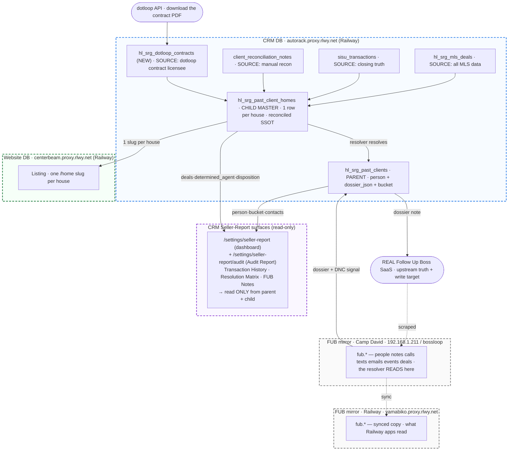

<Accordion title="Changelog — last updated 2026-06-28" icon="clock-rotate-left">
Newest first. Times Eastern.
- **2026-06-28 (PM)** — **🏛️ RESOLVER REBUILT ONE-WAY / TWO-ZONE + URL RECONCILIATION + HLID.** The resolver no longer "owns the output" as a single LLM pass that re-reads itself. It is now `resolve-client.mjs` — 7 deterministic-first steps where every column is INPUT (ground truth, read-only) or OUTPUT (write-only): `attach-closing-facts.mjs` locks **agent + disposition** from ground truth, then `s6-investigator.mjs` runs as a **NARRATOR** writing a clean `dossier_json` (it never decides a fact or reads its prior dossier). The old `resolver_block` blob is **quarantined** (replaced by `dossier_json`); `extract-to-child.mjs` is dead. Separately, `reconcile-pc-urls.mjs` gave **2,074 / 2,077** past-client homes a real `/home/<canonicalSlug>/<HLID>` URL, and the HLID id system is live site-wide. Build log: [SRG Reconciliation WIP](/guides/srg-reconciliation-wip). (Caleb)
- **2026-06-26 (PM4)** — **Renamed to "SRG Past-Client Reconciliation"; Audit Report split into its own page** under Seller Report; moved out of Website Integration into the **Seller Report** nav section. (Caleb)
- **2026-06-26 (PM3)** — **Visual whiteboard added** (Mermaid: each database as a dashed box, its tables inside, the reconcile→resolve flow). Matches Zach's whiteboard. (Caleb)
- **2026-06-26 (PM2)** — **Full database + table matrix locked** (5 sources, the FUB scraper mirror real+Camp-David+Railway structure, 4 databases with hosts, `client_reconciliation_notes` as the recon source). (Caleb)
- **2026-06-26 (PM)** — **🏛️ SSOT CONSOLIDATION LOCKED + bucket resolution + dotloop CONTRACT = final truth.** Two app tables (parent + child); raw sources feed the child; `hl_srg_mls_deals` retired as SSOT. Bucket precedence **dotloop CONTRACT > SISU > MLS > manual recon**; Internal (SG Holdings) excluded. dotloop `document:*` download unlocked → LICENSEE ASSISTING SELLER/BUYER = the real agent (Earl→Jessica, Burton→Jeremy). Zach Spradling → Ana. (Caleb)
- **2026-06-26** — Agent DNC screen (Step 0) + deed-lag / fresh-Repliers / chain of custody + KCMO→Jackson + Audit Report FUB links. (Caleb)
- **2026-06-23 (PM2)** — Resolver-owned dossier LIVE + tag taxonomy LOCKED. (Caleb)
- **2026-06-23** — 🚧 ARCHITECTURE LOCK: the resolver OWNS the output; the transport is dumb. (Caleb)
- **2026-06-22 (PM3)** — Households resolved ONLY by the S6 LLM resolver, on named evidence. (Caleb)
- **2026-06-17 5:54 AM** — Original guide (`hl_sold_profiles`, superseded).
</Accordion>

This is the canonical developer reference for the **Spradling Realty Group past-client reconciliation**. It powers the CRM seller-report dashboard, every past-client home's `/home` page, **the Follow Up Boss past-client dossier**, and the **CRM Audit Report**. Internal strategy: `GT_HOUSELOOP_SG_PAST_CLIENTS_PRD.md` §12–§13. SSOT consolidation: `GT_HOUSELOOP_PASTCLIENT_TRANSACTIONS_SSOT_PRD.md`.

## 🖼️ THE WHITEBOARD — the databases & the flow

Each **dashed box is a database** (with its host); the boxes inside are its **tables**. Arrows are the data flow: the four house-level **sources** reconcile into the **child**, the resolver resolves up to the **parent** (+ reads FUB for the person), and links one `Listing` per house.



**The single source list — every database we read from:** `CRM` (autorack), `FUB mirror Camp David` (192.168.1.211/bossloop), `FUB mirror Railway` (yamabiko), `Website` (centerbeam), and the `REAL Follow Up Boss` SaaS. Details + hosts in the matrix below.

## 🖥️ THE TWO CRM SURFACES READ ONLY FROM THE TWO TABLES (Zach LOCKED 2026-06-27 11:51 AM EDT)

Both Seller-Report surfaces render **only** from the two tables — the PARENT `hl_srg_past_clients` (person ·
contact · bucket) and the CHILD `hl_srg_past_client_homes` (**THE SSOT** — one row per house-deal ·
`determined_agent` · disposition). Neither reads a hand-written `resolver_block` blob as the source of
transactions/agents anymore. Source of truth = the two tables. (The dashboard's UI is mid-rebuild — polish
comes AFTER the data reads correctly from the two tables.)

| Surface | URL |
|---|---|
| Seller-Report **dashboard** | `/settings/seller-report` |
| **Audit Report** | `/settings/seller-report/audit` |

**The Audit Report's three sections — all derived from the two tables:**

| Section | Source |
|---|---|
| **Transaction History** | CHILD rows — `address` · `role` (BOUGHT/SOLD) · **`determined_agent`** · `original_price` · `transaction_date` · disposition |
| **Resolution Matrix** | CHILD (the per-home resolution) + PARENT (`bucket` / `resolution_status`) |
| **Follow-Up Boss Notes** | rendered FROM the CHILD rows + PARENT contacts (the 6-section card) |

**Dependency chain (Audit Report):**
`app/(crm)/settings/seller-report/audit/page.tsx` → `components/seller-report/AuditReport.tsx` →
`app/api/settings/seller-report/audit/route.ts` → `SELECT … FROM hl_srg_past_clients` **+** `hl_srg_past_client_homes`.

**The agent shown on every transaction = the CHILD `determined_agent`**, resolved via the waterfall
(SISU real agent → dotloop CONTRACT → FUB `Team Exit -` tag). A placeholder ("SRG", "Past Agent Referrals")
is NEVER displayed — it triggers the waterfall. The Step-1 writer that populates the child is
`tools/houseloop-cards/extract-to-child.mjs`. Internal governing file: `GT_HOUSELOOP_PASTCLIENT_SSOT_PRD.md`.


## 🏛️ THE DATA MODEL — two tables the app reads (Zach LOCKED 2026-06-26)

> **One source of truth, two layers: the PERSON (parent) and the HOUSE (child). Nothing else.**

| Layer | Table | Grain | Holds |
|---|---|---|---|
| **PARENT — person** | `hl_srg_past_clients` | 1 / past client (~1,834) | the PERSON: name · contact · `bucket` · **`dossier_json` (clean card: summary/contacts/tags/current_properties)** · `website_hlid`/`website_home_url`. Every child home carries a real `/home/<slug>/<HLID>` URL. |
| **CHILD — house (THE SSOT)** | `hl_srg_past_client_homes` | **1 / house (~2,256)** | the ONE reconciled house record — **all facts in one flat row** (MLS + SISU + dotloop + contract + value/photos) with `*_source` provenance. The resolver READS its facts. |

**Grain (Zach 2026-06-26):** **one row per house.** A past client with multiple homes has multiple child rows; the *same* house can have multiple rows across its life (sold more than once). **Each resolved home → exactly ONE `/home/<canonicalSlug>`** on the website `Listing`.

**The 5 SOURCES OF TRUTH — they FEED the child/parent; the app NEVER reads them directly:**
- `hl_srg_mls_deals` (CRM) — MLS facts — **retired as an SSOT**, raw staging only
- `sisu_transactions` (CRM) — SISU facts (agent, GCI, dates, status; 1,945 Closed)
- `client_reconciliation_notes` (CRM, 446) — Zach's hand-verified recon
- `hl_srg_dotloop_contracts` (CRM, **NEW — harvest target**) — the signed contract licensee + parties (final-truth agent)
- `fub.*` (the FUB scraper mirror) — the **person** source: notes, comms, contact info, the agent-COI/DNC signal → feeds the **PARENT** dossier

## 🗄️ THE DATABASES + FULL TABLE MATRIX

**Four databases (+ the FUB SaaS):**

| DB | Host (env var) | Holds |
|---|---|---|
| **CRM** (Railway) | `autorack.proxy.rlwy.net:53570` (`HL_CRM_DATABASE_URL`) | parent + child + every source table (MLS, SISU, recon, dotloop conn) |
| **FUB mirror — Camp David** | `192.168.1.211:5432/bossloop` (`DATABASE_URL`) | `fub.*` — the **scraped** copy; the scraper writes here, the resolver reads here |
| **FUB mirror — Railway** | `yamabiko.proxy.rlwy.net:40035` (`FUB_RAILWAY_DATABASE_URL`) | `fub.*` — a **synced copy** for Railway apps (identical — 49,225 people) |
| **Website** (Railway) | `centerbeam.proxy.rlwy.net:23509` (`HOUSELOOP_DATABASE_URL`) | `Listing` — the public `/home/<canonicalSlug>` house |
| **REAL Follow Up Boss** | the FUB SaaS (`FUB_API_KEY`) | upstream truth + the **write target** (the dossier note → real FUB → re-scraped into both mirrors) |

**Every table the pipeline touches:**

| Table | DB | Grain | Role |
|---|---|---|---|
| **`hl_srg_past_clients`** | CRM | 1/person (1,834) | **PARENT** — person + dossier + bucket |
| **`hl_srg_past_client_homes`** | CRM | 1/house (2,256) | **CHILD MASTER** — reconciled SSOT (+ `*_source` provenance) |
| `hl_srg_mls_deals` | CRM | 1/deal (1,971) | SOURCE: MLS facts |
| `sisu_transactions` | CRM | 11,636 | SOURCE: SISU facts |
| `client_reconciliation_notes` | CRM | 446 | SOURCE: manual recon (Zach) |
| `hl_srg_dotloop_contracts` ⬅NEW | CRM | 1/contract | SOURCE: dotloop contract licensee + parties |
| `hl_dotloop_connection` | CRM | 3 (active id=3) | dotloop OAuth token (`document:*`) |
| `fub.people / notes / calls / text_messages / emails / events / deals` | FUB mirror ×2 (Camp David + Railway) | 49,225 people · 138K notes · 399K texts · 200K emails · 40K calls · 146K events · 4,554 deals | SOURCE (person): dossier + contact verify + agent-COI/DNC signal |
| `Listing` | Website | 364,770 | one `/home/<canonicalSlug>` per house |

**Field precedence on the child (deterministic, provenance-tagged):** `agent`: dotloop contract > SISU > MLS list_agent > recon · `disposition`: live county deed > Repliers · `price/date`: full MLS CloseDate > SISU > MLS · `parties`: dotloop participants > FUB. Disagreement with no settling source → `verified=false / needs_review`.

### THE ARCHITECTURE LAW (Zach LOCKED 2026-06-28) — ONE-WAY, TWO-ZONE, the LLM narrates

> **Every column is INPUT (ground truth, read-only to the resolver) or OUTPUT (the resolver's product, write-only). No stage ever reads a column any stage writes — one direction, so re-running converges instead of corrupting itself.** Agent + disposition are locked DETERMINISTICALLY by `attach-closing-facts.mjs` from ground truth; the **s6 LLM is a NARRATOR** that writes prose over those locked facts and never decides an agent/disposition and never reads its own prior `dossier_json`. The transport (`dossier-to-fub.mjs`) stays dumb. If a fact is wrong, fix the deterministic attach; if the prose is wrong, fix the narrator prompt.

## 🏷️ THE BUCKET — a resolved output (Zach LOCKED 2026-06-26)

Derived from **who actually repped the deal**. Agent precedence: **dotloop CONTRACT licensee > SISU `agent` (Zach→Ana) > MLS `our_roles` (`*-ana`=Ana; `*-group`=brand, NOT a team agent — the Dallas bug) > Zach's manual recon.**

| Bucket | Meaning |
|---|---|
| **Ana Only** | Ana on **every** deal |
| **Ana Handoff** | Ana touched ≥1 deal + a named team agent worked another |
| **Team** | a named team agent only — Ana never on the deal (Earl = Jessica Rich) |
| **Internal (SG Holdings)** | a Spradling Holdings / "Ana & Zach Spradling" principal flip — our own investor deal, **excluded** |
| **Agent DNC** | the client is an SG agent or agent family |

## ⭐ dotloop CONTRACT = the source of final truth for the agent (Zach LOCKED 2026-06-26)

The participant list **lies on departed-agent loops** (a team agent who left is DELETED, leaving only Ana-of-record). The real agent survives ONLY inside the signed contract PDF. `document:*` scope is unlocked (re-consent — a refresh does NOT pick up a newly-enabled scope). Chain, **all OAuth API, no Chrome**:

```
loop → GET /folder → find the Exclusive-Right-to-Sell / buyer-rep doc
     → GET /folder/:fid/document/:did  with  Accept: application/pdf   (=> 200, PDF bytes)
     → pdftotext -layout → the name on the line above "LICENSEE ASSISTING SELLER|BUYER"
```

Use `lib/dotloop/client.ts → dotloop.downloadDocument()` (Accept + 500 retry). Helper: `tools/houseloop-cards/dotloop-contract-agent.mjs → contractAgent(profileId, loopId)`. Proven: Earl → Jessica Rich, Burton → Jeremy David. Details: [dotloop Integration](/guides/dotloop-integration).

## THE LIVE-DEED DISPOSITION — county deed is primary truth

(1) **County deed** (`verifyOwner()`; Johnson/Wyandotte KS + Jackson/Clay/Cass MO) — `owner_match` = owns, `owner_differs` = sold/moved. (2) **Repliers** = clean sold date/price; **Ninja** = agent names. (3) **DEED-LAG:** a recent real arm's-length MLS sale BEATS a lagging deed (`deed_lag`). (4) **ARBORIDGE GUARD:** exact-list price + no buyer agent = artifact, deed wins. (5) Full MLS listing for the real `CloseDate`. **⚠️ PARCEL LAW:** match zip + county + neighborhood + legal + coords ~150m.

## 🚫 AGENT DO-NOT-CONTACT SCREEN (Step 0)

The resolver loads the **agent roster** (distinct SISU `agent` names) and runs `checkAgent()`: exact full-name match → **Agent DNC**; surname-only → DNC **only** with a confirming signal (COI note, agent spouse on the deed, that agent repped the other side). Proven: April Atkinson, James Duston.

## THE CARD — the Follow Up Boss note format (LOCKED)

```
HouseLoop · Spradling Group Past Client — <Bucket>
Resolved <MM/DD/YYYY>

CONTACTS
• <Name> — <phone> · <email>

TRANSACTIONS WITH US
• <date> BOUGHT/SOLD <address>  $<price>  — <agent>

CURRENT
• Current home: <addr> — county-deed confirmed (<owner>).   (or: Current residence: not yet verified)
• Still owns: <addr> (investment)
• SELLER LEAD — <addr> sold <date> for $<price>, listed by <agent> (<broker>) — we lost this listing.

DOSSIER
<2–4 sentence "know them before you call" brief, grounded only in the facts>
```

A **DNC** or **Internal (SG Holdings)** card replaces all of it with a short suppression note.

## The Audit Report

The human-readable proof surface for this pipeline lives on its own page: **[Audit Report](/guides/audit-report)** (`Seller Report → Audit Report`). It reads the two canonical tables (parent `dossier_json` + child rows) and shows every client's transaction history, the resolution matrix (with `*_source` provenance), and the Follow-Up Boss dossier note, each linked to the client's FUB profile.

## The resolver's output block — `dossier_json` jsonb on `hl_srg_past_clients` (clean card only)

`dossier_json` holds ONLY the clean card: `summary` · `contacts[]` · `tags[]` · `current_properties[]` · `lost_buyers[]`. The per-deal facts (`determined_agent`+`_source`+`_role`, disposition, `sold_not_by_us`, price/date) live on the **CHILD** rows, not here. **`dossier_json` is never an accumulator** — raw MLS/Redfin/geocode/deed are INPUTS, never stored back into it. (The old `resolver_block` blob is quarantined in `hl_srg_resolver_quarantine`, drop gated.) ⚠️ Never write the `dossier` TEXT column (Myli's case-file).

### 🔖 FUB TAG TAXONOMY (Zach LOCKED 2026-06-23)

`HouseLoop Resolved` (every resolved client) · `SRG Closed - Ana Only` / `Ana Handoff` / `Team` / `Internal (SG Holdings)` / `Agent DNC` (the bucket) · `SRG Closed - Lost Listing`. Tags are **ATOMIC** — FUB smart lists AND them.

## Key files

| Concern | Where |
|---|---|
| **Resolve a client (THE one command)** | `tools/houseloop-cards/resolve-client.mjs` (7 steps, gated) |
| Stage-1 fact engine (agent + disposition, deterministic) | `tools/houseloop-cards/attach-closing-facts.mjs` |
| Narrator (clean dossier_json — kept intact) | `tools/houseloop-cards/s6-investigator.mjs` |
| URL reconciliation (every home → `/home/<slug>/<HLID>`) | `tools/houseloop-cards/reconcile-pc-urls.mjs` |
| dotloop CONTRACT agent | `tools/houseloop-cards/dotloop-contract-agent.mjs` · `lib/dotloop/client.ts → downloadDocument()` |
| Live county deed | `tools/houseloop-cards/county-owner-verify.mjs` |
| Repliers sold-check · Ninja agents | `repliers-sold-check.mjs` · `ninja-sold.mjs` |
| Transport (dumb writer → FUB + SSOT) | `tools/houseloop-cards/dossier-to-fub.mjs` |
| Book runner | `tools/houseloop-cards/resolve-all-past-clients.mjs` |
| Audit Report | `apps/houseloop-crm/components/seller-report/AuditReport.tsx` |

SSOT consolidation + reconcile precedence: `GT_HOUSELOOP_PASTCLIENT_TRANSACTIONS_SSOT_PRD.md`.
