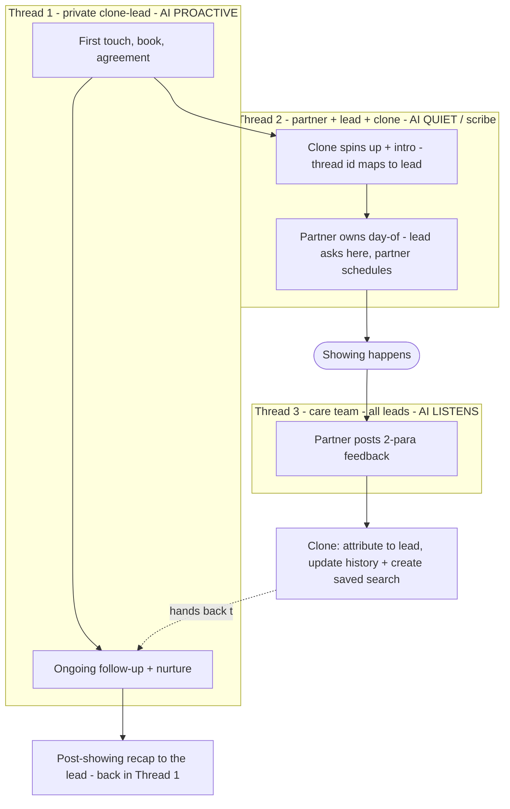

<Info>
**Boundary (one fact, one home).** The conversation that earns the showing — the first touch, the beats,
one question per text — is owned by [Connecting With People](/guides/connecting-with-people). This chapter
owns everything from the booking onward: the agreement, the watcher, the partner handoff, the three threads,
and the feedback loop. The tools each step fires live in the [AI Toolbox](/guides/ai-toolbox). This page
links to both rather than restating them.

**SPEC vs LIVE.** Much of the *coordination model* below is **SPEC** (target design, 2026-07-18). The
underlying machinery is mostly **LIVE** — see the built-vs-wire ledger at the bottom for the exact line.
</Info>

## Why it's deliberate — the anti-no-show spine

A lead with zero commitment no-shows (the real "Shamir" flake). So the back half of the loop is not
paperwork — it's **commitment engineering**. Every re-affirmation and every signature is a rung on a
ladder that makes flaking feel wrong:

- **Confirm the time**, then **confirm again** after the sellers/partner clear it.
- **A signed agreement** — skin in the game, and it gates the showing.
- **A named human** (the showing partner) meeting them in person.
- **A pre-showing re-confirm** close to the time — the last flake-catch.

Deliberate beats a flake. Each rung below is one of those commitments.

## The touring agreement — the connection mechanism AND the gate

The agreement turns a one-off door-open into a relationship, and its signature is the gate: **signed →
the partner meets them at the house.** It is framed as small and as what *locks their spot*, never a hurdle.

**The three forms** (all exist — KCRAR buyer-rep ladder by scope):

| Scope | Form key | When |
|---|---|---|
| One specific home (a showing) | `single_property_buyer_rep` | the default for a single tour |
| Multiple homes, non-exclusive (area/time) | `non_exclusive_buyer_rep` | they want to see several |
| Exclusive representation | `exclusive_buyer_agency` (KCRAR F314) | a deeper commitment |

**LIVE — the tool.** The clone calls `send_document` (`lib/ai/lead-conversation.ts` → `execSendDocument`),
which maps `form` → form key and calls `createFillSend` (`lib/esign/create-fill-send.ts`): it creates +
fills the loop, sends it through Documenso (`lib/esign/documenso.ts`), and returns a signing URL so the text
can link straight to it. Forms + field maps: `lib/tc/contract-forms.ts`, `lib/tc/fill-contract.ts`.

**The housekeeping sequence** (SPEC copy — three jobs at once: confirm availability, frame the agreement as
small + spot-locking, and capture the email as a micro-commitment). We email AND text the link; we never
announce the text:

> Great news — the sellers are all set, the house is available to show at 3:00 today. Couple quick
> housekeeping things so I can get you guys in:
>
> I'll send over a simple showing agreement to sign — it just outlines our commission (the seller pays us,
> no cost to you). As soon as it's signed, my showing partner Trish will meet you right at the house at 3:00.
>
> Is [their email] the best email to send it to?
>
> Perfect! It'll take me about 10 minutes to get it filled out, then I'll send it right over. Just a heads
> up — I'll need it signed before we can head over to the showing, so keep an eye out. It's quick, takes a
> sec on your phone.

**If they ask "what's this for?"** (SPEC copy): *"it's just what lets us officially show you homes — it
outlines our compensation (the seller pays us), and that if you write an offer we're working for you. No
cost to you."*

## The signature watcher — the 1-hour flake-catch

**LIVE — the "esign nudge."** When the agreement is sent, a scheduled action is set keyed to the showing:
`scheduleEsignNudge` (`lib/scheduledActions/schedule-esign-nudge.ts`) fires `beforeApptHours` before the
appointment. Set that to **1 hour** for the tour-request lane (it defaults to 24h — a config value, no new
engine). At fire time `dispatchEsignNudge` (`lib/scheduledActions/esign-nudge-dispatch.ts`) re-reads the doc
and only nudges if still unsigned, re-sending the same signing link. When the buyer signs, the Documenso
webhook (`app/api/esign/webhook/route.ts`, `DOCUMENT_COMPLETED`) marks it signed and **cancels the pending
nudge**. Status lives on `hl_tc_loop_document` (`status`, `signed_at`).

## The showing partner and the collaborator model

Everyone on a lead is a collaborator with a role: the **human agent** (owner), the **AI clone** (acts as the
agent), the **showing partner** (Trish), and — SPEC — an **AI manager** (Zach).

**PARTIAL today.** The roles/columns exist: `hl_lead_collaborators` (`role_id` → `hl_role`), the
**"Showing Partner"** role (`db/migrations/0348_team_role_groups.sql`), and the AI split
`assigned_ai_agent_id` / `ai_clone_id` (`db/migrations/0095`). But the showing partner is resolved from the
lead's *source config* today (`resolveShowingPartner`, `lib/leads/showing-partner.ts`), not attached
per-lead — and there is **no "AI manager" role yet**. WIRE: attach the partner (+ an AI-manager role) per-lead
via `hl_lead_collaborators`.

## The three-thread model — where the AI is proactive vs. quiet

The one rule: **the AI is proactive in exactly one place — its own private thread with the lead.**
Everywhere else it's silent or listen-only. That is what keeps it off the partner's toes. Attribution is by
**thread identity** (the stored group-chat id → lead), never by parsing names.

| Thread | Members | AI behavior | If the lead asks to schedule |
|---|---|---|---|
| **1 · Private** (the original 1:1) | clone ↔ lead | **PROACTIVE** — first touch, booking, agreement, all follow-up | the clone schedules |
| **2 · External group** | partner + lead + clone | **QUIET / scribe** — partner owns it; every message still updates the lead's record | the partner schedules; AI stays silent |
| **3 · Care team** (all leads) | partner + agent + manager + clone | **LISTENS** — attributes feedback to the partner's active showing, acts, then hands back to Thread 1 | n/a (no leads present) |

**Attribution — solved by state, not name-parsing.** A per-lead external thread's id maps to exactly one
lead. In the care-team thread, the partner's feedback is matched to *her active showing* (a set of 1-3),
never to the whole database.

**PARTIAL today.** Outbound group send is LIVE — `sendGroupText` (`lib/phone/send-bb.ts`) creates the
BlueBubbles group and returns its `chatGuid`; `doHandoffRollup` (`lib/coordination/mediation.ts`) already
group-texts the buyer + partner together. Inbound is 1:1 today — `app/api/bb/inbound/route.ts` attributes by
sender phone, with a single-agent divert (`maybeHandleAgentInbound`, `lib/coordination/agent-inbound.ts`)
that routes an agent's reply to the active coordination. WIRE: register each external thread's `chatGuid`
→ lead and route inbound group messages by it; flag the care-team thread listen-mostly.

## The feedback loop — showing → the lead's record → the next touch

After the showing, the partner drops a paragraph of feedback in the **care-team thread**. The clone
attributes it to her active showing, then ingests it and hands back to Thread 1.

**LIVE — the ingestion.** `handleAgentFeedback` (`lib/coordination/mediation.ts`) already extracts the
feedback, updates the saved search, sets a follow-up, and logs it. The write paths it uses all exist:
`add_note` → `hl_notes`; the dossier/facts via `extract-context.ts` → `hl_lead_facts` / `hl_lead_dossier`;
`schedule_followup` → `ensureFloor` (`lib/ai/ensure-floor.ts`).

**WIRE — the missing trigger.** `askAgentForFeedback` is fully built but **never called** — nothing prompts
the partner for feedback after a showing, so the feedback phase never starts. Fire it after the showing time
(or on disposition) and the loop closes.

**The post-showing recap** (SPEC copy, sent in Thread 1 — never the group, so it doesn't bug the partner):

> Hey [first name]! Looks like your showing went great with Trish — she mentioned you're looking a little
> closer into town and want more space than that one had, sounds like Overland Park and Olathe are on your
> radar. I set you up a saved search on HouseLoop and emailed you the link (your account's already created).
> If any catch your eye, just hit the tour button on there, or reply right here and we'll get you scheduled.

From there the [Closed-Loop Follow-Up](/guides/closed-loop-follow-up) engine keeps the lead alive.

## Built vs. wire — the exact line

| Piece | Status | Where |
|---|---|---|
| Send the agreement (3 forms) | **LIVE** | `send_document` → `createFillSend` (Documenso) |
| The 1-hour signature watcher | **LIVE** | `scheduleEsignNudge` + `esign-nudge-dispatch.ts` (set `beforeApptHours: 1`) |
| Partner feedback → lead record | **LIVE** | `handleAgentFeedback` (+ `add_note`, `extract-context`, `schedule_followup`) |
| Book the showing + partner handoff | **LIVE** | `schedule_appointment`, `doHandoffRollup` |
| Showing partner attached per-lead + AI-manager role | **WIRE 1** | `hl_lead_collaborators` (partner is source-config today) |
| Post-showing feedback trigger | **WIRE 2** | `askAgentForFeedback` is built but never called |
| External thread id → lead routing (inbound group) | **WIRE 3** | register `chatGuid` → lead; care-team thread listen-mostly |
| Set the nudge to 1 hour + `send_document` as a workflow step | **WIRE 4** | config + workflow node |

## Related

- [Connecting With People](/guides/connecting-with-people) — the conversation that earns the booking (beats, the engine, rapport)
- [Closed-Loop Follow-Up](/guides/closed-loop-follow-up) — the nurture engine that runs after the recap
- [Routing & the Care Team](/guides/care-team-routing) — who is staffed on the lead
- [AI Toolbox](/guides/ai-toolbox) — the one home for the tools (`send_document`, `schedule_appointment`, `create_saved_search`)
