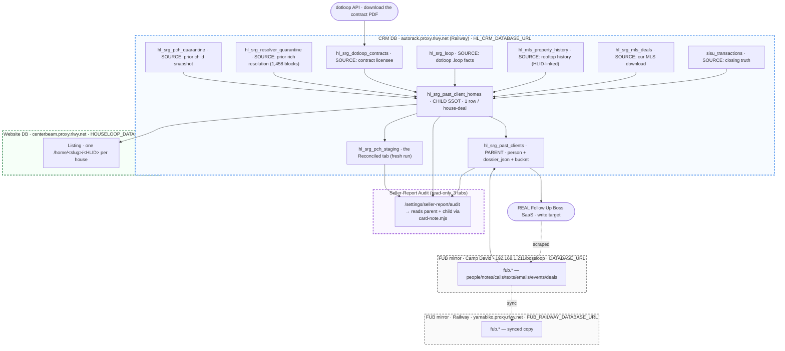

<Warning>
**Active WIP — last updated 2026-07-01.** This is the ONE current doc; it replaced `past-client-data-pipeline` + `srg-reconciliation-wip` (both now stubs). Rule: prove on the **first 20 (Nations first)** before anything touches 1,780. "Done" = the correct data VERIFIED IN THE TABLE by query — never "the script exited 0." Private canonical: `GT/GT - Pending/GT_SRG_RECONCILIATION_ENGINE_WIP.md`; deep-dive PRDs stay as indexed subordinates.
</Warning>

## ✅ CHECKLIST — the 7 boxes (live status 2026-07-01)

- [x] **Box 2 — Brain** (`hl_fub_person_facts`) — Haiku dossier over **2,178/2,178** past-client household members.
- [x] **Box 3 — MLS rooftop** (`hl_mls_property_history`) — **100% (1,955/1,955** past-client-home MLS#s); **6,017 selling agents** recovered (was 0%); all **151** Matrix columns are real searchable columns; MLS#-direct Speed-Bar recovery closed the malformed-address tail.
- [x] **Box 4 — HLID on the MLS table** — `hl_property_id` stamped on **7,152 rows / 1,886 homes** (exact deal-MLS# + rooftop-propagated; 7 multi-unit buildings held to exact-match).
- [x] **Box 1 — Dedup** — **54 merges (1,834 → 1,780 cards)**, 0 orphans, fully reversible via `hl_srg_dedupe_log`.
- [~] **Box 5 — Dotloop `.loop`** (`hl_srg_loop`) — **86.9% agent / 88.7% address** on the **2,128 real closings** (the 871-gap `--real-closings` harvest is done). Remaining ~278 are genuinely dotloop-empty (the agent waterfall covers them from SISU/MLS).
- [ ] **Box 6 — RECONCILE ENGINE** — 🔴 **THE ACTIVE BUILD.** Rework `triangulate-resolver.mjs` to ingest ALL sources (esp. the 1,458 rich `resolver_block`s) → union → canonical-source-per-field → write the NEW child.
- [ ] **Box 7 — Prove the first 20** — Nations first, then the golds → Zach signs off the PROCESS → scale to 1,780. **No auto-publish to FUB.**

---

## North Star
Every SRG past client → ONE accurate reconciliation card: person + household + every transaction we did (with the agent who worked it, even if they left) + their current home (deed-confirmed) + lost opportunities + dossier — for **past-client reactivation**. **Accuracy is the only benchmark. The table is the truth.** The card renders at `/settings/seller-report/audit` and is the exact note published to Follow Up Boss.

---

## ⭐ THE ARCHITECTURE (Zach LOCKED 2026-07-01)

**The resolver is the brain. Every prior output — including the old child table — is just a SOURCE it reads.**

<Note>
This **SUPERSEDES** the earlier "deterministic-virgin, ignore the prior `resolver_block`" note. The prior full Sonnet/s6 resolution is the RICHEST input we have and the resolver must ingest it, not re-derive from a narrower spine.
</Note>

1. **Quarantine all prior work** as read-only SOURCES (never the truth, never the render target):
   - `hl_srg_resolver_quarantine` — **1,473 rows, 1,458 rich `resolver_block`s** (the prior full Sonnet/s6 resolution: complete `transactions[]`, `lost_listings[]`, `dispositions`, `contacts`, `summary`, `dnc`, `tags`, `confidence`, `note_markdown`).
   - `hl_srg_pch_quarantine` — **2,168 rows** (snapshot of the structured child: `determined_agent`, `disposition`, `houseloop_url`).
2. **The resolver reads ALL sources together (union):** quarantined `resolver_block` + quarantined child + SISU + MLS (100%) + dotloop (`.loop` + contracts) + brain (FUB facts) + the parent deed field `resolved_current_home`.
3. **It triangulates → its OWN conclusion** — unions transactions so NOTHING prior work found is ever lost, applies the canonical-source-per-field law, adds the new recoveries (departed agents from dotloop, 100% MLS), and corrects errors.
4. **It writes the NEW child** `hl_srg_past_client_homes` = the truth = what renders. Quarantines stay as provenance/undo.
5. **PROVE on Nations first (dry-run, full card) → Zach sign-off → THEN write → scale to 1,780.** No auto-publish to FUB.

---

## 🔒 CANONICAL-SOURCE-PER-FIELD LAW (Zach LOCKED 2026-07-01)

Union everything; when sources disagree on a field, the CANONICAL source wins — `resolver_block` fills gaps only.

| Field | Canonical source (waterfall) |
|---|---|
| **A transaction exists** | UNION of ALL sources (SISU ∪ `resolver_block` ∪ old child ∪ MLS ∪ dotloop ∪ brain), deduped by rooftop + side |
| **Agent per deal** | SISU → dotloop contract licensee → FUB `Team Exit` tag → investigation. `resolver_block`/old-child agent = last-resort gap-fill. **Ben Froeschl NEVER. Zach → Ana.** |
| **Bucket** | the SISU-derived `bucket` COLUMN on `hl_srg_past_clients` (never the `is_ana` flag) |
| **Transaction price / date** | SISU (MLS agrees) — store as the deal's `original_price` (a historical fact, NOT a current value) |
| **Property address** | MLS `hl_srg_mls_deals` by `mls_number` → Google-Places-normalized SISU. **The address is the home identity — never key off a pre-existing hlid/slug (poison).** |
| **Current home** | County DEED (`resolved_current_home`). Bought through a competitor → **LOST PURCHASE, renders RED** under CURRENT PROPERTIES |
| **Current home value** | OpenWeb Ninja Zestimate (never the closePrice — a past sale ≠ today's worth) |
| **Lost listing** | MLS later-Sold-by-non-SRG after our buy (Bazalgette rule) ∪ `resolver_block.lost_listings` |
| **HouseLoop URL** | carry from the child `hl_srg_past_client_homes.houseloop_url` (by HLID); city-free `identityKey` for MATCH, the home's OWN stored city for the URL |
| **Dossier** | brain (Myli facts) + property facts + `resolver_block.summary` |

---

## THE LOCKED LAWS (quoted from the GT PRDs)

### Agent waterfall — chain of custody (SSOT_PRD + HOUSELOOP_DATA_DOCTRINE, Zach LOCKED 2026-06-27)
> **"NO AGENT = NOT RESOLVED. NEVER 'SRG', NEVER MLS-LISTING AGENT, NEVER A PLACEHOLDER."**
1. **SISU `agent`** — precise match (client FIRST+LAST + amount ±$3k + date ±20d). The chain of custody.
2. **No SISU agent → dotloop CONTRACT** → the signed **Licensee Assisting Seller/Buyer** (the participant list LIES on departed-agent loops; the real agent is only in the PDF). `Past Agent Referrals` + `SRG` are placeholders that MUST trigger this step.
3. **No dotloop → FUB** `Team Exit - <name>` tag + the notes/texts/calls.
4. **Still nothing → NOT RESOLVED → investigation.** Do not fake.

- ⛔ **THE BEN FROESCHL RULE:** `Agent: Ben Froeschl` is NEVER the agent of record (sales manager, never closed; default/unassigned attribution got dumped on him). Jerry Hall (`Ben Froeschl` + `Team Exit - Alexis Miller`) → agent = **Alexis Miller**.
- 🤝 **KEEP THE DEPARTED AGENT.** Mikey Fletcher, Alexis Miller, Ashmir Mehandi were all SRG agents who quit + took the client. **SRG owns the client; we are servicing them now.** Reference them past-tense, as a former teammate — that warmth is the reactivation play.

### Bucket — SISU-derived only (HOUSELOOP_DATA_DOCTRINE §4b, Zach LOCKED 2026-06-27)
Read from the `bucket` COLUMN — **never re-derive, never the `is_ana` flag.**

| Bucket | Definition | Count |
|---|---|---|
| **Ana Only** | earliest closing = Ana AND Ana did them all | **461** |
| **Ana Handoff** | started with Ana, a later closing was a team agent | 93 |
| **Spradling Team** | Ana never on any closing (team agent closed it) | 1,066 |
| **HouseLoop** | HouseLoop-sourced client | 29 |
| **Internal (SG Holdings)** | our own investor flip — excluded from reactivation | — |

> Ana-Only = **461, NOT the 260** you get from the dirty `is_ana` flag. Pulling the agent from `closings.agent` (MLS-polluted) put 42 wrong agents on cards (Derek Brinkman "Ana" when SISU = Will Arnett). **The benchmark is ACCURACY.**

### Disposition — did they still own it or move? (SSOT_PRD + SRG_PAST_CLIENT_HOMES_PRD)
1. **County DEED PRIMARY** (`owner_match`=owns / `owner_differs`=moved) → 2. **Repliers** (sold date/price) → 3. **Ninja** (agents). Deed-lag beats a lagging deed; Arboridge guard.
- **SOLD-AFTER SOURCE LAW:** primary = the stored **OpenWeb Ninja `sale_history`** (broader than MLS — public + county + agent-provided). Secondary = Repliers **by address** (streetNumber + street CORE + zip; never by MLS#).
- **THE 180-DAY RULE:** a home is `sold_after_purchase` IFF its most-recent `Sold` is **strictly >180 days AFTER** the client's purchase. (≤180d = the client's OWN purchase. Scrubbed ~66 false positives.)
- **SELLER SIGNAL:** the Ninja re-validation pass — if the candidate current home shows actively listed / pending / recently sold, flip `current_home_status='sold_moved_unverified'` + raise a seller signal (log zestimate, list/pending/sold dates). *"A past client actively selling = the highest-value reactivation event."*

### Lost listing — the Bazalgette rule (SSOT_PRD, Zach LOCKED 2026-06-27)
> ONLY a home **we BOUGHT** for them that **THEY later sold through a NON-SRG agent**. If WE SOLD the address, it is NEVER lost. Match by house# + street token; a same-date buyer agent = the OTHER side of OUR sale.

### Address first, URL last (SRG_PAST_CLIENT_HOMES_PRD, Zach LOCKED 2026-06-21 PM)
Resolve every closing's ADDRESS + deal facts FIRST; mint the HLID + `/home` URL DEAD LAST. The `hlid`/`slug` stored on a closing is **poison** (a prior resolver overwrote old closings' hlids with the client's current-home id). The `mls_number` is a deal attribute, not the house key. City-free `identityKey` (canonical street + zip5) for MATCH; the home's OWN stored city for the URL (Lee's 404 fix — plurality city stamped a KC home "raytown").

### Two-table model + child = SSOT (SRG_PAST_CLIENT_HOMES_PRD + SSOT_PRD)
> "6 SOURCE tables FEED 2 CANONICAL read tables. Both layers stay. The app ONLY reads the 2 read tables. Never re-JOIN 6 tables at read time; never copy 138K FUB notes into the 2 tables." The client points at the house (`website_hlid` → `Listing.hlid`); **the house carries NOTHING about the client** (one pointer, one direction, edits only in CRM).

### Resolver cost-tiers (DETERMINISTIC_RESOLVER_PRD, Zach LOCKED 2026-06-27)
🟢 **GREEN** (1–2 deals, named agent, triangulated, not DNC) = deterministic $0 · 🟡 **YELLOW** (Ana-only, agent hidden) = +1 dotloop probe · 🔴 **RED** (3+ deals or conflicting/ambiguous) = Sonnet ~$0.30–0.50 · 🚫 **DNC** (surname on the SRG agent roster + COI signal). Current triangulate-resolver tiering on the 1,780: GREEN 1,386 · YELLOW 297 · RED 97.

---

## 🗺️ WHERE EVERYTHING LIVES (live counts 2026-07-01)

**Each dashed box is a database; the boxes inside are its tables. Arrows = data flow.**



### CRM DB — `autorack.proxy.rlwy.net` (`HL_CRM_DATABASE_URL`)
| Table | Rows | Grain / what it holds |
|---|---|---|
| **`hl_srg_past_clients`** | **1,780** | PARENT — person, `bucket`, `dossier_json`, `resolved_current_home`, `website_hlid`. **13 signed off** (`houseloop_resolved_at`) · 481 have a dossier · 1,743 HLID-linked (97.9%) |
| **`hl_srg_past_client_homes`** | **2,168** | CHILD SSOT — 1 row / house-deal; `determined_agent` (535, 24.7%) · `disposition` (591) · HLID/URL (2,165, 99.9%); role buy 1,596 / sell 572 |
| **`hl_srg_resolver_quarantine`** | **1,473** | prior rich Sonnet resolution — **1,458 `resolver_block`s** (resolved 988 · needs_review 358 · needs_agent_recovery 84 · complete 35 · agent_dnc 8) |
| `hl_srg_pch_quarantine` | 2,168 | snapshot of the child (a read-only SOURCE + undo) |
| `hl_srg_pch_staging` | 50 | the **Reconciled** audit tab (fresh resolver run, awaiting sign-off) |
| `hl_srg_dedupe_log` | 54 | reversible dedup merge log |
| `sisu_transactions` | 11,636 | closing spine — 1,945 Closed + 44 Pending; 100% have an agent |
| `hl_mls_property_history` | 7,713 | rooftop history — `hl_property_id` on 7,152 (92.7%) · `selling_agent` on 6,017 (78%) |
| `hl_srg_mls_deals` | 1,971 | our downloaded Heartland MLS (beds/baths/sqft 99% · sale_price 93%) |
| `hl_srg_loop` | 13,449 | dotloop `.loop` facts — **2,128 real closings** (86.9% agent · 88.7% address) |
| `hl_srg_dotloop_contracts` | 13,257 | contract licensee source |
| `hl_srg_dotloop_loops` | 17,455 | raw loop index |
| `hl_fub_person_facts` | 5,694 | Myli brain (Haiku dossier + facts) |
| `hl_fub_deals` | 4,554 | FUB deal report |
| `hl_fub_sisu_link` | 4,442 | FUB person ↔ SISU closing linker |
| `hl_srg_agent_roster` | 136 | every SRG agent (who was ever ours) |

### FUB mirror — Camp David (`192.168.1.211/bossloop`, `DATABASE_URL`) + Railway (`yamabiko`, `FUB_RAILWAY_DATABASE_URL`)
`fub.*` — people **49,229** · text_messages **444,864** · notes **140,223** · calls **39,867** · events **146,292** · deals 4,554. Scraper: Camp David FUB DOM scraper (pm2 `fub-backfill`). The resolver READS the person here for the dossier + DNC signal.

### Website DB — `centerbeam.proxy.rlwy.net` (`HOUSELOOP_DATABASE_URL`)
`Listing` — one `/home/<canonicalSlug>/<HLID>` per house. Value/photos/schools/tax/priceHistory live here; the child links by `website_hlid` and NEVER copies these.

---

## THE CARD — Follow Up Boss note format (LOCKED)

```
HouseLoop · Spradling Group Past Client — <Bucket>
Resolved <MM/DD/YYYY>

CONTACTS
• <Name> — <phone> · <email>

TRANSACTIONS WITH US
• <date> BOUGHT/SOLD <address>  $<price>  — <agent>

CURRENT PROPERTIES
• 🟢 OWNS <addr> — county-deed confirmed        (or 🔴 OWNS <addr> — bought through a competitor (lost purchase))

LOST PROPERTIES
• 🔴 LISTING <addr>  $<price> <date>  — <agent> (sold without us)

DOSSIER
<2–4 sentence "know them before you call" brief, grounded only in the facts>
```
A **DNC** or **Internal (SG Holdings)** card replaces all of it with a short suppression note. The Audit Report and `fub-publish.mjs` render this from the SAME `deriveCard()` → byte-for-byte identical.

**FUB tag taxonomy (Zach LOCKED 2026-06-23):** `HouseLoop Resolved` · `SRG Closed - Ana Only`/`Ana Handoff`/`Team`/`Internal (SG Holdings)`/`Agent DNC` (the bucket) · `SRG Closed - Lost Listing`. Tags are ATOMIC (FUB smart lists AND them).

---

## THE 3-TAB AUDIT UI (built 2026-07-01)
`/settings/seller-report/audit` — `?tab=` selects the child source. Files: `app/api/settings/seller-report/audit/route.ts` + `components/seller-report/AuditReport.tsx`, both rendering via the shared `lib/pastclient/card-note.mjs`.
- **Pending Review — Old** (default) — the pre-existing resolution, UNCHANGED (full list, resolved-at-top, Nations #1). Kept for compare.
- **Reconciled — 2026-07-01** — the fresh resolver run (reads `hl_srg_pch_staging`, currently 20 clients).
- **Final Resolved** (green) — signed-off cards only (`houseloop_resolved_at` not null) — the 13 golds.

Sections per tab: Transaction History · Resolution Matrix · Follow-Up Boss Notes (50-row paginated). Status is derived: resolved (signed off) · pending (card built, not signed) · unresolved (no card). The **sign-off button** (staging → child + stamp) is the one remaining UI piece (not built yet).

---

## 📍 THE NATIONS REFERENCE CASE (pc1 — what CORRECT looks like; Zach walked it 2026-07-01)
**TRANSACTIONS WITH US** (all 6, each with a `/home` link): BOUGHT + SOLD 23309 W 45th Terrace, Shawnee (Ana) · BOUGHT 816 E Saddlewood, Gardner (Ana) · BOUGHT 801 W Poplar Street, Olathe (Ana) · BOUGHT + SOLD 301 E 68th Terrace, Kansas City MO (Ana).
**CURRENT PROPERTIES:** 🔴 OWNS **7325 Oakview St, Shawnee KS 66216 — bought through a competitor (LOST PURCHASE, red)** — deed-confirmed (`resolved_current_home`). ✅ card builder fixed (`card-note.mjs`: deed home wins as current; competitor → red).
The thin SISU-spine resolver produced only 3 transactions with no links → the regression that proved the union-all approach is the correct one.

---

## WHAT'S DONE THIS SESSION (2026-07-01)
- **MLS → 100%** (1,955/1,955): 151-column CSV backfill (6,017 selling agents, was 0%), 22 unit-condos recovered from disk CSVs, 41 malformed-address homes via a NEW MLS#-direct Speed-Bar mode in `mls-address-lookup.mjs`.
- **HLID on the MLS table** (`hl_property_id`, 7,152 rows / 1,886 homes).
- **Dedup** — 54 merges (1,834 → 1,780), reversible (`hl_srg_dedupe_log`).
- **Dotloop `--real-closings` harvest** — closed the 871-gap → 86.9% agent / 88.7% address on the 2,128.
- **Card builder** — deed-confirmed current home wins; competitor-bought = RED lost purchase (Nations 7325 Oakview).
- **3-tab Audit UI** + `hl_srg_pch_staging` (Reconciled tab) + `hl_srg_pch_quarantine` (snapshot).
- Commits (`[caleb]` 2026-07-01): `ad3be347f1` (deed-current card fix) · audit `route.ts`/`AuditReport.tsx` tab wiring · MLS/HLID/dedup/persist tools.

---

## THE FUCK-UP LOG + LESSONS (locked, honest)
1. **From-scratch resolver that ignored s6's discoveries** (GIS current homes, lost buyers like 7325 Oakview) + wrote to a scrap table the audit never read → thin/wrong cards, "my list vs your page" divergence.
2. **Exact first-name match bug** — SISU deals filed under "Kyle" were dropped for "Kyle & Karly" → Nations lost 801 Poplar + both 68th Terrace deals.
3. **Brain harvest on the WRONG pool** (`hl_fub_sisu_link`) → dossiered non-clients, skipped real past clients (since fixed — Box 2 = 2,178).
4. **Silent-whiff "done"** — reported off a process exit, never measured coverage.

**Lessons (locked):** the table is the truth (ONE source, no scrap side-tables) · **reconcile, don't rebuild** (s6 already did the expensive GIS/deed work — combine it) · "done" = correct data IN the table, verified by query · match fuzzy (surname + first-name-token; households merge) · **prove on 20 before scale.**

---

## KEY FILES + TOOLS
| Concern | Where | Status |
|---|---|---|
| Reconcile resolver (Stage-1 assemble) | `tools/houseloop-cards/triangulate-resolver.mjs` | 🔴 being reworked (Box 6) |
| Stage-2 Haiku reconcile + dossier | `tools/houseloop-cards/triangulate-stage2.mjs` | ✅ |
| Shared card builder (Audit + FUB note) | `apps/houseloop-crm/lib/pastclient/card-note.mjs` | ✅ deed-current + competitor-red |
| Audit UI (3 tabs) | `app/api/settings/seller-report/audit/route.ts` · `components/seller-report/AuditReport.tsx` | ✅ (sign-off button pending) |
| Dedup (Box 1) | `tools/houseloop-cards/dedupe-past-clients.mjs` | ✅ committed (Rule #0) |
| Persist resolver → staging | `tools/houseloop-cards/persist-reconcile.mjs` | ✅ |
| MLS 151-col backfill | `tools/houseloop-cards/backfill-mls-csv.mjs` | ✅ |
| MLS recover from CSV / by MLS# | `recover-pch-from-csv.mjs` · `recover-pch-by-mls.mjs` | ✅ |
| HLID on MLS (Box 4) | `tools/houseloop-cards/link-hlid-on-mls.mjs` | ✅ |
| Dotloop `.loop` harvest (Box 5) | `tools/houseloop-cards/harvest-loop-full.mjs` (`--real-closings`) | ✅ |
| Matrix scraper (MLS#-direct) | `tools/mls-scraper/mls-address-lookup.mjs` (`MLS_QUERY=`) | ✅ (Camp David `:18804` only) |
| dotloop CONTRACT agent | `tools/houseloop-cards/dotloop-contract-agent.mjs` · `lib/dotloop/client.ts` | ✅ |
| Live county deed | `tools/houseloop-cards/county-owner-verify.mjs` | ✅ |

**Deep-dive PRDs (indexed subordinates, per the HouseLoop SSOT law):** `GT_HOUSELOOP_PASTCLIENT_SSOT_PRD.md` (child = SSOT) · `GT_HOUSELOOP_PASTCLIENT_DETERMINISTIC_RESOLVER_PRD.md` (tiers + waterfall) · `GT_HOUSELOOP_SRG_PAST_CLIENT_HOMES_PRD.md` (two-table + address-first) · `HOUSELOOP_DATA_DOCTRINE.md` §4b (canonical source per field). Private canonical WIP: `GT/GT - Pending/GT_SRG_RECONCILIATION_ENGINE_WIP.md`.

---

## CHANGELOG
- **2026-07-01 (PM)** — 📚 **Consolidated three docs into this ONE master** (`past-client-data-pipeline` + `srg-reconciliation-wip` retired to stubs). All counts made live. **Session shipped:** MLS→100%, HLID-on-MLS, dedup 54, dotloop 871-gap→87%, deed-current/competitor-red card fix, 3-tab Audit UI + staging/quarantine tables. **Architecture corrected:** resolver ingests the prior `resolver_block` + quarantined child (union), no longer a thin SISU-spine. (Caleb)
- **2026-06-28 (PM)** — Resolver rebuilt one-way/two-zone + URL reconciliation (2,074/2,077 homes → `/home/<slug>/<HLID>`) + HLID live site-wide. (Caleb)
- **2026-06-27** — SSOT: child = the single source of truth; canonical-source-per-field + agent/bucket laws locked; resolver cost-tiers (GREEN/YELLOW/RED/DNC). (Zach)
- **2026-06-26** — SSOT consolidation + bucket precedence + dotloop CONTRACT = final-truth agent; Audit Report split to its own page; whiteboard + 4-DB matrix. (Caleb)
- **2026-06-23** — Resolver-owned dossier + FUB tag taxonomy locked. (Caleb)
- **2026-06-21 PM** — CHILD table restored as canonical (over the jsonb blob); address-first / URL-last. (Zach)
- **2026-06-20** — City-free identityKey (Lee's `/home` 404 fix). (Lee + Zach)
- **2026-06-17** — Original guide (`hl_sold_profiles`, superseded). (Caleb)
